# ELECTROCULTURA

**Por Mons. Justin Christofleau**

*[p. 1]*
Miembro de la Sociedad de Científicos e Inventores de Francia

ALEX. TROUCHET & SON

la Padbury's Buildings, Forest Place, Perth, Australia Occidental

JeBoys' Home, Westmead.

---

> **PDF original:** [Electroculture (Archive.org)](https://ia601400.us.archive.org/27/items/Electroculture_127/Christofleau-Electroculture_text.pdf)
>
> 📖 **Guías rápidas:**
> - [Electroculture For Dummies (English)](docs/electroculture-for-dummies.md)
> - [Electroicultura Para Dummies (Español)](docs/electroculture-for-dummies-es.md)
>
> 🔬 **Patentes de Christofleau (versión actualizada con diagramas SVG):**
> - [Ver todas las patentes actualizadas](patents/Patents-updated/README.md)

# ELECTROCULTURA

**Por MONS. JUSTIN CHRISTOFLEAU**

*[p. 3]*
Miembro de la Sociedad de Científicos e Inventores de Francia

---

# Electrocultura

**Por JUSTIN CHRISTOFLEAU,**

*[p. 4]*
Caballero del Mérito Agrícola, Medalla de Oro de la Sociedad de Fomento para la Industria Nacional, Miembro de la Sociedad de Agricultura, Miembro de la Sociedad de Científicos e Inventores de Francia, Miembro Fundador de la Asociación Nacional de Fabricantes e Inventores de Francia.

---

## ELECTROCULTURA

### EL LLAMAMIENTO DEL SR. J. CHRISTOFLEAU A LOS AGRICULTORES, VITICULTORES Y HORTICULTORES DEL MUNDO

*[p. 5]*

Falange laboriosa, a la que tengo el honor de pertenecer por mi nacimiento, me dirijo ahora a vosotros para alzar mi voz en favor de un gran invento que será, si me comprendéis, uno de los grandes factores de la resurrección y prosperidad del mundo entero, pues significa la intensificación de la producción de la tierra, el aumento de las cosechas en proporciones considerables, y la reducción al mínimo posible del trabajo manual relativo al cultivo y el ahorro de las inmensas sumas de dinero que se gastan anualmente en fertilizantes, reemplazándolos por este nuevo aparato en el que se condensan todas las fuerzas de la naturaleza.

Es decir: el magnetismo terrestre, las corrientes telúricas, la electricidad del aire flotante y la transportada por las nubes, el sol, el viento, la lluvia, e incluso las heladas, fuerzas eléctricas que son capturadas y transformadas en energía enérgica por este aparato que las lleva al suelo de **MANERA DÉBIL Y CONTINUA**, y que lo libera de los microbios que atacan las Semillas y las Plantas.

*(Firmado)* **J. CHRISTOFLEAU.**

---

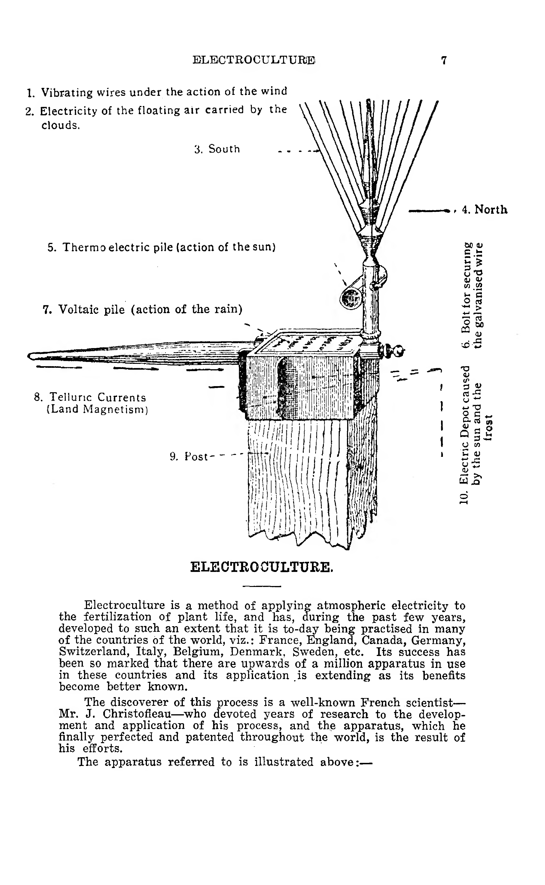

## ELECTROCULTURA

*[p. 7]*

La electrocultura es un método de aplicación de la electricidad atmosférica a la fertilización de la vida vegetal, y se ha desarrollado durante los últimos años hasta tal punto que hoy en día se practica en muchos países del mundo, a saber: Francia, Inglaterra, Canadá, Alemania, Suiza, Italia, Bélgica, Dinamarca, Suecia, etc. Su éxito ha sido tan notable que hay más de un millón de aparatos en uso en estos países y su aplicación se extiende a medida que sus beneficios se conocen mejor.

El descubridor de este proceso es un conocido científico francés, el Sr. J. Christofleau, quien dedicó años de investigación al desarrollo y aplicación de su proceso, y el aparato que finalmente perfeccionó y patentó en todo el mundo es el resultado de sus esfuerzos.

El aparato en cuestión se ilustra arriba.

---

## ELECTROCULTURA

*[p. 8]*

### DESCRIPCIÓN

**Magnetismo Terrestre y Corrientes Telúricas.** — El aparato debe colocarse firmemente sobre un poste de al menos 20 pies (6 m) del suelo, con el puntero horizontal apuntando directamente al sur magnético, y el puntero perpendicular hacia el cielo.

**N.º 1. Electricidad Atmosférica.** — Las corrientes de las que la atmósfera está impregnada son capturadas por medio de un puntero perpendicular y los cables aéreos del aparato, que sirven como conductores, mediante los cuales la electricidad atmosférica positiva se transmite a las corrientes negativas de la tierra. El puntero horizontal, que apunta directamente al Sur, captura el magnetismo terrestre y las corrientes telúricas que rodean el aparato.

**N.º 2. La Acción del Sol.** — En el interior de la carcasa del aparato hay crestas, y en el exterior hay aletas que corresponden con las partes más delgadas de la carcasa. Cuando el aparato se coloca en posición sobre el poste, con el puntero directamente al Sur, el sol naciente golpea naturalmente la faceta oriental del aparato. Las aletas en la parte exterior de la carcasa sirven para desviar los rayos del sol desde la parte delgada de la carcasa hacia las crestas gruesas. Estas aletas, al estar también expuestas al viento, enfrían la porción de la carcasa a la que están unidas. La diferencia resultante de temperaturas causa un "Depósito" o almacén eléctrico, debido a las partículas metálicas. La misma acción tiene lugar más tarde por la tarde en la tercera faceta, o lado occidental, del aparato, así que **DURANTE TODO EL DÍA EL SOL CREA UN DEPÓSITO ELÉCTRICO EN TODO EL APARATO.**

**Pila Termoeléctrica.** — Unida a la parte inferior del vástago del aparato hay un tubo que consiste en dos piezas de metal, una de cobre y la otra de zinc, unidas mediante dos soldaduras y conectadas al vástago principal, de modo que una de las soldaduras queda expuesta al calor del sol, mientras que la otra, al estar debajo, queda sombreada de sus rayos. Esto forma o genera una corriente eléctrica del cobre al zinc, es decir, una corriente negativa y positiva, que desde allí se transmite a la porción del aparato a la que está unido el zinc. El conjunto se convierte en un depósito termoeléctrico, y se produce por la acción de los rayos solares y el contacto de los metales zinc y cobre.

**El Efecto del Frío y las Heladas.** — El frío y las heladas generan electricidad, debido a la diferencia de temperaturas transmitida a las paredes o carcasa del aparato de la misma manera descrita en el párrafo anterior, bajo el título "La Acción del Sol".

**Efecto del Viento.** — El viento, al soplar a través de los cables aéreos, hace que estos vibren y capturen la electricidad positiva con la que el aire está cargado.

**Efecto de la Lluvia.** — En la parte superior del aparato hay un platillo de zinc al que está remachada una placa de cobre; el simple contacto de estos dos metales es suficiente por sí mismo para formar un "Depósito" o almacén eléctrico y, además, el platillo forma un receptáculo para la humedad causada ya sea por la humedad de la atmósfera, la lluvia, la helada o el rocío. Esta acción sobre el platillo de zinc y cobre lo convierte en una pila voltaica. El aparato mismo, al ser metálico y estar colocado sobre un poste alto, está frío y sirve naturalmente para atraer la humedad de la atmósfera.

Toda esta energía eléctrica recolectada por el aparato es la electricidad positiva de la atmósfera, que se transmite al suelo por medio del cable galvanizado. El cable galvanizado en el suelo se dirige en línea recta hacia el norte magnético directo, a cualquier distancia que se requiera. Esto sirve para capturar las corrientes magnéticas terrestres. Es la combinación de la electricidad positiva de la atmósfera y la electricidad negativa de la tierra lo que causa un flujo y reflujo continuo de electricidad natural en el suelo. Esta corriente destruye todos los insectos y parásitos que atacan la vida vegetal por el hecho mismo de que las vibraciones causadas son proporcionalmente mayores que las vibraciones de los propios insectos. Se producen transformaciones químicas que proporcionarán a la vegetación los elementos fertilizantes y los productos nitrogenados que son necesarios para la nutrición y el desarrollo de la vida vegetal.

---

### NOTAS DE M. JUSTIN CHRISTOFLEAU

*[p. 9]*

Ya en 1749, el Abate Nollet, científico que parece haber sido el primero en notar los efectos de la electricidad en la vegetación, anunció que la electricidad contribuía a la **EVAPORACIÓN DEL SUELO**, facilitaba la germinación de las semillas y aumentaba la rapidez de la ascensión de la savia en la vegetación.

En 1783, el Abate Bertholon no solo dio a conocer el papel de la electricidad atmosférica en la vegetación en una de sus obras, sino que hizo su aplicación práctica con un "electro-vegetómetro" que inventó.

En un período mucho más tardío, un científico ruso, Spechnoff, perfeccionó el Electro-vegetómetro inventado por el Abate Bertholon y observó una sobreproducción del 62% para la avena, 56% para el trigo, 34% para la linaza. El Sr. Spechnoff también descubrió que la composición del suelo se modifica por la acción de las corrientes.

Hacia finales del siglo pasado, el Hermano Paulin, Director del Instituto Agrícola de Beauvais, inventó un nuevo aparato, el "Geomagnetífero", que dio resultados maravillosos, especialmente en lo que respecta a las uvas, que resultaron más ricas en azúcar y alcohol; su maduración era más temprana y más regular.

Todos los experimentos realizados hasta hoy por los científicos demuestran que las tierras sometidas a la electricidad han dado cosechas de más de un tercio, el doble e incluso el triple, según la eficacia del aparato y el cuidado prestado a su instalación, y, además, que dichas cosechas están preservadas de los microbios, los parásitos y las enfermedades epidémicas que arruinan a los agricultores, siendo esos microbios, etc., destruidos por la electricidad.

Para que no se me acuse de invocar el testimonio de científicos muertos hace mucho tiempo, me complace registrar el testimonio irrefutable de experimentos realizados con mi aparato por varias personas de buena reputación que viven actualmente, a quienes se puede interrogar, y cuyos experimentos han sido, en algunos casos, certificados por un funcionario municipal.

*J.C.*

---

### INSTRUCCIONES DE INSTALACIÓN

*[p. 10]*

1. Fije firmemente el aparato en la parte superior de un poste de 25 pies (7,6 m), y asegúrelo con una clavija de madera en el orificio de la faceta sur del aparato.
2. Entierre el poste 5 pies (1,5 m) y oriente el puntero del aparato directamente al Sur (magnético) y la cabeza del aparato al Norte magnético. Esto es absolutamente esencial, ya que todo el funcionamiento del aparato depende de ello. (Véase la página 11).
3. Embrete la parte superior del poste que se inserta en el aparato, y también los 5 pies (1,5 m) del poste que quedan enterrados en el suelo.
4. Sujete el cable de hierro galvanizado blando y maleable de calibre N.º 12 o 12½ al perno entre la arandela y el aparato mediante un bucle de "ojo" simple y enrolle el extremo firmemente alrededor del cable principal "descendente" durante 6 pulgadas (15 cm); luego suelde el extremo para hacer un buen contacto. (Véase la Fig. D, página 11).
5. Aísle el cable principal con 4 o 5 aisladores de porcelana a lo largo del poste, cuidando de que el cable se mantenga tenso. (Véanse las Figs. A y B, página 11).
6. Use tres vientos o cables de retenida para evitar que el poste se balancee con vientos fuertes.
7. Entierre el cable a 10 pulgadas (25 cm) de profundidad en un surco recto, que vaya desde el poste en línea recta hacia el norte magnético directo hasta el final de la franja de tierra que se va a electrificar. En los casos en que el terreno vaya a ser arado, el cable debe enterrarse al menos cuatro pulgadas (10 cm) más profundo que la profundidad del arado. (Véase la página 11).
8. Use un aislador doble, similar a los utilizados para las antenas de radio, en la base del poste bajo tierra, donde el cable principal gira en ángulo recto desde el poste a lo largo del surco. El cable se pasa a través del aislador, que está sujeto a la base del poste mediante tres hebras cortas de alambre resistente. Después de que el cable principal se haya colocado correctamente y fijado en cada extremo, es decir, en el perno del aparato y en la estaca en el extremo norte del campo, las hebras cortas de alambre que sujetan el aislador en la base del poste se retuercen o "tensan" lo más posible, tensando así el cable principal en el surco y a lo largo del poste. (Véase la página 11).
9. Donde se corta el cable en el límite norte, se retuerce firmemente alrededor de una estaca en el suelo y el extremo del cable se entierra.
10. Al establecer la dirección correcta para el surco con una brújula, esta debe colocarse sobre un trozo de madera seca y nunca directamente sobre el suelo o cerca de cualquier materia de hierro o cable, etc., ya que las corrientes terrestres y el hierro influirán en la brújula.
11. El funcionamiento exitoso del aparato depende enteramente de la dirección precisa del puntero del aparato hacia el Sur (magnético) y del cable subterráneo hacia el norte magnético directo.
12. Es necesario usar madera seca para el poste sobre el que se fija el aparato, ya que la madera verde tiende a deformarse y, por lo tanto, desviaría la punta del aparato de su dirección.
13. Es aconsejable probar la dirección del puntero de vez en cuando por si el poste se ha torcido. Un buen método para hacerlo es clavar dos estacas de madera en el poste, a unos 5 pies (1,5 m) de distancia entre sí, en línea recta debajo del puntero; manteniendo así los puntos en una línea exacta. Entonces es fácil probar la dirección del puntero mirando hacia arriba desde la estaca inferior hasta el punto superior para ver si los tres están todavía alineados; si no es así, es necesario reorientar el aparato con una buena brújula.
14. Se debe tener cuidado de eliminar cualquier raíz o piedra que se encuentre en el curso del surco.
15. El cable no debe enrollarse alrededor de los aisladores en el poste, sino que debe pasarse hacia abajo por el costado y fijarse al aislador mediante un trozo de alambre de "atadura" de calibre ligero. (Véase la Fig. B, página 11).

---

### APLICACIÓN A VIDES CON ALAMBRES

*[p. 12]*

La electrificación de vides que están sobre alambres es muy simple y se ve considerablemente ayudada por los propios alambres, que se cargan de electricidad.

Como el aparato influye en una franja de terreno de 14 pies (4,3 m) de ancho, si las hileras de vides están separadas 14 pies (4,3 m) o menos, es aconsejable colocar el poste con el aparato en el extremo Sur, equidistante entre las hileras, y pasar el cable en un surco recto por el centro de las hileras hasta un punto directamente al Norte (magnético) del aparato.

En los casos en que las hileras estén separadas más de 14 pies (4,3 m), el aparato puede colocarse en el extremo Sur de cada hilera, y el cable dirigirse en un surco que vaya hacia el Norte y a pocos pies de los troncos de las vides.

Como segundo método de aplicación del aparato a una hilera de vides (véase el diagrama en la página 13), el cable principal del aparato puede sujetarse al alambre superior del emparrado, siempre que el alambre sea de naturaleza adecuada, es decir, de calibre 12 o 12½, blando y maleable, de hierro galvanizado, y se coloquen goteros del mismo calibre de alambre (véase el diagrama en la página 13).

El cable gotero debe sobresalir 16 pulgadas (40 cm) por encima del alambre superior principal del emparrado, luego pasar en dirección perpendicular hacia abajo y enterrarse 18 pulgadas (45 cm) en el suelo.

De los dos métodos, el primero es el más aconsejable. En ambos casos, es esencial, por supuesto, que las hileras de vides corran directamente de Sur a Norte (magnético).

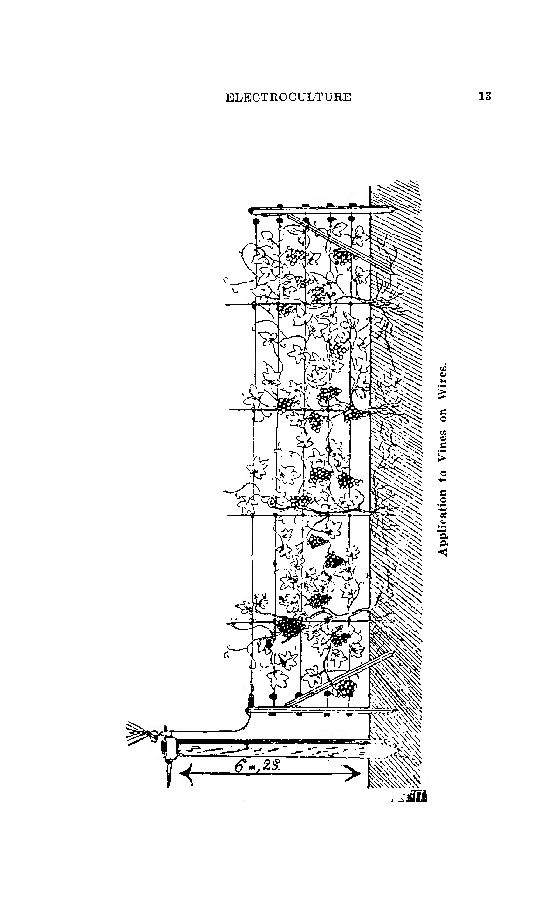

---

### NOTA

*[p. 14]*

Como la electricidad llega mucho más allá del extremo donde se ha cortado el cable, y para evitar que esta fuga entre en un campo vecino, se puede establecer fácilmente una barrera enterrando una estaca en cada extremo y fijando el mismo calibre de cable y a la misma profundidad que el cable principal, a 6 pies (1,8 m) del límite Norte.

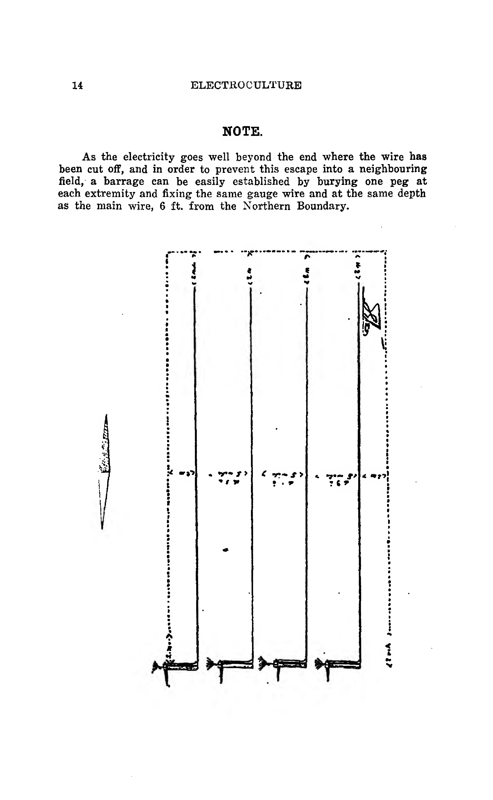

---

### PARA VIDES QUE CORREN DE ESTE A OESTE

*[p. 15]*

Erga postes de 20 pies (6 m) sobre el suelo para soportar el aparato en el extremo Sur del viñedo; los postes separados 14 pies (4,3 m), con un poste tensor de 8 pies (2,4 m) directamente opuesto, cada aparato en el extremo Norte del campo.

Conecte el cable de hierro galvanizado blando y maleable de calibre N.º 12 o 12½ al aparato, aislándolo a lo largo del poste durante 13 pies (4 m); luego conecte (usando aisladores) con el poste tensor en el límite Norte, pasando el cable sobre cada emparrado para conectarlo a un gotero del mismo calibre de alambre, pero dejando los goteros 16 pulgadas (40 cm) por encima del cable aéreo y enterrados 18 pulgadas (45 cm) en el suelo (véase el diagrama en la página 54).

El efecto del aparato sobre las vides, aparte de destruir insectos, parásitos, etc., por el hecho mismo de que las vibraciones causadas en el suelo son más altas que las vibraciones de los propios insectos, **ES** crear materia fertilizante y los productos nitrogenados que dan a cada vid una fuerza prodigiosa, permitiéndole así resistir con éxito el mildiu y el oídio. Durante tres años, el pulverizado y azufrado de las vides puede reducirse en gran medida, y después de cinco años puede eliminarse por completo.

Las vides electrificadas aumentarán la cosecha en una proporción considerable y las uvas mismas serán más ricas en azúcar y en alcohol, lo que las hace más adecuadas para el comercio de exportación.

---

### APLICACIÓN A UNA HILERA DE ÁRBOLES

*[p. 15]*

Cuando se va a electrificar una hilera de árboles, sin importar su longitud, siempre que corra directamente de Sur a Norte, el aparato se coloca sobre un poste de 20 pies (6 m) sobre el suelo en el extremo Sur de los árboles, y como en el caso de las vides, si las hileras de árboles están separadas 14 pies (4,3 m) o menos, coloque el poste con el aparato equidistante entre las hileras en el extremo Sur, y pase el cable en el surco por el medio de las hileras en línea recta hasta un punto en el límite Norte. Si las hileras están separadas más de 14 pies (4,3 m), coloque el aparato y el poste cerca del comienzo de la hilera, y pase el cable en el surco hacia el Norte desde allí, pasando a pocos pies de los troncos de los árboles.

Los árboles tratados de esta manera serán más vigorosos y crecerán más rápido, y la fruta producida es más grande, más dulce y madurará dos semanas antes que la de los árboles no electrificados. La fruta contiene más alcohol, se conservará mejor y, por lo tanto, será más adecuada para el comercio de exportación. Los cereales contendrán más carbohidratos.

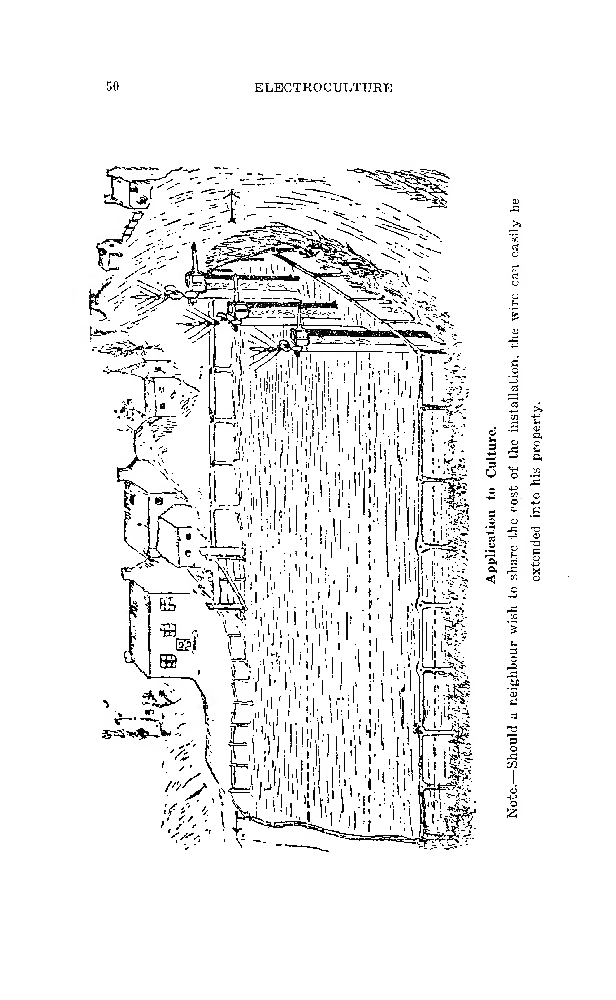

---

### APLICACIÓN A ÁRBOLES AISLADOS

*[p. 16]*

**Electrificación de un Solo Árbol.** — Es muy fácil electrificar un solo árbol. El aparato se coloca a menos de tres pies (1 m) de él, estando el árbol al Norte del aparato. El cable galvanizado se entierra a 15 o 16 pulgadas (38-40 cm) en la base del árbol, y se vierten unos cubos de agua (preferiblemente agua de lluvia) donde está enterrado el cable. Después de unos meses, el árbol ganará un nuevo vigor y, si está enfermo, echará nuevos brotes y mejorará rápidamente.

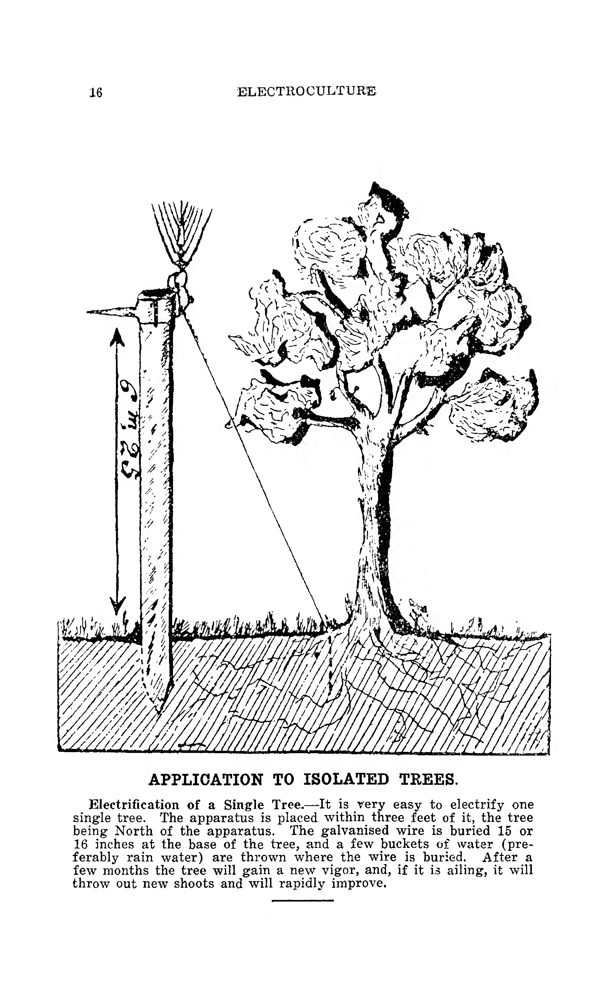

---

## ELECTROCULTURA
**Por GEORGE BLANCHARD**

### CHARLA CIENTÍFICA

*[p. 17]*

La omisión de una corrección en el texto de un folleto me hace afirmar que la electricidad mató "TODOS" los parásitos del suelo. Esta palabra "TODOS" es engañosa, al menos en lo que concierne a la electricidad de bajo voltaje, como la suministrada por el aparato Christofleau, pues las corrientes capaces de matar todos los parásitos también destruirían la vegetación.

La electricidad atmosférica, como todas las corrientes de baja intensidad, destruye las enfermedades criptogámicas de la vegetación, lo que ya es un gran avance. Las corrientes de 110 y 220 voltios son más mortales para los parásitos de las plantas que las corrientes débiles, pero **NO SON INOCUAS** para la propia planta. Si se conduce una corriente de 110 voltios al suelo durante varias horas al día, puede, como mostró el Sr. Breton, ejercer una influencia ligeramente favorable sobre la vegetación, pero el profesor húngaro Kovessi demostró en 1912 que la misma corriente aplicada **CONTINUAMENTE** era absolutamente perjudicial para la vegetación, a la que erradicaba por completo.

Intencionadamente paso por alto todos los demás métodos de aplicación de electricidad al cultivo (es decir, **CORRIENTES DE INDUCCIÓN, LUZ ELÉCTRICA DE ALTA TENSIÓN, RAYOS ULTRAVIOLETAS, ETC.**). Todos ellos se mencionan en las actas del Primer Congreso de Electrocultura, que se celebró en Reims en 1912, bajo la presidencia del profesor Armand Gauthier. Tienen para mí un valor experimental ciertamente, pero son menos interesantes que el método que voy a relatar.

Las pruebas surgen a diario en favor de esta teoría, que es **EL ÚNICO MÉTODO RACIONAL** de aplicar la electricidad a la vida y a las enfermedades de las plantas, de los seres humanos y de los animales, y esta fórmula proveerá la totalidad de la electroterapia y la electrocultura, es decir:

**EL FLUJO CONTINUO DE UNA CORRIENTE DE BAJA INTENSIDAD.**

El reciente trabajo científico de A. Lumière nos habla de líquidos orgánicos compuestos de coloides cuyos granos, llamados por él "micelas" o "gránulos eléctricos", están cargados de electricidad contraria en el interior y en el exterior.

Sin embargo, vemos este mundo de infinitamente "pequeños" animados por un movimiento continuo debido a la atracción de los polos contrarios y a las repulsiones de los polos idénticos, y nos vemos forzados, de deducción en deducción, a considerar el fluido eléctrico como el verdadero fluido vital que regula la circulación de la savia como la de la sangre y realiza su tarea de intercambio favoreciendo todos los intercambios y la elaboración de los productos indispensables para el mantenimiento de la vida.

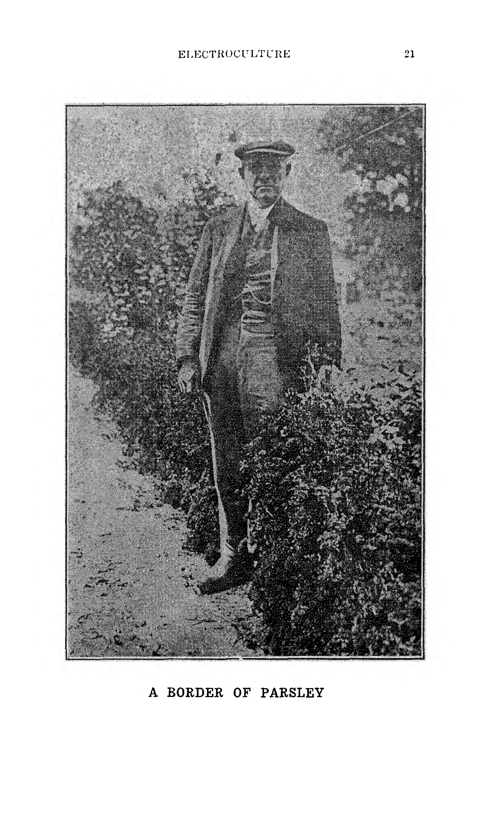

*[p. 19]*

Aunque están en el dominio de la hipótesis, es bueno meditar sobre las concepciones de Chardin y Lumière, pues no son contrarias a ningún principio científico y nadie las ha puesto en duda hasta ahora.

La electricidad es tan débil que casi escapa a nuestras investigaciones. Si se afirma que la electricidad ha causado curaciones por sugestión en seres humanos, no se puede tener tal pretensión en lo que respecta a un animal o una planta.

Chardin concluye fácilmente que es ridículo acudir en su ayuda con corrientes poderosas.

Por lo tanto, ya estaba familiarizado con este método y convencido de los malos efectos y la inutilidad de las **CORRIENTES QUE PRODUCÍAN DESCARGAS** cuando, por casualidad, conocí el proceso de electrocultura practicado por M. Christofleau.

Inmediatamente me sentí atraído por la forma en que la electricidad actuaba sobre la vegetación, mostrando así la mayor analogía con sus acciones sobre los seres humanos y los animales; analogía entre la corriente débil aplicada en **PUERICULTURA**, y la corriente débil aplicada al cultivo de plantas; analogía entre la acción terapéutica humana y veterinaria, y la curación de las enfermedades de la vegetación; analogía entre la acción fatal de las corrientes intensas en los seres humanos y los animales, y esa acción no menos fatal de esas corrientes en la vida vegetal.

Por lo tanto, me habría faltado curiosidad si no hubiera estudiado la electrocultura comparativamente, ya que tocaba tanto la electroterapia que yo practicaba.

Así es como me convertí, por tanto, en un ferviente discípulo de la electrocultura.

No es por candidez que me hice apóstol del método Christofleau, y mis convicciones reposan en los experimentos que he realizado personalmente.

El Abate Nollet, Secretario de la Academia de Ciencias, Bertholon, Paulin, Spechnoff, Becquerel y el gran Marcelin Berthelot no fueron personas alucinadas. ¿Acaso no han demostrado estos dos últimos **LA INFLUENCIA INDISCUTIBLE DE LA ELECTRICIDAD EN LA FIJACIÓN DEL NITRÓGENO POR EL SUELO Y LAS PLANTAS?** ¿No se sabe ya que bajo la influencia de la corriente se produce la nitrificación del suelo, **DANDO LUGAR A LOS NITRATOS, A LA CIANAMIDA**, que son excelentes elementos nitrogenados fertilizantes? Cuando una planta se somete a la oscuridad absoluta, no solo no se desarrolla, sino que perece rápidamente, mientras que si se hace pasar una corriente eléctrica débil en el recipiente que la contiene, la planta no solo se desarrollará, sino que alcanzará una fructificación perfecta.

Para explicar este hecho, M. Basty afirmó en el Congreso de Reims que la corriente artificial reemplazaba en este caso a la **ELECTRICIDAD SOLAR QUE ES INDISPENSABLE PARA LA VEGETACIÓN**.

**SE ENCUENTRA EN LAS PARCELAS DE TIERRA ELECTRIFICADAS EL DOBLE DE HUMEDAD QUE EN LAS PARCELAS COMPARATIVAS, Y ESTO SE EXPLICA POR LA LIBERACIÓN DE MOLÉCULAS DE AGUA DEBIDO A LAS REACCIONES QUÍMICAS DE LA ELECTRÓLISIS, COMO LO DEMUESTRA LA INCONTESTABLE SUPERIORIDAD DE LA ELECTROCULTURA SOBRE LOS ABONOS QUÍMICOS EN TIEMPOS DE SEQUÍA.**

Las declaraciones científicas anteriores solo pueden interesar a los agricultores exponiéndoles los resultados prácticos obtenidos.

No me referiré a los experimentos realizados en Metz por el Gobierno Francés, pues los resultados de estos experimentos han sido comunicados al propio inventor y no a mí. Podría hablar nuevamente de los maravillosos resultados obtenidos en Bélgica en el cultivo de la remolacha con los análisis químicos adjuntos, y también de los resultados que me ha dado a conocer la Sociedad de Electrocultura de Suiza, y de aquellos resultados obtenidos en países extranjeros. Todos esos resultados se publicarán más adelante. Por el momento, mis lectores tendrían toda la razón al afirmar que esos países están lejos y que, por lo tanto, es difícil controlar esos experimentos. Hablemos, pues, exclusivamente de los experimentos franceses.

¿Hay que decir a los escépticos e incrédulos que durante dos años sucesivos un cultivador ha podido cosechar dos hermosas cosechas de remolacha, y se sabe cómo la remolacha agota el suelo, hasta el punto de que generalmente se cultiva en el mismo suelo **SOLO CADA TRES AÑOS**?

Uno de mis corresponsales, M. Fernand Frison, 56 Avenue de Cambrai, me contó un hecho aún más extraordinario: "Un campo de centeno se cortó cuando tenía 22 pulgadas (56 cm) de alto y se dio al ganado; el centeno volvió a crecer y tenía hermosas espigas. La segunda vez que lo corté, noté que algunos brotes tenían 4 pies y 6 pulgadas (1,37 m) de alto. Los tallos y las espigas de esta segunda cosecha eran más hermosos que los del campo vecino que no había sido cortado en verde". Tenga en cuenta que normalmente nunca se cortan dos cosechas de centeno.

El 16 de agosto de 1925, di una conferencia en la Cornisa Agrícola de L'Isle-sur-le-Doubs, a la que asistieron los profesores de agricultura de esa región. Durante mi conferencia, cité los siguientes resultados, obtenidos en el lugar llamado "Croix de Mission", en una parcela de tierra que fue electrificada. La avena cosechada allí creció en promedio 4 pies (1,22 m) y tenía 54 granos por espiga. En la cosecha comparativa que no fue electrificada, la altura promedio de la avena era de 32 pulgadas (81 cm) y las espigas contenían solo 29 granos. Es necesario señalar que la cosecha de avena de ese año fue algo deficiente, y los agricultores que estaban presentes admiraron los resultados de la cosecha electrificada y rindieron homenaje a los hechos.

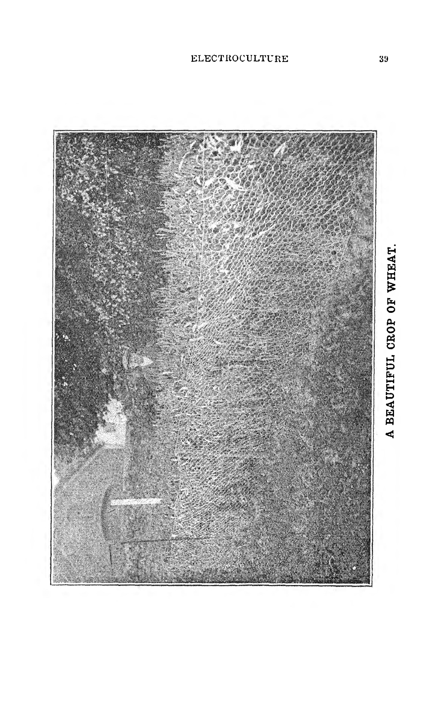

*[p. 20]*

---

### APLICACIÓN DE LA ELECTRICIDAD A LA VIDA VEGETAL

*[p. 22]*
**Por Mons. G. Blanchard**
*(Traducido del francés)*

El objetivo principal de la "ELECTROCULTURA" es dar a conocer a los agricultores algunas de las fuerzas de la naturaleza que pueden ser utilizadas ventajosamente.

Un inventor francés, el Sr. J. Christofleau, ha demostrado que no hay necesidad de abonos para fertilizar el suelo, y que la naturaleza, y la naturaleza sola, es lo suficientemente rica en sí misma para proporcionar el alimento necesario a la vida vegetal. Los rayos del sol, la lluvia, el nitrógeno del aire, la electricidad atmosférica transportada por las nubes, todos estos elementos pueden ser utilizados para ocupar el lugar de los abonos.

Si se utiliza abono para intensificar el crecimiento, no debe asumirse que los productos químicos tienen una influencia directa sobre la vegetación. Los hechos son: todos los cuerpos químicos, al descomponerse, desprenden una corriente eléctrica, y es a esta corriente eléctrica, debida a la descomposición de los abonos en el suelo, la que proporciona a la vegetación el fluido necesario para el intenso desarrollo de la planta.

Los elementos de la atmósfera aportan mucho más alimento a las plantas que el propio suelo, y esto refuerza nuestra afirmación de que si los fertilizantes químicos intensifican la producción, es porque su descomposición en el suelo **PRODUCE UNA CORRIENTE ELÉCTRICA QUE FORTALECE LA DE LA ATMÓSFERA.**

La captura de la electricidad atmosférica en beneficio del cultivo es, por lo tanto, un invento de la mayor importancia, y solo los escépticos se negarán a hacer uso de esta fuerza natural que no cuesta nada.

Para intensificar las cosechas, no se puede esperar que las fuerzas de la naturaleza por sí solas fertilicen el suelo. Deben ser capturadas, drenadas y dirigidas donde se necesiten, y esto es lo que el aparato del Sr. Christofleau hará.

Los resultados de la electrificación de los cultivos son muy notables:

1. En un campo que no fue abonado ni irrigado, pero influenciado por el aparato del Sr. Christofleau, se cosechó avena que medía 5 pies y 6 pulgadas (1,68 m). En otro campo, la avena creció hasta 7 pies (2,13 m) y era de excelente calidad.
2. El trébol cultivado en las mismas condiciones midió 5 pies y 8 pulgadas (1,73 m).
3. Las patatas se cultivaron en las mismas condiciones; las plantas tenían 6 pies y 8 pulgadas (2,03 m) de alto, cada planta producía de 30 a 35 tubérculos, cuyo peso variaba de 1 libra y 1 onza (0,48 kg) a 2 libras y 2 onzas (0,96 kg) cada una, y eran de calidad excepcional.
4. Las vides que estaban gravemente atacadas por la filoxera se curaron y rejuvenecieron hasta tal punto que, después de tres años de tratamiento con el aparato, estaban cargadas de enormes racimos de uvas muy dulces. (Cabe mencionar aquí que todas las uvas cultivadas con la ayuda de la electrocultura son mucho más dulces y tienen un sabor mucho más rico, además de ser más ricas en alcohol).

Las zanahorias crecieron hasta una longitud de 19 pulgadas (48 cm), las remolachas hasta 18 pulgadas (45 cm) y casi 17 pulgadas (43 cm) de circunferencia, y los tomates, judías verdes, espárragos, alcachofas y apio crecieron proporcionalmente.

En cuanto a los árboles frutales, los resultados son realmente asombrosos. Un viejo peral, tan viejo que apenas le quedaba corteza en el tronco y tenía pocas hojas, produjo una abundancia de peras como resultado de la electrocultura, algunas de las cuales pesaban hasta 1 libra (0,45 kg) cada una.

Lo anterior son solo algunas ilustraciones que muestran lo que se puede lograr sin el uso de abonos.

El aparato Christofleau no solo captura la electricidad atmosférica, sino que también forma una asociación de la electricidad positiva de la atmósfera con el magnetismo de la tierra, las corrientes telúricas.

El calor del sol, la lluvia, el viento e incluso las heladas, todos contribuyen a su vez a determinar o formar en el aparato una función que se transforma en electricidad. Todas estas acciones combinadas producen en las plantas una energía vital extraordinaria.

El aparato, que genera su propia electricidad sin costo alguno y que dura toda la vida de un hombre.

Mucho antes del Sr. Christofleau, se hicieron intentos del mismo tipo, pero los aparatos eran muy imperfectos y el costo era demasiado grande para una aplicación práctica.

El aparato Christofleau es una masa magnética que se coloca sobre un poste; la punta de acero se orienta hacia el Sur, y la cabeza hacia el Norte. La punta captura el magnetismo de la tierra, las corrientes eléctricas, mientras que la electricidad del aire es capturada por las antenas que están en la parte superior del aparato y apuntan hacia el cielo. Mediante una distribución de crestas y aletas, el sol, el frío, la helada, el viento y la lluvia aportan su contingente de fuerzas eléctricas que se distribuye al suelo por medio de un cable galvanizado.

Los numerosos parásitos que atacan a las plantas son destruidos y los efectos beneficiosos de la electricidad, que siempre viaja de Sur a Norte, a partir de la transformación química que proporciona a la vegetación los elementos necesarios para su nutrición y desarrollo.

Una vez fijado el aparato, no hay necesidad de intervenir, y permanece allí indefinidamente, y el primer gasto se ha hecho de una vez por todas, y el costo del abonado se minimiza, pues el suelo lo contiene. Los resultados seguirán aumentando, es decir, que el segundo año y los años siguientes serán mejores que el primero.

Las espigas de la cosecha serán más grandes y más llenas, las hojas de las verduras, los árboles frutales, las vides y otra vegetación comenzarán a ser más gruesas, más grandes y más verdes, la fruta será más grande y más numerosa, las verduras, como patatas, tomates, judías, etc., serán mucho más grandes y más abundantes.

Pero esto es solo el primer resultado, que sigue aumentando hasta el quinto o sexto año, cuando el suelo, que es entonces mucho más rico, hace que la vegetación sea más constante y más abundante y más rica en elementos útiles, como almidón, azúcar y alcohol. La fruta es más dulce y el sabor es mucho más pronunciado. Nunca puede haber fallo, siempre que el aparato esté correctamente orientado hacia la aguja de la brújula, es decir, Sur-Norte.

Deseamos superar el escepticismo y el prejuicio que los cultivadores a menudo manifiestan hacia los nuevos procesos científicos, y no anticipamos mucha dificultad en demostrarles las muchas ventajas del descubrimiento del Sr. Christofleau. A los cultivadores incrédulos y tímidos les aseguramos que incluso una prueba modesta los convencerá del extraordinario valor de las débiles corrientes atmosféricas y magnéticas para la vegetación.

Simplemente les pedimos que hagan una prueba de dos a seis aparatos en su tierra, teniendo cuidado de hacer la comparación junto a donde se ha colocado el aparato, es decir, junto a donde se ha enterrado el cable. El resultado del primer año demostrará clara y efectivamente el valor del método, y el aumento del rendimiento recompensará ampliamente el gasto de la prueba. Al año siguiente, complacidos con los maravillosos resultados, los experimentadores se convencerán plenamente de la eficacia del invento.

La electricidad atmosférica capturada por el aparato Christofleau se acumula en el suelo hasta que este se satura de ella. El primer año, la sobreproducción recompensa ampliamente, como se ha dicho antes, el costo de la instalación, y este aumento continúa año tras año hasta el quinto o sexto año; a partir de entonces, las cosechas, etc., se mantendrán estacionarias y de regularidad constante en cuanto a abundancia y calidad excepcional. El suelo habrá alcanzado su máxima capacidad de producción y se mantendrá en ese nivel. Se alcanza un rendimiento muy alto, a menudo de hasta el 100% o más, en comparación con los cultivos realizados con la ayuda de abonos artificiales.

Los estragos de la sequía se reducen en gran medida, y explicaremos por qué: como es necesario tener agua o lluvia para descomponer los fertilizantes en el suelo y así suministrar a las plantas la corriente necesaria para su vitalidad, el aparato Christofleau suministra esta corriente lentamente, pero de forma continua, y, por lo tanto, suple a la lluvia del mismo modo que suple a los fertilizantes. Asimismo, la vegetación que crece en un suelo electromagnético es inmune a la pudrición por lluvias intensas, ya que los gérmenes de la podredumbre no pueden desarrollarse cuando están en contacto con las corrientes eléctricas. (N.B. Esto debería, por lo tanto, eliminar por completo la "roya"). Se ha observado que los cultivos influenciados resisten mucho más victoriosamente los efectos de las heladas. La prueba de la acumulación de electricidad en el suelo me fue señalada por un electricista de renombre que, después de leer mis artículos sobre electrocultura, aplicó corrientes eléctricas de débil intensidad a unas aspidistras enfermas mediante una corriente eléctrica débil de solo unos pocos "miliamperios" en el suelo donde estaba la planta. Cinco días después de detener la corriente, notó que el suelo había retenido toda la electricidad que le había introducido, y la planta se había vuelto más verde bajo la benéfica influencia de este fenómeno.

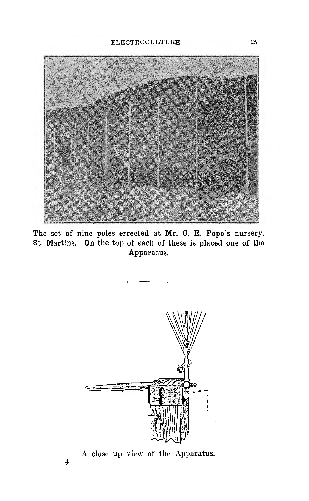

*[p. 25]*

*[p. 25]*

Se me ha señalado que las corrientes eléctricas industriales podrían producir los mismos resultados que la electricidad capturada por el aparato Christofleau. Se hizo esta comparación y la ventaja de la electricidad atmosférica fue manifiesta: las corrientes industriales no alcanzaban el rendimiento dado por el proceso electromagnético.

*[p. 26]*

¿Significa esto que la constitución y la calidad del fluido son diferentes en la corriente atmosférica y la corriente industrial? No, ciertamente no. Pero hay un punto en el que esencial e inmediatamente insistimos. Es sobre la extraordinaria diferencia que existe entre los efectos de las corrientes de **DÉBIL INTENSIDAD**, pero de aplicación continua, y aquellos de corrientes intensas, pero de aplicación limitada. Se han realizado experimentos utilizando corrientes de 110 voltios durante un tiempo limitado y renovando la aplicación cada día. Tal electrificación nunca ha podido mostrar un aumento de más del 25% al 30% en comparación con parcelas comparativas. Con el proceso Christofleau, sus efectos beneficiosos repercuten no solo en el desarrollo general de las plantas mismas, sino también, y especialmente, en el aumento del rendimiento y en el tamaño y la calidad excepcional de los cereales, verduras, frutas, tubérculos, vides, etc., que se vuelven más ricos en elementos útiles como almidón, azúcar, alcohol, etc., y aumentan no meramente un 25% o 30%, sino un 100% y un 200%, y a menudo más.

¿A qué se puede atribuir esta aplastante superioridad a favor del proceso Christofleau? Sin duda a estos tres factores esenciales:

1. La débil intensidad de la corriente.
2. Su aplicación continua.
3. Ciertamente a su acción magnética, que no podría ser suministrada por la electricidad industrial.

Todos los agricultores conocen el efecto benéfico de una lluvia constante, aunque sea ligera, en comparación con chaparrones intensos y cortos. La corriente atmosférica, el efluvio magnético, no cuestan nada, al igual que las corrientes suministradas por el aparato Christofleau, que son proporcionadas por el sol, la lluvia, las nubes, el viento y las heladas.

No hay absolutamente ninguna duda sobre los efectos beneficiosos de la electricidad atmosférica en la vegetación. Varios científicos lo han demostrado. El Abate Nollet en 1749, el Abate Bertholon en 1783, y un poco más tarde Spechnoff, un científico ruso, demostraron la influencia de la electricidad en la vegetación, y mediante su proceso, Spechnoff mostró un aumento del rendimiento del 100%. La idea nunca fue abandonada, y si los predecesores del Sr. Christofleau no pudieron poner sus ideas en práctica, fue debido a que sus aparatos eran demasiado complicados, susceptibles a los cambios de temperatura, de alto costo y no podían usarse económicamente. El éxito del inventor, el Sr. Christofleau, consiste en haber realizado un rendimiento máximo, haber acumulado en su aparato, además de la corriente atmosférica, las corrientes producidas por el sol, la lluvia, las nubes, el viento y las heladas, y haber hecho un aparato muy resistente, práctico, no susceptible a los caprichos de la temperatura, que dura para siempre y que no requiere atención ni mantenimiento.

La proximidad de una planta de radio inalámbrica no es perjudicial para la electrocultura, ni es necesario que el terreno a tratar sea llano, ya que puede ser ondulado y tener varias depresiones. **PERO UN HECHO ES MUY IMPORTANTE, Y ES QUE EL CABLE SEA DIRIGIDO DIRECTAMENTE AL NORTE CON LA BRÚJULA.** El único perjuicio podría ser cuando hay árboles, digamos, a menos de 100 yardas (91 m) al Sur del aparato, por la razón de que las corrientes eléctricas, que invariablemente viajan de Sur a Norte, serían interceptadas y, en consecuencia, interferirían con la eficiencia del aparato. En tales casos, sin embargo, el efecto no se anularía; tomaría un período comparativamente más largo para lograr su objetivo. Cualquier obstrucción, como árboles o edificios, al Norte, sin embargo, no influiría en el efecto de ninguna manera.

La electrocultura ha sido muy elogiada por muchos científicos, que han dado al inventor mucho ánimo, y hoy en día se considera uno de los descubrimientos más importantes de la época.

*G.B.*

---

### OPINIÓN DE LOS CIENTÍFICOS

*[p. 29]*

*Extracto de la **"Electro Revue"**, de enero de 1921. Artículo escrito y firmado por el célebre electricista, Dr. Foreau De Courmelles.*

"La idea de aumentar el rendimiento de la agricultura mediante el uso de la electricidad, es decir, empleando este fluido para activar el crecimiento de las plantas, no es nueva.

"Se realizaron algunos experimentos bastante exitosos en el siglo XVIII, cuando la ciencia hizo grandes progresos. Los Abates Nollet, Bertholon y Sans hicieron experimentos durante ese siglo. Citaré este pasaje de una conferencia que di el 28 de febrero de 1893, en la fiesta anual de la Sociedad Hortícola de Picardía, en Amiens: 'Si la planta es neurasténica, es decir, carente de vigor, aunque no esté realmente enferma, la electricidad le será de gran beneficio, al igual que lo es para los seres humanos.'

"Se hizo un experimento en dos campos idénticos, plantados con la misma vegetación, mediante cadenas metálicas que atravesaban uno de los campos y por las que se formaban corrientes eléctricas oxidantes. El crecimiento de las plantas en el campo electrificado fue más considerable que en el otro campo. Conociendo los felices resultados que he obtenido mediante la aplicación de la electricidad a las enfermedades humanas, no me sorprendió, por tanto, este resultado. Para volver, por tanto, al método que debe aplicarse a las plantas enfermas y neurasténicas y a los seres humanos, el remedio está encontrado, a saber, la electrificación de la vegetación morbosa.

"El Abate Bertholon ya demostró esta cura hace mucho tiempo. Se han hecho muchos experimentos con electricidad en la vegetación desde el siglo XVIII. En esta era en que, debido a la subproducción, el costo de vida es tan caro, cualquier sugerencia que aumente el rendimiento de nuestros recursos naturales debería ser publicada, fomentada y puesta en uso práctico. Es, por lo tanto, placentero para mí discutir el trabajo de uno de los lectores de la 'Electro Revue', M. Justin Christofleau, quien conoce y cita el trabajo de sus predecesores, los Abates Nollet y Bertholon.

"El Abate Nollet, quien fue el tutor de Luis XVI, anunció al mundo que la electricidad contribuía a la **EVAPORACIÓN DEL SUELO**, facilitaba la germinación de las semillas y aumentaba la aceleración ascendente de la savia en la vegetación.

"El Abate Bertholon, quien también trató enfermedades humanas por medio de la electricidad, inventó el 'Electro-vegetómetro' para probar su acción en la vida vegetal. En 1900, el Hermano Paulin, Director de la Sociedad Agrícola de Beauvais, llevó a cabo algunos experimentos muy exitosos en Montbrison. Finalmente, M. Grandeau estableció el hecho de que la nitrificación de los productos del suelo a través de la vegetación se debía a la electricidad atmosférica.

"Los productos nitrogenados toman del aire flotante y del fluido eléctrico los elementos de sus transformaciones; esto es innegable y se utiliza hoy en día industrialmente.

"Estando bien versado en los hechos anteriores y siguiendo las leyes del magnetismo terrestre, M. Justin Christofleau ha inventado y puesto en uso práctico un aparato muy simple, que captura las corrientes telúricas, esas corrientes terrestres que dirigen la aguja de la brújula para indicar el Norte y el Sur. Este aparato se coloca sobre un poste de madera de 20 pies (6 m) de alto (al menos) y se coloca estrictamente según la dirección de la aguja de la brújula; las partes boreal y austral llevan las antenas Norte y Sur, de modo que la corriente magnética que viaja de Norte a Sur es capturada en su paso por las antenas del aparato. Un cable galvanizado conduce esta electricidad al suelo. El aire flotante, que está electrificado, electrifica también la punta de las antenas, y esta electricidad, que sigue el mismo curso que la corriente terrestre, añade su acción en las profundidades del suelo. El resultado es excelente, y esto no es sorprendente, y no queda más que propagar el invento. Esta doble electricidad no tiene límite; se pueden así recolectar los fluidos terrestres y aéreos por millas y millas y duplicar la producción sin aumentar el trabajo manual."

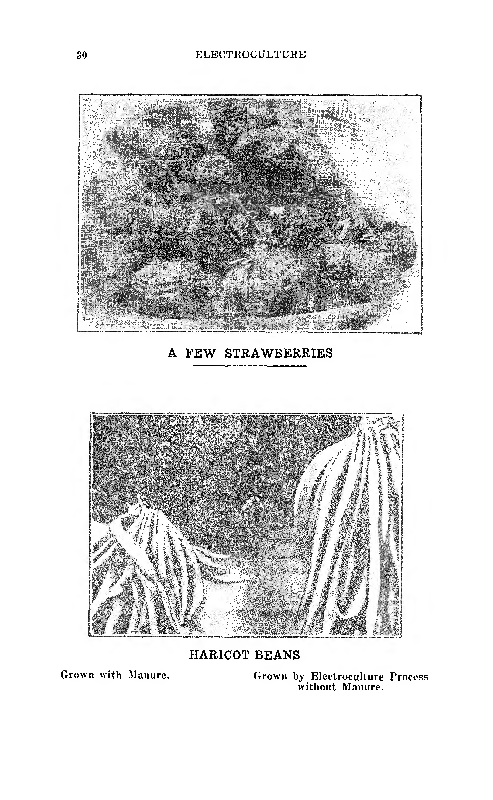

*[p. 30]*

---

### INFORMES OFICIALES

*[p. 31]*

**Experimentos realizados en la Institución de Agricultura de Metz con el aparato de electrocultura.**

**REPÚBLICA FRANCESA**

El Director de la Estación Agrícola de Metz,

Metz, 5 de agosto de 1921.

A M. J. Christofleau:

En respuesta a su carta del 26 de julio, tengo el honor de adjuntar los informes sobre los resultados de las pruebas realizadas con su aparato por M. Sabatier, **QUÍMICO PRINCIPAL**, en la Estación de Agricultura de Metz.

Sírvase aceptar, Señor, mis saludos.

*(Firmado)* El Director de la Estación Agrícola de Metz.

---

**INFORME DE M. SABATIER**
Ingeniero Agrícola y Químico Jefe de la Estación de Agricultura de Metz.

**Experimento de Electrocultura con el Aparato Christofleau.**

**1. Sobre Árboles Frutales.** — Hemos observado una vegetación más intensa por la acción del aparato sobre un albaricoquero enfermo. La enfermedad se debía a un parásito fúngico que ha desaparecido por completo, y durante el mes de agosto notamos numerosos y muy vigorosos brotes nuevos. La fructificación fue forzosamente mediocre, pues todos los árboles frutales habían sido atacados por una helada negra de 6 grados cuando los árboles estaban en flor.

**2. Sobre Hortalizas.** — Un campo de judías verdes se dividió en dos partes. Una fue sometida a la acción del aparato de electrocultura, la otra sirvió como parcela comparativa; el abonado de las dos parcelas fue idéntico. Bajo la acción del proceso Christofleau, las judías verdes resistieron el tiempo seco; el crecimiento siempre se mantuvo regular y se pudo notar un crecimiento uniforme en toda la parcela influenciada. La parcela comparativa no pudo resistir la intensa sequía que tuvo lugar en el mes de julio. Los tallos de las judías en esa parcela se volvieron completamente amarillos y la cosecha se redujo considerablemente. La parcela de tierra donde se instalaron los aparatos Christofleau produjo **TRES VECES** la cosecha de la parcela comparativa.

Estos experimentos merecen la atención de los agricultores, horticultores, arboricultores y viticultores. Sin embargo, deben continuarse durante dos o tres años en diferentes cultivos para mostrar su acción sobre la vegetación en general y sobre la fructificación de los árboles frutales en particular.

---

### OPINIÓN DE LA PRENSA

*[p. 32]*

*Extracto del periódico **"Agriculture de Touraine"**, 26 de mayo de 1921.*

**UN PROGRESO INMENSO EN AGRICULTURA — ELECTROCULTURA.**

El trabajo de los científicos y la experiencia adquirida por ellos a lo largo de los años ha demostrado que cuando una calamidad afecta a la humanidad, la Naturaleza viene en ayuda de la humanidad con alguna ayuda natural u otra para combatir esta calamidad.

El espantoso cataclismo que recientemente ha barrido todo el mundo ha tenido una larga secuencia de consecuencias muy desafortunadas, y entre esas consecuencias desafortunadas hay una que es particularmente grave, ya que afecta a millones de individuos que están aplastados, por así decirlo, por su enorme peso.

**EL ALTO COSTO DE LA VIDA.** Es necesario, por lo tanto, combatir este mal. Se han sugerido muchos medios diversos y, hasta ahora, los resultados han sido extremadamente escasos. Solo hay una forma de remediar este mal: **LA INTENSIFICACIÓN DE LA PRODUCCIÓN DE AQUELLAS COSAS QUE SON NECESARIAS PARA LA VIDA.**

El problema, por lo tanto, es este: **AUMENTAR LA PRODUCCIÓN DEL SUELO, DISMINUYENDO ASÍ EL COSTO DE IMPORTACIÓN, QUE LASTRA LOS RENDIMIENTOS DE LOS AGRICULTORES.**

**LA SOLUCIÓN SE ENCUENTRA EN LA ELECTROCULTURA.**

La electrocultura es una ciencia antigua. Durante siglos, los científicos habían descubierto que esta misteriosa fuerza de la electricidad estaba conectada a la vida de los hombres, de los animales y de las plantas, y habiendo notado sus efectos en los cuerpos animados, la han aplicado en beneficio de la vegetación. Muchos inventores han aplicado la electricidad al desarrollo de las plantas y todos han obtenido resultados impresionantes y concluyentes. Era, por lo tanto, un hecho establecido desde hace mucho tiempo que la electricidad influía en la vida de las plantas y las desarrollaba, pero nadie había encontrado los medios y las formas de aplicar este principio de manera práctica hasta que uno de nuestros compatriotas, un investigador incansable (que durante el grave período de la guerra prestó muchos servicios a la Defensa Nacional), después de muchos años de trabajo experimental y ensayos, ha resuelto esta dificultad de manera tan efectiva por los sorprendentes resultados que ha obtenido que ha patentado un sistema de electrocultura que es para la agricultura lo que la telegrafía sin hilos es para la telegrafía aérea de Chappe.

La electrocultura ha nacido, y la agricultura debe su genial aplicación a M. Justin Christofleau. **EN EL FUTURO, LA NECESIDAD DE ABONOS QUÍMICOS PARA FERTILIZAR NUESTRA TIERRA SE REDUCIRÁ EN GRAN MEDIDA.** Hasta ahora, todos los inventores habían presentado diferentes sistemas que sin duda eran eficaces, pero eran inaplicables por ser demasiado complicados. M. Christofleau ha inventado un pequeño y simple aparato que, colocado en un extremo de un campo, captura las corrientes atmosféricas que combina con las corrientes telúricas, las cuales, al entrar en contacto, son transportadas por un cable galvanizado al suelo, donde depositan sus efectos beneficiosos, multiplicando de manera increíble la cantidad y calidad de las cosechas.

---

*10 de octubre de 1926. **"The Brisbane Daily Mail"**.*

**HAMBRE MUNDIAL; Reducción de Cosechas.** — Sir Daniel Hall, Asesor Científico Jefe y Director General del Departamento de Inteligencia del Ministerio de Agricultura, hablando ante la Asociación Británica, presagió el espectro de una gran hambruna cuando los campos de trigo del mundo no pudieran alimentar a los pueblos multiplicados.

Sir Daniel dijo que la buena tierra ya era escasa, lo que obligaba a la ganadería lechera alternando con la agricultura en Australia y Sudáfrica. La población mundial consumidora de trigo aumentaba en 5.000.000 por año, lo que exigía encontrar 12.000.000 de acres de tierra adicional, mientras que, por el contrario, había habido una reducción en la superficie de muchos cultivos desde la guerra. Los pueblos blancos podrían verse forzados al teetotalismo y al vegetarianismo, pero las razas que omiten la carne y el alcohol para multiplicarse son los tipos esclavos permanentes, diseñados para funcionar como abejas obreras.

La agricultura había perdido sus mejores cerebros debido a los bajos rendimientos que producía. El éxodo del campo a la ciudad progresaba en todas partes. La superpoblación y el desempleo eran realidades terribles, **Y LA ÚNICA ESPERANZA DE LA HUMANIDAD ERA INTENSIFICAR CIENTÍFICAMENTE EL CULTIVO DE LA TIERRA EXISTENTE.**

---

*Extracto del periódico **"L'Homme Libre"**, 20 de febrero de 1921. Artículo escrito por M. Fernand Hure.*

"Si alguien nos dijera: 'Ya no hay necesidad de carbón, de petróleo, no hay necesidad de aceite lubricante para ayudar al funcionamiento de la maquinaria en las fábricas; no hay más necesidad de fertilizantes para el cultivo', nos inclinaríamos a pensar que es un milagro. Sin embargo, es una realidad. En el pueblo de La Queue-les-Yvelines, cerca del bosque de Rambouillet, hemos visto a M. Christofleau, un trabajador incansable perteneciente a esta rara elite, que trabaja tranquila y silenciosamente.

"M. Christofleau (que también ha inventado una turbina aérea capaz de evitar el uso de carbón vegetal y que presentó al Gobierno francés durante la guerra), trabajando sobre las leyes del magnetismo terrestre, ha inventado un aparato que captura la electricidad del aire y la extiende en el suelo, donde contribuye a la formación de productos nitrogenados.

"Su aparato, que ha sido patentado en todo el mundo bajo el nombre de 'Electro-magnético-terro-celestial', es extremadamente simple, y su efecto sobre la vegetación es realmente maravilloso. Los cereales, verduras, vides, árboles frutales, crecen con un vigor extraordinario asimilando rápidamente las sustancias nutritivas del suelo. Esto significa que estamos en vísperas de una revolución total de nuestros métodos actuales de cultivo.

"El Abate Moreux, Director del Observatorio de Bourges, afirma que el aparato impartirá rendimientos extraordinarios a las plantas que se sometan a su influencia.

"El precioso fluido eléctrico puede usarse por millas y millas, formando prácticamente una inmensa red magnética dentro de la cual perecen los microbios y parásitos malévolos. Las vides tratadas por el proceso de M. Christofleau son inmunes a la filoxera y al mildiu.

"¿No es esto, por lo tanto, una fuente de inestimables riquezas para la agricultura? M. Christofleau ha cumplido con su deber para con la humanidad. Nosotros cumplimos humildemente el nuestro llamando la atención sobre su trabajo."

---

*Extracto de **"La Science du Ciel"**. Artículo periodístico escrito por el Abate Moreux.*

"Este problema no es nuevo, y entre los experimentos que se han realizado para resolverlo, debo citar al Abate Nollet, quien fue el primero en notar la influencia de la electricidad en la vegetación. En 1783, el Abate Bertholon observó la acción de la electricidad atmosférica en la vegetación en una de sus obras, e hizo una aplicación práctica de ella con la ayuda del 'Electro-vegetómetro'.

"Hacia 1900, el Hermano Paulin, Director del Instituto Agrícola de Beauvais, hizo experimentos exitosos en Montbrison, que causaron gran sensación. Más recientemente aún, M. Grandeau, el científico agrícola, ha establecido que la electricidad tenía una influencia notable en la nitrificación de los productos del suelo a través de la vegetación.

"Siguiendo los experimentos antes mencionados, M. Christofleau, que también es el inventor de una turbina aérea de una capacidad de 15.000 caballos de fuerza, ha inventado un aparato que ha denominado 'Electro-magnético-terro-celestial', que captura la electricidad del aire para extenderla en el suelo, donde contribuye a la formación de productos nitrogenados. Es de gran importancia dirigir el aparato SUR-NORTE, el puntero de acero hacia el SUR y el cable subterráneo hacia el NORTE. Es suficiente que el cable subterráneo se coloque en el suelo a unas dos pulgadas (5 cm) por debajo del paso del arado. Los postes sobre los que se asegura el aparato deben colocarse a una distancia de 10 pies (3 m).

"Desde hace algún tiempo, el uso del aparato de M. Christofleau se ha desarrollado enormemente, y parece que todos elogian el invento que proporciona a la vegetación sometida a la influencia de la electricidad así capturada **RENDIMIENTOS EXTRAORDINARIOS**. Nuestros lectores interesados en la agricultura nos agradecerán haberles llamado la atención sobre esto."

---

### LISTA DE PERIÓDICOS QUE HAN COMENTADO FAVORABLEMENTE EL PROCESO AGRÍCOLA CHRISTOFLEAU

*[p. 37]*

- "La Nature," 28 de marzo de 1921.
- "Le Bonhomme Normand," 1 de abril de 1921.
- "La Belgique Productrice," 1 de abril de 1921.
- "Le Sud Marocain," 7 de abril de 1921.
- "La Vallée d'Aoste," 9 de abril de 1921.
- "Le Paysan de France," 10 de abril de 1921.
- "Le Revue Économique de Tours," 16 de abril de 1921.
- "La Défense Agricole de la France et du Perche," 4 de junio de 1921.
- "L'Union Catholique de Rodez," 16 de agosto de 1921.
- "Le Radical de Paris," 7 de septiembre de 1921.
- "La Démocratie Nouvelle," 30 de julio de 1922.
- "Le Pionnier," junio de 1922.
- "Le Chasseur Français," 22 de febrero de 1923.
- "L'Électricien," 15 de abril de 1923.
- "Le Magasin Pittoresque," 15 de abril de 1923.
- "Le Paysan de l'Yonne," 10 de mayo de 1923.
- "La Revue Mondiale," 15 de mayo de 1923.
- "Le Petit Inventeur," 12 de junio de 1923.
- "L'Aube Nouvelle," 30 de junio de 1923.
- "Le Soir de Bruxelles," 15 de junio de 1923.
- "Le Pionnier," enero de 1923.
- "Almanach du Petit Parisien," junio de 1924.
- "L'Homme Libre," 23 y 27 de julio de 1924.
- "L'Excelsior," julio de 1924.
- "The Times" (edición de París), 3 de agosto de 1924.
- "Le Fermier," 11 de agosto y 30 de octubre de 1924.
- "L'Indépendant de Rambouillet," 15 de agosto de 1924.
- "L'Industrie Naturelle Belge," 21 de agosto de 1924.
- "L'Almanach du Petit Haut-Marnais," 1925.
- "L'Oeuvre," 2 de marzo de 1924.
- "Le Petit Parisien," 2 de noviembre de 1924.
- "L'Intransigeant," 3 de noviembre de 1924 y 1 de febrero de 1926.
- "Berlin Tageblatt," 16 de noviembre de 1924.
- "Le Matin d'Anvers," 20 de noviembre de 1924 y 28 de diciembre de 1924.
- "The World Magazine," 22 de marzo de 1925.
- "Lokal Anzeiger," 8 de abril de 1925.
- "Der Blitz," 21 de mayo de 1925.
- "Le Revue Mondiale," 15 de julio de 1925.
- "The Popular Science Magazine," junio de 1925.
- "Primary Producers' News," Sydney, 21 de enero de 1927.
- "Primary Producer," Perth, 10 de febrero de 1927.
- "Sunday Times," Perth, 13, 20, 27 de junio de 1926.
- "Truth Newspaper," Perth, 16 de julio de 1927.
- "West Australian," Perth, 7 de julio de 1927.
- "Mirror," Perth, 23 de julio de 1927.
- "Otago Daily Times," Nueva Zelanda, abril de 1927.
- "Timaru Herald," Nueva Zelanda, abril de 1927.
- "Lyttelton Press," Nueva Zelanda, 5 de marzo de 1927.
- "World's News," Sydney, 15 de enero de 1927.
- "Recorder," Australia del Sur, 11 de diciembre de 1926.

---

### NOTAS VARIAS

*[p. 38]*

En lugar de cultivos alternos en los centros trigueros donde la lluvia es escasa, debe practicarse el barbecho cada dos años. Mientras el suelo descansa, el aparato nunca está inactivo, sino que deposita constantemente electricidad y materia fertilizante en el suelo, y continúa su trabajo al año siguiente mientras el cultivo crece, funcionando así perpetuamente. Después de tres años, se pueden cosechar cultivos cada año, siempre que se permita que el suelo descanse un año cada cinco o seis años.

Es evidente que no hay un solo hombre vivo hoy que pueda explicar por qué la electricidad hace crecer las plantas, porque nos enfrentamos aquí al gran misterio de la vida: solo podemos notar los efectos que la electricidad tiene sobre la vegetación. Las plantas son más fuertes, más sanas, más vigorosas, más verdes; las cosechas rinden más, las espigas son más grandes y más llenas, las verduras y frutas más grandes, más tempranas, más numerosas. En cuanto a las transformaciones químicas que tienen lugar en el suelo por la acción de la electricidad, debemos, en lo que respecta a la ciencia en su estado actual, contentarnos con observar los resultados beneficiosos y aprovecharlos. Si algún día se explica este misterio, tanto mejor.

1. Debido a los cambios de la electricidad del aire con la electricidad de la tierra, se crean vibraciones que los pequeños insectos no pueden resistir.
2. Las plantas, al asimilar la electricidad, son mucho más vigorosas y, más tarde, cuando el suelo se vuelva más impregnado de electricidad, resistirán más victoriosamente todas las enfermedades y parásitos que puedan atacarlas.

Alemania ha ofrecido en vano 12 millones de francos por los derechos mundiales del aparato del Sr. Christofleau.

Al unir los extremos del cable, es aconsejable empalmarlos muy apretadamente durante unas 15 o 16 pulgadas (38-40 cm) y soldar los extremos para asegurar que no haya fugas.

Cuanto más alto esté el poste sobre el suelo, mejores serán los resultados.

Con la ayuda de los agricultores, una nueva era de prosperidad se acerca rápidamente y pronto se extenderá por toda la Commonwealth, y eventualmente por todo el mundo.

Todo lo cultivado mediante electrocultura es más saludable para el consumo humano y para la salud general del público.

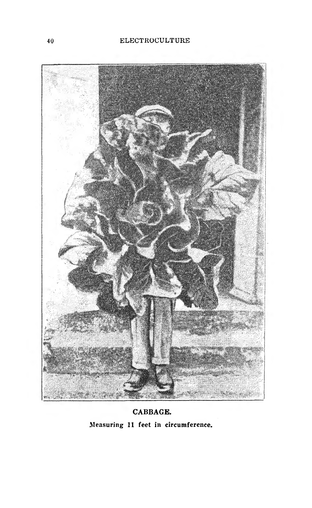

*[p. 40]*

El agricultor sabio y progresista reconocerá fácilmente las virtudes del proceso de electrocultura y no perderá tiempo en instalar el aparato.

Todo lo cultivado mediante el proceso de electrocultura se acelera y, en consecuencia, se beneficiará de un mercado temprano.

Cuando se va a electrificar un terreno, la operación es muy simple. Mediante una brújula, se establecen correctamente las direcciones Sur-Norte; esto es muy importante, ya que el magnetismo terrestre viaja de Sur a Norte. El aparato se coloca entonces con el puntero directamente al Sur, para capturar las corrientes telúricas, y el cable colocado en el surco directamente al Norte, capturando así el magnetismo terrestre (corrientes terrestres).

El aparato influirá en una franja de terreno de 14 pies (4,3 m) de ancho, Este y Oeste, y una distancia ilimitada de Sur a Norte.

El cultivador no debe decepcionarse si toda la franja de 14 pies no está electrificada el primer año. La influencia se extenderá gradualmente año tras año a medida que más electricidad se acumule en el suelo.

Las plantas, al asimilar la electricidad, son mucho más vigorosas y, por lo tanto, más adelante, cuando el suelo se vuelva más impregnado, resistirán las heladas y muchas enfermedades que puedan atacarlas de manera mucho más victoriosa.

El proceso Christofleau es el único proceso conocido que combina las corrientes telúricas (magnetismo terrestre) con la electricidad positiva de la atmósfera.

El cable subterráneo puede llevarse por millas y millas en dirección debidamente Norte de una propiedad a otra.

Existen muchos tipos diferentes de electrocultura que utilizan electricidad industrial, que se introduce en el suelo en grandes cantidades, generalmente de 110 voltios durante cuatro horas continuas. Luego se apaga la corriente y se renueva al día siguiente. Los experimentos han demostrado que si esta intensidad de electricidad industrial se introdujera en el suelo durante más de cuatro horas, quemaría y destruiría la vegetación.

Desde el punto de vista de un agricultor, el Sr. Christofleau compara este proceso con un fuerte aguacero de corta duración. Después de muchos años de investigación en su laboratorio, ha logrado, mediante su aparato, capturar la electricidad positiva de la atmósfera, drenarla e introducirla en el suelo de manera débil pero continua, lo que compara con una lluvia ligera de larga duración.

Los procesos industriales nunca han mostrado más del 35% de aumento en la producción.

El rendimiento casi increíble obtenido por el proceso Christofleau se debe a la débil corriente de electricidad atmosférica que se introduce en el suelo, junto con su combinación con el magnetismo terrestre.

El cable del aparato en el surco puede llevarse cuesta arriba y cuesta abajo, siempre que la línea siga siendo directamente al Norte; puede llevarse sobre un arroyo o río expuesto, y el cable volver a enterrarse al otro lado y continuar en el surco como antes. En el caso de un drenaje pequeño, el cable puede pasarse a través de un tubo de barro pequeño.

A medida que el suelo se vuelve más impregnado de la riqueza que el aparato introduce en él, las cosechas aumentan durante el primer, segundo, tercer y cuarto año; entre el quinto y sexto año, el suelo habrá alcanzado su máxima capacidad de producción, y las cosechas se mantendrán en su punto más alto, y no disminuirán mientras no se retire el aparato.

Se recomienda al cultivador usar abono el primer año, como si el aparato no estuviera allí. El segundo año, el cultivador puede optar por usar o no abono. Después del segundo año, no es necesario usar más abonos. Los primeros resultados se verán por el follaje, que adquiere un verde mucho más oscuro, y las hojas se volverán más grandes y gruesas, debido a la mayor cantidad de productos nitrogenados que se introducen en el suelo.

La electricidad atmosférica corre en estratos o capas separadas en el aire, cada una en un plano diferente, una sobre otra. Cuanto más altas están las capas del suelo, mayor es el voltaje en ellas. Estas corrientes, que son corrientes positivas, pasan continuamente de un lado a otro en su propio plano particular. El puntero perpendicular y los cables aéreos del aparato sirven como conductores para pasar esta corriente atmosférica positiva a la corriente negativa en el suelo. Es obvio que cuanto más alto esté el poste sobre el que se coloca el aparato, más electricidad se captura.

Todo lo cultivado por electricidad es más saludable para el consumo humano.

Con la ayuda de los agricultores, una nueva era de prosperidad se acerca rápidamente y pronto se extenderá por toda Australasia, y eventualmente por todo el mundo.

Se recomienda pintar el poste sobre el que se coloca el aparato para preservar la madera, teniendo cuidado de que no se ponga pintura sobre el aparato mismo ni sobre el cable.

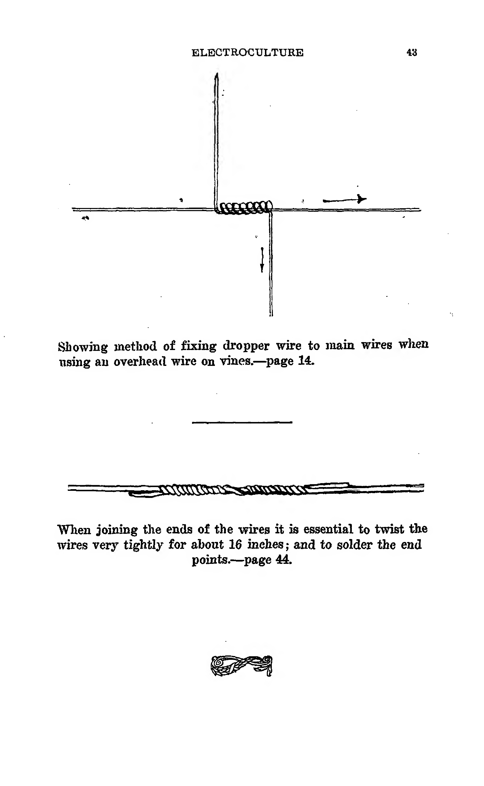

*[p. 43]*

Al unir los extremos de los cables, es esencial retorcerlos muy apretadamente durante unas 16 pulgadas (40 cm) y soldar los puntos de los extremos.

---

### PUNTOS A RECORDAR

*[p. 44]*

Si tiene dudas sobre algunos puntos, no dude en consultarlas. Sus preguntas serán respondidas completamente a su debido tiempo por su Agente local.

El aparato puede instalarse en cualquier momento, cuanto antes mejor.

La electrocultura **ENDULZARÁ Y REJUVENECERÁ RÁPIDAMENTE** la tierra que se ha vuelto agria por el cultivo constante, y mantendrá el suelo bien aireado.

No es aconsejable esperar a que la cosecha esté sembrada antes de instalar el aparato. Cuanto más tiempo haya estado instalado, más electricidad se habrá introducido en el suelo.

Entre el quinto y el sexto año, el suelo habrá alcanzado su máxima capacidad de producción y permanecerá siempre en ese nivel.

El aparato no debe retirarse.

El cultivador no debe decepcionarse si no se electrifica toda la franja de 14 pies (4,3 m) el primer año. La influencia se extenderá gradualmente año tras año a medida que más electricidad se acumule en el suelo.

Al unir los extremos de los cables, es esencial empalmar los cables muy apretadamente durante unas 16 pulgadas (40 cm) y soldar los puntos de los extremos.

El proceso de electrocultura de M. Christofleau tiene un efecto realmente maravilloso en las flores. Las flores aumentan considerablemente y son de un tamaño notable; el perfume es mucho más pronunciado, y el follaje adquiere un verdor mucho más rico.

En cualquier empresa comercial, el objetivo es obtener el máximo de resultados con el mínimo de trabajo y gasto. Tenga en cuenta que este objetivo se alcanzará utilizando el proceso de electrocultura de M. Christofleau.

Cuando los agricultores se familiaricen más con la influencia de la electricidad en el cultivo y la vegetación, se darán cuenta de sus múltiples e inmensas ventajas.

Los resultados obtenidos en el primer año de instalación del aparato eliminarán este velo de duda que oscurece las mentes de los escépticos y los tímidos. Al final del segundo año, cuando los resultados sean aún más manifiestos, el agricultor se dará cuenta de que la electrocultura ha marcado el amanecer de una nueva era en la agricultura.

---

### TESTIMONIOS

*[p. 45]*

**Experimento realizado por M. Roger Claret en su propiedad en Fleury d'Aube (Aube).**
*(Testimonio del Oficial del Municipio)*

En el año 1922, el 16 de septiembre, yo, J. Boyer, Oficial del Tribunal Civil de Narbona, y allí residente, a petición de M. Roger Claret, propietario en Fleury d'Aube, quien me ha certificado: Que el 1 de abril de 1922 instaló en uno de sus viñedos, en el lugar llamado "Les Prés", 28 aparatos de electrocultura inventados por M. Christofleau. Que como resultado de la influencia de dichos aparatos, las cosechas que actualmente están en la tierra electrificada son muy hermosas, y me solicitó visitar su propiedad antes de la retirada de dichas cosechas, para constatar: 1.º, los resultados obtenidos por el uso de dichos aparatos; 2.º, constatar la diferencia de las cosechas con las parcelas comparativas, que eran del mismo suelo, la misma variedad de vides y que fueron plantadas al mismo tiempo.

Yo, J. Boyer, en deferencia a esta solicitud, visité dicha propiedad y he constatado: 1.º, que en una parte de esta muy extensa propiedad plantada con vides, M. Claret ha instalado 28 aparatos inventados por M. Christofleau; 2.º, la vegetación es soberbia, los brotes son muy largos, grandes y abundantes, las hojas son muy verdes, grandes y bien desarrolladas; 3.º, la cosecha en la tierra electrificada es muy grande; en numerosas vides he contado 35 racimos de uvas grandes, las bayas eran muy apretadas y muy largas; 4.º, esta cosecha es muy regular y superior a la de las parcelas comparativas que habían sido abonadas. La tierra electrificada no había sido abonada; 5.º, novecientas veinticuatro vides de la tierra electrificada, que fueron cosechadas en mi presencia, produjeron 100 "comportes"* de uvas y las 2.274 plantas habrían producido más de 300 comportes; 6.º, en las otras parcelas comparativas de tierra que no fueron sometidas a la acción de dichos aparatos, M. Claret ha declarado que 2.000 vides habían producido 199 comportes de uvas.

Se verá que el rendimiento de la tierra que fue sometida al tratamiento electromagnético fue superior al de la tierra comparativa. M. Claret declaró que las comportes habían sido llenadas y prensadas por la misma persona y de la misma manera.

Y de todo lo anteriormente expuesto, he firmado la presente declaración.

*(Firmado)* **J. BOYER**, Oficial, Narbona.

*Una "comporte" es un pequeño barril de madera utilizado para transportar la vendimia.

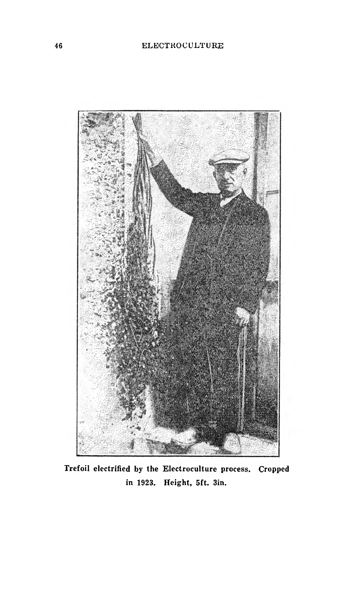

*[p. 46]*

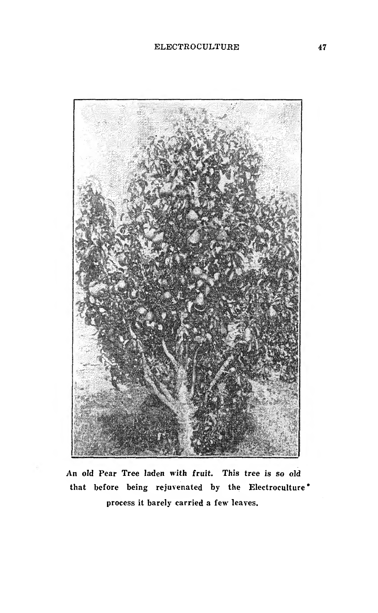

*[p. 47]*

---

**Oakdale, via Camden, 4 de enero de 1927.**

*[p. 48]*

A Tylors (Australia) Limited,
13 Bridge Street,
SIDNEY.

Estimados Señores:

Les escribo para contarles los resultados más satisfactorios que he obtenido de dos Aparatos de Electrocultura Christofleau. Hace doce meses, en una franja de tierra en la que hasta ahora nunca había podido cultivar maracuyá con éxito y, como planté maracuyá de nuevo, pueden ver que sometí el aparato a una prueba severa. Planté hileras comparativas de vides junto a las buenas tierras y aboné bien esas hileras.

La primera diferencia que noté fueron las hojas verdes y saludables que aparecieron en las vides electrificadas, y también el mayor crecimiento, aunque apenas tuvimos lluvia, y solo en invierno, que no es buena para las vides de maracuyá. Ahora, después de 12 meses, la diferencia es muy marcada. Las hileras electrificadas de vides no solo son más saludables, con hojas más grandes y verdes, sino que la cantidad de fruta es al menos el doble que en las hileras no electrificadas, y la fruta es mucho más grande.

Espero resultados aún mejores a partir de ahora, ya que hemos tenido buenas lluvias. Estoy seguro de que estos buenos resultados se deben a la influencia del aparato. Sé que la gente es escéptica, y se rieron de mí cuando instalé el mío por primera vez, pero ahora recibo visitantes de todas partes, y estoy seguro de que los convenzo a todos antes de que se vayan de mi granja de que la Electrocultura no es una broma.

Le he escrito al Sr. Christofleau sobre mi éxito, y pronto podré pedirle más aparatos, y sé que la Electrocultura está haciendo por mi cosecha todo lo que su folleto afirma que debería hacer.

Deseándoles todo el éxito.

Atentamente,
*(Firmado)* **HARRY LOVELL.**

---

**Steere Street, COLLIE, 11/1/27.**

Al Sr. Alex. Trouchet.

Estimado Señor:

Habiendo instalado uno de los Aparatos de Electrocultura del Sr. Christofleau, me complace informar que he tenido resultados muy gratificantes. Puedo decir con seguridad que he ganado más de tres semanas en la maduración de mis tomates, que planté en tierra tratada por el Aparato. La fruta madura uniformemente y es grande y de excelente sabor.

También he notado que tenía un melocotonero y un nectarino que durante tres años han estado en un estado deplorable con enfermedad de la hoja (abolladura), y desde que instalé el Aparato ha desaparecido por completo. No puedo atribuirlo a otra causa que no sea la Electrocultura; nunca he fumigado ni abonado los árboles desde que fueron plantados. El Aparato se instaló en julio de 1926.

También he notado resultados muy beneficiosos en las plántulas de tomates y lechugas plantadas bajo la influencia del Aparato. Estoy completamente satisfecho de los resultados en plantas comparativas que están prácticamente en la misma clase de terreno, que en dos cosechas separadas de tomates el resultado ha sido idéntico, y los que están bajo la influencia son mucho más grandes y una clase de fruta totalmente superior.

He hablado con el Sr. Bevan, de Allanson, y él también está muy contento con los resultados de una cosecha de guisantes que sembró, y aunque era en arena pobre, usó superfosfato como abono, y dijo que estaba asombrado por el crecimiento y la productividad de la cosecha que fue influenciada por el cable; la parcela comparativa, con el mismo abono, en el mismo tipo de suelo pobre, no dio ni de lejos la cosecha tratada por Electrocultura. El Sr. Bevan tiene la intención de escribirle pronto, y sin duda le complacerá recibir su carta.

Visité a un Sr. J. Sykes, de Allanson, y me mostró algunas vides donde había instalado uno de los Aparatos, y aunque sus vides fueron plantadas al mismo tiempo, hace dos años, hay un crecimiento maravilloso en las vides cerca de donde está enterrado el cable del Aparato. Con una o dos excepciones, ninguna de las vides más alejadas del cable se les acerca en longitud de madera.

Deseándole la mejor de las suertes.

Atentamente,
**JOHN McCAUGHAN.**

**TESTIGO:**
H. Whiteaker, Juez de Paz,
Collie, W.A., 11 de enero de 1927.

---

**La Queue-les-Yvelines, 20 de julio de 1923.**

*[p. 49]*

Yo, el infrascrito, G. Etoc, concejal municipal, comerciante de productos en La Queue-les-Yvelines, declaro por la presente que durante los últimos cinco años he comprado cada año la cosecha de avena cultivada en un campo muy pequeño perteneciente a M. J. Christofleau. La producción de este pequeño campo ha aumentado cada año, y esta cosecha, que era solo de 120 a 150 gavillas, ha aumentado este año a 275 gavillas, más 25 gavillas que fueron retenidas por M. Christofleau, dando por lo tanto un total de 300 gavillas. La avena era de espléndida calidad. ¡Las cosechas se duplicaron desde que M. Christofleau vive en esa propiedad!

*(Firmado)* **G. ETOC.**

Testigo de la firma de M. Etoc:
**A. JOULAIN.**
(Sello del Municipio).

---

**Montfort L'Amaury, 27 de septiembre de 1923.**

M. Christofleau:

Aunque los tres aparatos que le compré no se instalaron hasta finales de marzo (solo seis meses), me complace informarle que los resultados han sido buenos. Nunca había tenido tantas alcachofas, algunas de las cuales eran muy grandes. He tenido grandes cosechas de tomates, y las coliflores y la lechuga eran muy grandes. Mis árboles frutales parecen más vigorosos y me hacen esperar que el próximo año los resultados sean aún más satisfactorios.

*(Firmado)* **A. GROUSSIN,**
Presidente de la Sociedad Hortícola de Montfort.

---

**Cook Street, "Riverside," 30, NEDLANDS, W.A.**

*[p. 50]*

Al Sr. Trouchet, Químico, PERTH.

Estimado Señor:

Con referencia a la Electrocultura, de la que veo que tiene la agencia.

En 1914, cuando estaba en Francia con la Fuerza Expedicionaria, nos detuvimos cerca de una granja o lo que parecía ser una granja que consistía en una casa, un huerto y grandes jardines de vegetales. Como no habíamos comido nada más que galletas y carne enlatada durante varios días, nuestro Mayor, Lord George Stewart Murray, decidió conseguir algo de fruta si era posible, y con esa intención tomó a cinco de nosotros y subió a través de los jardines hasta la casa. Al entrar en los jardines, nos quedamos asombrados al ver plantas de tomate de un tamaño enorme, cargadas de fruta. Cuando conocimos al caballero de la casa, nos mostró todo y parecía estar notablemente orgulloso de sus productos. Nos señaló una higuera que crecía en grava, sin nada de tierra cerca de las raíces. Este hecho lo notamos nosotros mismos. No entendimos la conversación entre el Mayor y el Sr. Christofleau, como resultó ser después, ya que hablaban en francés. Finalmente, nos fuimos con una cantidad de fruta hermosa, que se distribuyó a la Compañía. Mientras la comíamos, prácticamente todos los hombres comentaron su belleza, no solo en tamaño, sino en dulzura y sabor. Más tarde ese día, nuestro Mayor (lamento decir que fue asesinado unos días después) nos dijo que la fruta que habíamos comido había sido cultivada por un invento del cultivador. Parecía que fertilizaba su tierra mediante electricidad derivada del aire y no usaba ningún abono.

Me parece que lo que vimos hace tantos años está finalmente llegando a uso general. Estoy seguro de que si los posibles usuarios hubieran visto lo que nosotros vimos, aceptarían el sistema de inmediato.

Espero que me disculpe por la libertad que me tomo al escribirle, pero sentí que, como ya le he escrito al "Sunday Times" y le he contado al Editor lo antes mencionado, haría lo mismo con usted.

Si fuera tan amable, me gustaría mucho ver este instrumento si pudiera tomarse el tiempo de mostrármelo y explicármelo.

Esperando que lo anterior le interese.

Atentamente,
*(Firmado)* **J. FAIRWEATHER,**
Ex Sargento, Black Watch.

---

**Box 30, Dowerin, W.A., 13/6/27.**

*[p. 51]*

Sres. A. Trouchet & Son,
Forrest Place,
Perth.

Estimados Señores:

Su nota recibida respecto a las semillas electrificadas que me enviaron después de someterlas al proceso de Electrocultura. Tengo mucho placer en decirles que estoy muy satisfecho con los resultados. Las semillas brotaron bien; todas deben haber germinado. Ahora están plantadas y crecen bien.

Atentamente,
*(Firmado)* **E. E. McHUGH.**

Doodlakine, W.A.

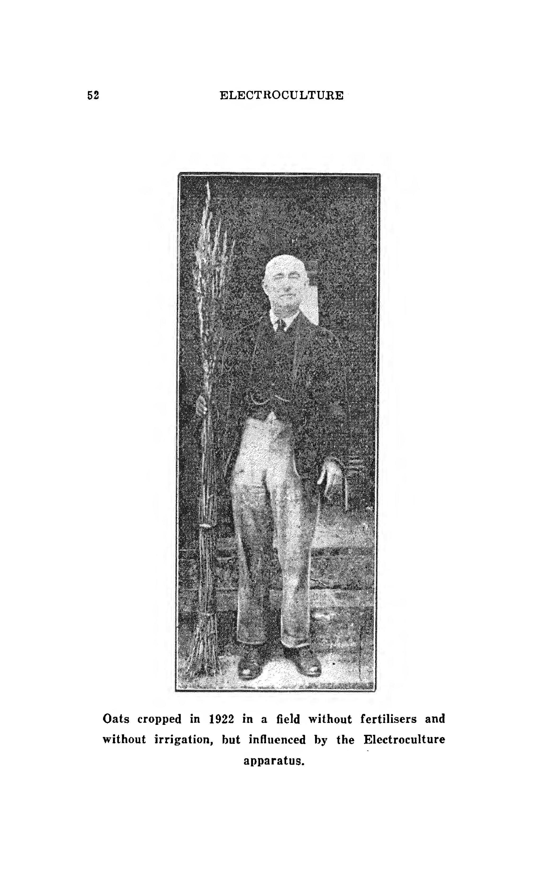

*[p. 52]*

---

**OAKDALE, via CAMDEN, N.S.W., 4 de enero de 1927.**

*[p. 53]*

Tylors (Australia) Ltd.,
13 Bridge Street,
SIDNEY.

Estimados Señores:

Les escribo para contarles los resultados más satisfactorios que he tenido de dos Aparatos de Electrocultura Christofleau instalados por mí en mi huerto. Instalé el aparato hace 12 meses en una franja de tierra en la que hasta ahora nunca había podido cultivar vides de maracuyá con éxito, y como planté maracuyá de nuevo, pueden ver que sometí el aparato a una prueba severa. Planté hileras comparativas de vides junto a las buenas tierras y aboné bien esas hileras.

La primera diferencia que noté fueron las hojas verdes y saludables que aparecieron en las vides electrificadas, y también el mayor crecimiento, aunque apenas tuvimos lluvia, y solo en invierno, que no es buena para las vides de maracuyá. Ahora, después de 12 meses, la diferencia es muy marcada. Las hileras electrificadas de vides no solo son más saludables, con hojas más grandes y verdes, sino que la cantidad de fruta es al menos el doble que en las hileras no electrificadas, y la fruta es mucho más grande.

Espero resultados aún mejores a partir de ahora, ya que hemos tenido buenas lluvias. Estoy seguro de que estos resultados se deben a la influencia del aparato. Sé que la gente es escéptica, y se rieron de mí cuando instalé el mío por primera vez, pero ahora recibo visitantes de todas partes, y estoy seguro de que los convenzo a todos antes de que se vayan de mi granja de que la Electrocultura no es una broma.

Le he escrito al Sr. Christofleau sobre mi éxito, y pronto podré pedirle más aparatos, y sé que la Electrocultura está haciendo por mi cosecha todo lo que su folleto afirma que debería hacer.

Deseándoles todo el éxito.

Atentamente,
*(Firmado)* **HARRY LOVELL.**

---

**22 Molloy Street, Bunbury, W.A., 23 de mayo de 1927.**

*[p. 53]*

Sr. Trouchet,
Padbury's Buildings,
PERTH.

Estimado Señor:

Recibí su carta hace unos días sobre nuestro proceso de Electrocultura. En primer lugar, debo decirle que la Sra. Illingsworth se ha ido de un largo viaje a Europa; se fue de aquí el pasado abril y creo que estará en Inglaterra aproximadamente a mediados de junio. No espera regresar durante 12 meses.

Bueno, sobre esas máquinas que tenemos; yo mismo creo que son maravillosas, ya que no hemos usado ningún abono, y nuestras verduras han sido simplemente maravillosas, también las dalias. El sabor de los guisantes y las judías fue simplemente excelente, también la lechuga. También tuvimos una cantidad maravillosa de melones y melones de mermelada.

Ahora estamos usando zanahorias que se plantaron hace aproximadamente 9 semanas, así que uno no puede quejarse de eso.

Agradeciéndole,
Atentamente,
**L. ILLINGSWORTH,**
Por la Srta. Higgie.

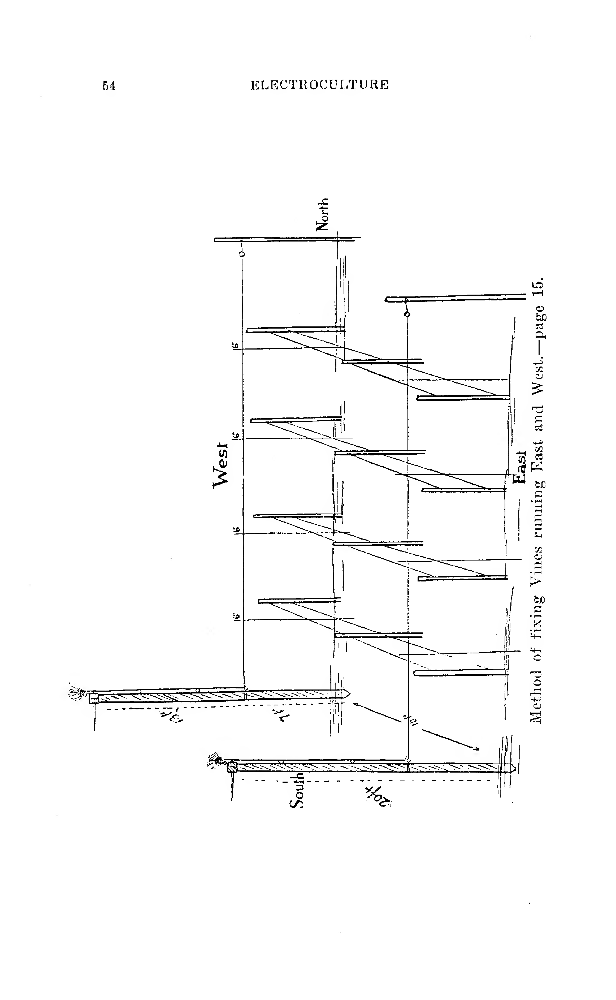

*[p. 54]*

---

**Perth, 25 de marzo de 1927.**

*[p. 55]*

Sres. A. Trouchet & Son,
PERTH.

**Re: Electrocultura.**

Estimados Señores:

En referencia a los experimentos realizados por mí en mi huerto de Mt. Barker, me complace decir que fueron altamente satisfactorios.

Instalé el aparato y llevé el cable subterráneo, a una profundidad de 15 pulgadas (38 cm), a través del huerto, durante 10 cadenas (aprox. 200 m), y luego a través de dos pequeños potreros, durante unas 8 cadenas más (aprox. 160 m), con el propósito de experimentar con otros cultivos además de las manzanas.

Instalé el aparato el 10 de noviembre de 1926, y el 26 del mismo mes planté parcelas de Judías Canadian Wonder y Guisantes Yorkshire Hero a lo largo del cable y parcelas de control a 20 pies (6 m) a un lado del cable, dándoles la misma cantidad de abonos, a saber: Superfosfato 6 partes, Nitrato de Sosa 1 parte, Potasa 1 parte. Diez semanas después de la siembra, tomé muestras de las judías, y el resultado fue que las judías en el cable rindieron 6 veces el peso de la parcela de control con el mismo número de plantas. Los guisantes también rindieron más del doble. En ambos casos, esto se debió a que maduraron mucho antes.

La influencia de la Electrocultura en las manzanas fue muy notable. Las Jonathan y Cleopatra estaban casi dos semanas adelantadas con respecto a los árboles en las hileras adyacentes.

Habiendo vendido mi huerto al Sr. T. Hawley en febrero, solo tuve tres meses para llevar a cabo estos experimentos, pero por lo que vi, estoy completamente convencido de que la Electrocultura será beneficiosa para todos los cultivos.

Lo único que realmente quería probar era si el aparato curaría el "bitter-pit" (mancha amarga) en la manzana Cleopatra; pero desafortunadamente me fui antes de que alcanzaran la madurez y no tuve la oportunidad de ver el resultado final. Aún así, el próximo año sería el mejor momento para probar esto, y espero que el Sr. Hawley o el Sr. Young vigilen esto de cerca para mí.

Tan pronto como me establezca de nuevo, estaré encantado de realizar experimentos para ustedes, donde tendrán la oportunidad de ver el aparato probado a fondo.

Atentamente,
**C. J. VAN ZUILECOM.**

---

**Iolanthe Street, Bassendean, W.A., 9/6/27.**

*[p. 55]*

Sres. A. Trouchet & Son,
Forrest Place,
Perth.

Estimados Señores:

En respuesta a la suya del 7 del corriente. Se sembraron tres lotes de semillas de tomate, dos aproximadamente quince días antes que las tratadas por ustedes. Las semillas electrificadas brotaron mucho mejor que las otras, y fueron las únicas que resistieron las heladas de las últimas dos noches.

Les informaré más adelante qué tipo de cosecha obtengo de las mismas, y cuando esté en condiciones de hacerlo, compraré uno de sus aparatos.

Atentamente,
*(Firmado)* **D. GORDON.**

---

**Hack Street, GOSNELLS, 23 de febrero de 1927.**

*[p. 56]*

Sres. A. Trouchet & Son,
PERTH.

Estimados Señores:

**Re: Electrocultura.** Puede interesarles saber que el aparato de Electrocultura instalado por mi hijo parece estar funcionando satisfactoriamente. El pasado invierno, al ser excepcionalmente lluvioso, las plantas de todo tipo naturalmente sufrieron, especialmente en suelos anegados. Los cítricos y otras plantas que estaban bajo la influencia del aparato de Electrocultura parecieron resistir mejor la humedad que aquellos que no estaban dentro del radio de su influencia.

Las plantas de tomate están excepcionalmente bien.

Para obtener un resultado más rápido, creo que el cable debería estar más cerca de la superficie (no a casi dos pies de profundidad), como tenemos el nuestro.

Los postes de Jarrah verde tienden a torcerse hacia el sol, pero no lo suficiente como para hacer mucha diferencia.

Su representante, el Sr. Wood, y otros han visto y pudieron comparar la diferencia, en un momento muy desfavorable.

Actualmente no tenemos mucho en cultivo, ya que mi hijo, estando ocupado en otras direcciones, no ha tenido tiempo para completar algunas modificaciones en nuestro jardín para obtener el máximo beneficio del aparato de Electrocultura.

Atentamente,
**CHAS. H. STAGG.**

**P.D.** — Para confirmar la declaración anterior, mis mandarinas enviadas al mercado la temporada pasada se vendieron a 14/- por caja, contra los precios publicados en el "West Australian", de aproximadamente 11/-.

*G.H.S.*

**Testigo de esta declaración,**
23 de febrero de 1927.
**W. F. GUPPY, J.P.,**
Presidente de la Asociación de Jueces de Paz
de Australia Occidental.

---

**Hack Street, GOSNELLS, 24 de febrero de 1927.**

Sres. A. Trouchet & Son,
PERTH.

Estimados Señores:

En una declaración anterior, sugerí que los cultivos superficiales se beneficiarían si el aparato se colocara más cerca de la superficie. Nuestra experiencia subsiguiente, con el crecimiento de Guisantes, Judías, Lechuga y Tomates, ha sido excepcionalmente buena durante el período más seco. La observación justifica lo anterior, más particularmente sin la aplicación de riego artificial.

**Testigo de esta declaración,**
24 de febrero de 1927.
**W. F. GUPPY, J.P.,**
Presidente de la Asociación de Jueces de Paz
de Australia Occidental.

Atentamente,
**CHAS. H. STAGG.**

---

**Steere Street, COLLIE, 11 de enero de 1927.**

*[p. 57]*

Sr. Alex. Trouchet,
PERTH.

Estimado Señor:

Habiendo instalado uno de los Aparatos de Electrocultura del Sr. Christofleau, me complace informar que he tenido resultados muy gratificantes. Puedo decir con seguridad que he ganado más de tres semanas en la maduración de mis tomates, que planté en tierra tratada por el aparato. La fruta madura uniformemente, es grande y de excelente sabor.

También he notado que tenía un melocotonero y un nectarino que durante tres años han estado en un estado deplorable con abolladura de la hoja, y desde que instalé el Aparato ha desaparecido por completo. No puedo atribuirlo a otra causa que no sea la Electrocultura. Nunca he fumigado ni abonado los árboles desde que fueron plantados. El Aparato se instaló en julio de 1926.

También he notado resultados muy beneficiosos en las plántulas de tomates y lechuga plantadas bajo la influencia del aparato. Estoy completamente satisfecho de los resultados en parcelas comparativas que están prácticamente en la misma clase de terreno, que en dos cosechas separadas de tomates el resultado ha sido idéntico, y los que están bajo la influencia son mucho más grandes y una clase de fruta totalmente superior.

He hablado con el Sr. Bevan, de Allanson, y él también está muy contento con los resultados de una cosecha de guisantes que sembró, y aunque era en arena pobre, usó superfosfato como abono, y dijo que estaba asombrado por el crecimiento y la productividad de la cosecha que fue influenciada por el cable; la parcela comparativa, con el mismo abono, en el mismo tipo de suelo pobre, no dio ni de lejos la cosecha tratada por Electrocultura. El Sr. Bevan tiene la intención de escribirle pronto, y sin duda le complacerá recibir su carta.

Visité al Sr. J. Sykes, de Allanson, y me mostró algunas vides donde había instalado uno de los aparatos, y aunque sus vides fueron plantadas al mismo tiempo, hace dos años, hay un crecimiento maravilloso en las vides cerca de donde está enterrado el cable del aparato; con una o dos excepciones, ninguna de las vides más alejadas del cable se les acerca en longitud de madera.

Deseándole la mejor de las suertes.

Atentamente,
**JOHN McCAUGHAN.**

**Testigo:**
**H. WHITAKER, J.P.**, Collie, 11 de enero de 1927.

---

**"Marbro," New Norcia, W.A., 18/6/27.**

Sres. A. Trouchet & Son,
Forrest Place,
Perth.

Estimados Señores:

En respuesta a la suya del 16 del corriente, las semillas que ustedes electrificaron para mí hace poco tiempo han dado buenos resultados hasta ahora. Tuve la desgracia de que la mayoría de las semillas se echaron a perder, ya que fueron escarbadas por las gallinas. Las semillas que quedaron parecieron crecer maravillosamente, ya que casi todas germinaron. Algunas de las semillas dieron pobres resultados el año pasado, pero desde que fueron electrificadas, germinaron y crecieron rápidamente, aunque el suelo no estaba en su mejor momento.

Atentamente,
*(Firmado)* **H. HALLIGAN.**

---

**Devon Road, BASSENDEAN, W.A., 5 de enero de 1927.**

*[p. 58]*

Sres. A. Trouchet & Son,
Padbury's Buildings,
PERTH.

Estimados Señores:

Compré un aparato de Electrocultura a ustedes el pasado noviembre para probar con una puesta de huevos. Me aconsejaron que la máquina debía estar funcionando dos o tres meses para ser efectiva. Encontré que sería demasiado tarde para conseguir una gallina clueca. Tenía una que insistía en sentarse en un lugar con poca o ninguna sombra hasta que enfermó.

El aparato había estado instalado tres semanas, así que lo probé; los pollos debían salir, según su folleto, el domingo por la noche a las 10:30 p.m. El lunes por la mañana rompimos un huevo y encontramos un pollo dentro; el martes por la tarde los pollos habían salido y estaban bien. Probé los tres restantes y los encontré infértiles. Los pollos son fuertes a pesar del clima cálido, y la gallina se ha recuperado completamente sin ninguna atención especial.

Esto supone un día y medio antes de lo habitual, que sería el miércoles por la noche o el jueves por la mañana. Considero esto muy satisfactorio, y espero obtener los resultados completos en la temporada adecuada.

Debo mencionar que he instalado este aparato cerca de una higuera que ha perdido sus hojas durante los últimos dos años cuando la fruta está madurando, así que ahora estoy observando esto con interés.

Confío en que esto sea de interés para ustedes.

Atentamente,
**THOS. A. WOOD.**

**Testigo de esta declaración,**
17 de enero de 1927.
**W. F. GUPPY, J.P.,**
Presidente de la Asociación de Jueces de Paz de Australia Occidental.

---

Sres. A. Trouchet & Son,
Forrest Place,
Perth.

Estimados Señores:

Tengo mucho gusto en responder a su carta del 7 del corriente respecto a mis semillas electrificadas. Están espléndidas. Son mejores que cualquier semilla de flores que haya cultivado jamás.

Por lo general, tengo problemas para que mis semillas de flores crezcan, pero estas brotaron en un instante y han crecido rápidamente desde entonces.

Atentamente,
*(Firmado)* **M. CULAHAN.**

---

**BRUNSWICK JUNCTION, W.A., 30 de mayo de 1927.**

*[p. 58]*

Sres. A. Trouchet & Son,
PERTH.

Estimados Señores:

En mis experimentos con su máquina de Electrocultura, encontré que el trigo y la avena eran un 75% mejores que en la parcela no tratada; y el maíz y el mijo también mejoraron en la misma medida. Otras plantas estaban más o menos iguales, pero debe tenerse en cuenta que las parcelas no recibieron el trabajo necesario para producir buenas cosechas durante el verano cálido y seco de este país.

Atentamente,
**O. A. TITLEY.**

---

### INFORMES SOBRE LOS RESULTADOS OBTENIDOS EN LA PROPIEDAD DEL SR. BURGESS, CULTIVADOR DE BANANAS, GYMPIE ROAD, ASPLEY, QUEENSLAND

*[p. 59]*

Visitamos al Sr. Burgess el 4 de enero. El Sr. Burgess tiene instalada una planta que había estado en funcionamiento exactamente dos (2) meses en la fecha de nuestra visita. El Sr. Burgess es notablemente enfático sobre los excelentes resultados obtenidos, incluso a esta fecha.

Primero señaló una pequeña parcela de tierra muy pobre, que había sido formada a partir de los residuos de una curtiduría. Este es el primer año, en un período de cuatro (4) años, desde que incluso la hierba y las malas hierbas han crecido en esta pequeña parcela de tierra. Inmediatamente después de que se instaló la planta, y durante un clima extremadamente seco, el Sr. Burgess, como experimento, plantó 18 plantas de tomate que estaban gravemente infestadas de tizón, plantando al mismo tiempo algunas plantas de control fuera de la franja electrificada. El tizón eventualmente mató estas plantas de control. En la franja electrificada, sin embargo, el tallo principal se pudrió debido a los estragos del tizón, pero se emitieron nuevas raíces desde la porción madre del tallo, que ahora son plantas vigorosas y de aspecto saludable. El Sr. Burgess afirma que este resultado es asombroso, y no recuerda que una planta se haya recuperado jamás después de ser afectada por esta enfermedad.

**MELONES Y PEPINOS.** — El Sr. Burgess encontró que los melones y pepinos germinaron en las franjas electrificadas entre 4 y 5 días. En una parcela de control a cierta distancia, las semillas de melón y pepino tardaron 14 días en germinar. El Sr. Burgess afirma que, hasta donde puede decir, la totalidad de las semillas en la franja electrificada germinaron, mientras que en la parcela de control el porcentaje de germinación fue pobre. Señaló el crecimiento mucho mayor y más vigoroso en las franjas electrificadas.

**BANANAS.** — El Sr. Burgess es un cultivador de bananas de muchos años de experiencia, y es un cultivador muy metódico. En la franja electrificada tiene plantas de 1.º, 2.º y 3.º año, y en el caso de cada planta puede señalar un aumento muy marcado en el crecimiento, y mantiene que, en todos los casos, las plantas son mucho más saludables. El Sr. Burgess ya está convencido de que sus bananas de 2.º año en la franja electrificada darán una cosecha abundante, mientras que en el suelo que está trabajando actualmente no obtiene rendimientos de las plantas de 2.º año. Comentó particularmente sobre dos plantas muy enfermizas que, en circunstancias normales, un cultivador arrancaría y no se molestaría con ellas, que en la franja electrificada han hecho un progreso realmente notable, y en un período de dos meses pasaron de ser plantas enfermizas a plantas muy finas, saludables y robustas.

Comenzó sintiéndose muy escéptico sobre los resultados, pero ahora está convencido de los resultados de la Electrocultura, y ha realizado un pedido de otras 24 plantas para ser entregadas a razón de 2 por mes. Afirma que cuando las reciba, si puede manejarlo, seguirá añadiendo hasta haber electrificado toda su propiedad.

---

### PRECIO DEL APARATO

*[p. 60]*

**EL APARATO CUESTA £6.**

Embalado gratis, puesto en ferrocarril en Perth.

**PAGO POR ADELANTADO.**

Se añadirá el cambio de cheques.

---

### ALEX. TROUCHET & SON

la Padbury's Buildings, Forest Place,
**Perth, Australia Occidental.**

Agentes Exclusivos para Australia, Nueva Zelanda, Java, Estrechos Settlements, Estados Federados Malayos, Siam, India, Ceilán, Sumatra, Birmania, Demerara y Sudáfrica.

---

## ELECTROCULTURA

**Cultiva todo por Inalámbrico.**

### ¡LA MÁQUINA DE HACER DINERO!

*[p. 62]*
### ¡LA MÁQUINA DE AHORRAR DINERO!

**Un Nuevo Progreso Científico aplicado a la Vegetación**

Por el cual:

1. — Las cosechas de Grano, Fruta, etc., aumentan de 100 a 200 por ciento y más.
2. — Se elimina el Uso y Gasto de Fertilizantes.
3. — Las Verduras y Frutas son mejores, saben mejor y son más grandes.
4. — Las Uvas son más dulces, contienen más alcohol, el clima frío no afecta su crecimiento, se elimina el azufrado de las Vides. No más miedo al mildiu, filoxera, oídio, etc.
5. — Los Parásitos, Enfermedades e Insectos son destruidos.
6. — Los Árboles Frutales Viejos son rejuvenecidos y vuelven a dar fruto.
7. — Las Ovejas y el Ganado prosperan mejor cuando se alimentan con Forraje cultivado por Electrocultura.
8. — Se economiza Trabajo Manual.
9. — Las Cosechas son mucho más tempranas y sus productos se venderán en un mercado temprano.
10. — La Electrocultura es especialmente adecuada en regiones afectadas por la sequía.
11. — La Electrocultura suministra humedad al suelo y, por lo tanto, elimina la necesidad de lluvia, del mismo modo que elimina la necesidad de Fertilizante.

**NOTA.** — El Aparato genera su propia Electricidad sin ningún costo.

**NO SE REQUIEREN BATERÍAS.**

---

### ALEX. TROUCHET & SON

la Padbury's Buildings, Forest Place,
**Perth, Australia Occidental.**

Agentes Exclusivos para Australia, Nueva Zelanda, Java, Estrechos Settlements, Estados Federados Malayos, Siam, India, Ceilán, Sumatra, Birmania, Demerara y Sudáfrica.

---

### ELECTRIFIQUE SUS SEMILLAS

*[p. 64]*

**HACEMOS UNA ESPECIALIDAD DE LA ELECTRIFICACIÓN DE SEMILLAS.**

Las semillas electrificadas germinarán mucho más rápidamente, y el porcentaje de germinación mismo será mucho mayor.

Las plantas cultivadas a partir de semillas electrificadas crecerán más rápido, serán más robustas, resistirán mejor las heladas, y su productividad será mucho mayor.

**PAQUETE DE SEMILLAS DE HASTA UNA ONZA (28 g).**

**PRECIO: 10/- POR ONZA.**

**SEMILLAS DOBLEMENTE ELECTRIFICADAS: 20/- POR ONZA.**

**SE HACEN REDUCCIONES PARA GRANDES CANTIDADES.**