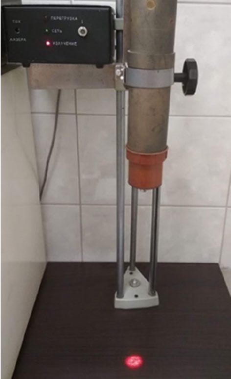
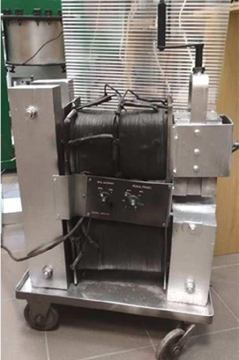
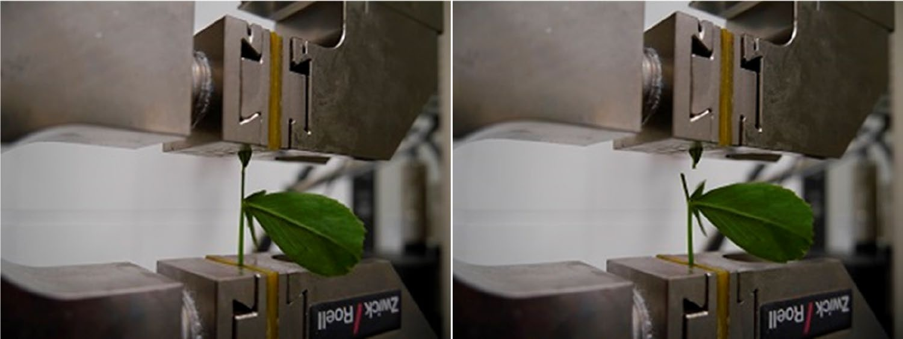
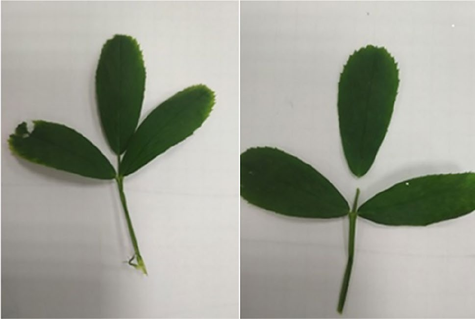
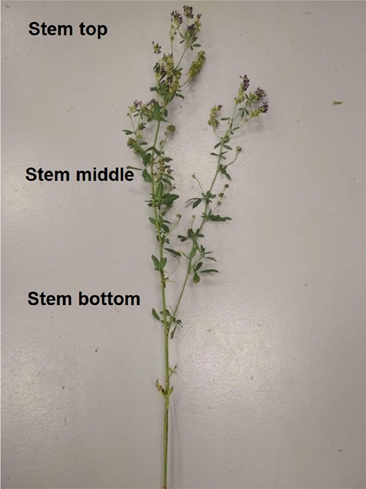
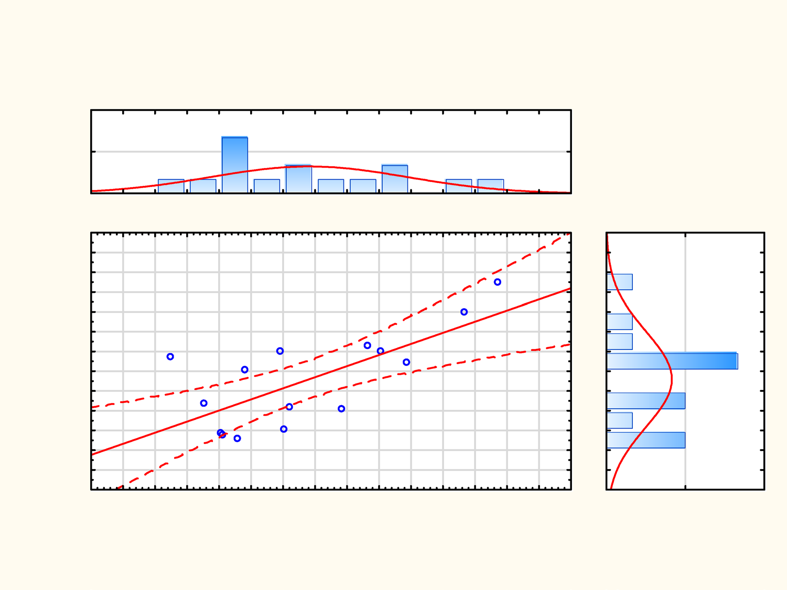
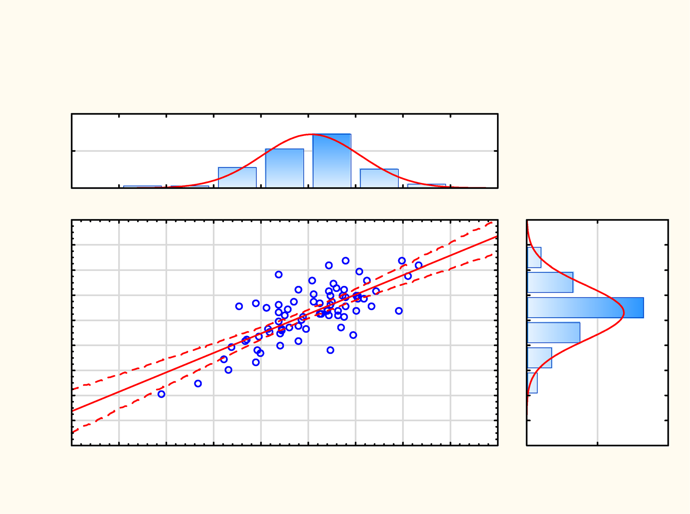

# Impact of Electromagnetic Stimulation on the Mechanical Properties and Quality of Winter Wheat Grain

**Authors:** A. Dziwulska-Hunek, K. Sadowski, M. Kania, K. Krawczyk, J. Wowro  
**Journal:** Scientific Reports (Nature)  
**Year:** 2022  
**DOI:** [https://doi.org/10.1038/s41598-022-20737-z](https://doi.org/10.1038/s41598-022-20737-z)

---

# Materials and methods

> **Plant material.** The research material consisted of 4-year-old leaves of alfalfa, Ulstar cultivar, obtained from the field experiment conducted by the Department of Plant Production Technology and Commodity Science, University of Life Sciences, in Felin (51°13′21.9″ N, 22°37′55.85″ E), on a soil classified in the good wheat com-plex (soil quality class III a). The leaves were harvested on May 25, 2018, during the budding phase (BBCH scale 55--59).

> **Electromagnetic stimulation.** The leaves were grown from seeds subjected to pre-sowing treatment: C (control---unstimulated seeds); L1 and L5---seeds stimulated with laser light with 1 and 5 min exposure, respec-tively; and F1 and F5---seeds stimulated with a magnetic field with 1 and 5 min exposure, respectively.

> 

> **Figure 1.** Self-designed rig for laser light stimulation of seeds. Photo by Agata Dziwulska-Hunek.

Light stimulation was done using an He-Ne laser with the wavelength of 632.8 nm and surface power density of 3 mW cm⁻². A proprietary and unique rig was created for this purpose (Figure 1), with the divergent laser light beam directed downwards onto seeds placed in a single layer at the bottom of a dish. An electromagnet (Figure 2) [23] was used for the purpose of stimulating seeds with an alternating magnetic field with the magnetic induction of 30 mT.

> **Mechanical strength of leaves.** The tension test was conducted unsung a Zwick/Roell Z005 instrument equipped with data registration software Test Xpert II.V3.5 by Zwick. The tensioning was done using a 50 N measurement head at the rate of 10 mm s−1 (Figs. [3] and [4]). The temperature at the laboratory was maintained at

> 

**Figure 2.** Electromagnet. Photo by Agata Dziwulska-Hunek.

**Figure 3.** Before and after tensioning with the Zwick/Roell Z005 instrument. Photo by Agata Dziwulska-Hunek.

**Figure 4.** A leaf before and after tensioning. Photo by Agata Dziwulska-Hunek.

> 20 °C during the measurement. The tested leaves were collected from the top, middle, and bottom parts of plant stems (Fig. [5]). Each sample measurement was repeated five times.

> **Fluorescence lifetimes.** Measurements of fluorescence decay were done using a K2 phase-modulation fluorimeter (ISS, USA). The leaves were crushed in a mortar in a Hepes--NaOH buffer (25 mM; pH 7.8) contain-

> 

**Figure 5.** Parts of the stem from which leaves were collected for testing. Photo by Agata Dziwulska-Hunek.

> ing 1 mM of MgCl~2~, 1 mM of EDTA, and 0.4 M of sorbitol. The homogenate was diluted using the buffer so that the absorbance of the sample for 440 nm did not exceed 0.15. The sample was excited with 440 nm waves and the fluorescence was observed through a KV550 cut-off filter (λ \> 550 nM). Measurements were done in a 1 × 1 cm cuvette, at room temperature, at 10 frequencies of exciting wave modulation (in the range of 2--200 MHz), rela-tive to the diffusing suspension (Ludox®, Sigma Aldrich). Vinci2 software (ISS, USA) was used in the analysis for a double exponential and triple exponential fluorescence decay model that best corresponded to the results obtained. All measurements were done in triplicate.

> **Photosynthetic pigments.** Determination of the content of photosynthetic pigments. Photosynthetic pigments were isolated from leaves using acetone containing 0.01% w/v BHT (butylated hydroxytoluene), in darkness, after which the contents of chlorophyll and carotenoids were determined. The UV--Vis spectrum was measured using a Carry Bio 300 spectrometer and analyzed in accordance with the procedure published by Lichtenthaler and Buschmann[24]. Each sample was analyzed in triplicate.

> **Statistical analysis.** The experimental results were processed with STATISTICA 13.1 software, using the ANOVA variance analysis and post-hoc LSD test at the significance level of α = 0.05. The relations between vari-ables were determined using Pearson's linear correlation coefficient.

> We confirm that experimental and field studies on used plants cultivated in the study, are comply with relevant institutional and national guidelines and legislation effectual at Research Centre for Cultivar Testing[25].

# Results and discussion

> **Mechanical tensile strength.** Leaf parameters measured prior to the tensile strength test included the length and the width of the leaf and the thickness of the petiole, as well as the mass of leaf without the petiole measured after the test, are presented in Table [1]. The tensile test measured the force needed to detach the leaf from the petiole (Table [2]). In general, the seed stimulation did not significantly affect the tested parameters. Nonetheless, a certain reduction thereof was noted for the top and middle sections of the stem. On the other hand, leaves from the bottom part of the stem showed contrary results with the leaf length and petiole thickness visibly increased due to the electromagnetic field stimulation.

> Data regarding the parameters recorded after tearing the leaves grown from seeds subjected to electromag-netic stimulation are presented in Table [2]. The tensile strength of leaves was measured at approx. 1.58--2.45 N. Electromagnetic stimulation lowered the tensile strength of leaves that were collected from the top and middle parts of the stem, especially for L5 and F5. The significant decrease was observed for the L5 treatment for the top part of the stem, where the value was 73% relative to the control. A slight increase of this parameter was observed for the bottom leaves. The observed difference may be due to the dimensions of the leaves or the thickness of the stem, or possibly the overall shape of leaves. An interaction between variables L5 and F1, L5 and F5 was observed. It should be noted that the mass of leaves without petioles (from the top) was higher in the stimulated object L5, as compared to objects F1 and F5. In turn, the petiole thickness and tensile strength was reduced.
 **Stimulation factors**              | **Top part of the stem** | **Middle part of the stem** | > **Bottom part of the stem** |
 **Length (cm)**                      |                          |                             |                               |
 C                                    | > 3.00 ± 0.49a           | > 3.18 ± 0.62a              | > 2.14 ± 0.29a                |
 L1                                   | > 3.20 ± 0.12a           | > 3.22 ± 0.55a              | > 2.30 ± 0.88a                |
 L5                                   | > 2.84 ± 0.29a           | > 3.18 ± 0.18a              | > 2.00 ± 0.45a                |
 F1                                   | > 2.80 ± 0.12a           | > 2.94 ± 0.30a              | > 2.66 ± 0.50a                |
 F5                                   | > 2.94 ± 0.43a           | > 2.98 ± 0.51a              | > 2.60 ± 0.27a                |
 **Width (cm)**                       |                          |                             |                               |
 C                                    | > 1.30 ± 0.32a           | > 1.76 ± 0.32a              | > 1.38 ± 0.51a                |
 L1                                   | > 1.32 ± 0.15a           | > 1.64 ± 0.22a              | > 1.59 ± 0.62a                |
 L5                                   | > 1.06 ± 0.23a           | > 1.54 ± 0.22a              | > 1.34 ± 0.06a                |
 F1                                   | > 1.24 ± 0.25a           | > 1.38 ± 0.16a              | > 1.40 ± 0.24a                |
 F5                                   | > 1.30 ± 0.34a           | > 1.76 ± 0.69a              | > 1.76 ± 0.47a                |
 **Petiole thickness (mm)**           |                          |                             |                               |
 C                                    | 0.548 ± 0.190a           | 0.660 ± 0.173a              | 0.368 ± 0.204a                |
 L1                                   | 0.540 ± 0.073a           | 0.592 ± 0.198a              | 0.456 ± 0.247a                |
 L5                                   | 0.432 ± 0.061a           | 0.656 ± 0.069a              | 0.364 ± 0.092a                |
 F1                                   | 0.484 ± 0.063a           | 0.666 ± 0.150a              | 0.444 ± 0.125a                |
 F5                                   | 0.506 ± 0.245a           | 0.624 ± 0.237a              | 0.542 ± 0.235a                |
 **Mass of leaf without petiole (g)** |                          |                             |                               |
 C                                    | 0.713 ± 0.084a           | 0.803 ± 0.123a              | 0.632 ± 0.137a                |
 L1                                   | 0.769 ± 0.034a           | 0.821 ± 0.096a              | 0.691 ± 0.193a                |
 L5                                   | 0.743 ± 0.090a           | 0.790 ± 0.085a              | 0.651 ± 0.094a                |
 F1                                   | 0.668 ± 0.084a           | 0.802 ± 0.081a              | 0.647 ± 0.059a                |
 F5                                   | 0.702 ± 0.109a           | 0.750 ± 0.062a              | 0.735 ± 0.084a                |

**Table 1.** Parameters characterizing alfalfa leaves. *C* control (unstimulated seeds); *L1, L5* He--Ne laser light stimulation with 1 and 5 min exposure, respectively, *F1, F5* alternating magnetic field stimulation with 1 and 5 min exposure, respectively. a, b---different letters in respective columns indicate statistical differences, ± standard deviation, n = 5.
 **Stimulation factors** | **Top part of the stem** | **Middle part of the stem** | > **Bottom part of the stem** |
 **Force (N)**           |                          |                             |                               |
 C                       | 2.16 ± 0.48a             | 2.45 ± 0.53a                | > 1.59 ± 0.62a                |
 L1                      | 2.32 ± 0.13a             | 2.36 ± 0.48a                | > 1.77 ± 1.00a                |
 L5                      | 1.58 ± 0.20bd            | 2.12 ± 0.20a                | 1.65 ± 0.45a                  |
 F1                      | 1.79 ± 0.25ac            | 2.32 ± 0.25a                | 2.03 ± 0.60a                  |
 F5                      | 1.99 ± 0.42ac            | 2.21 ± 0.46a                | 1.93 ± 0.41a                  |

**Table 2.** Tensile force detaching the leaf from the petiole. *C* control (unstimulated seeds), *L1, L5* He--Ne laser light stimulation with 1 and 5 min exposure, respectively, *F1, F5* alternating magnetic field stimulation with 1 and 5 min exposure, respectively. a, b---different letters in respective columns indicate statistical differences, ± standard deviation, n = 5.

> As mentioned above, the tensile force recorded in our study was between 1.58 and 2.45 N. The parameter may have been influenced by both the stimuli employed and the leaves' enervation. The results do suggest, however, that the pre-sowing stimulation primarily affects early stages of plant growth, whereas the tensile strength as such is significantly more dependent on leaf enervation than pre-sowing stimulation. The mechanical properties of leaves are vital to their protection against damage caused by herbivores or abiotic factors (e.g.: drought, wind, precipitation, etc.)[8],[26]. As follows from a study by Sahaf and Sharon[27], mechanical stress caused by loads placed on a leaf affects its mechanical properties (elasticity modulus). The mean values of Young's modulus were shown to change, depending on the season, for: maple 4.06--24.13 MPa and linden 1.01--16.57 MPa, and in terms of tensile forces within the range of 0.21--0.52 N mm−1 (maple) and 0.14--0.38 N mm−1 (linden)[8]. Young's modulus values for black salsify leaves grown from seeds stimulated with laser light at various exposure times oscillated between approx. 3 and 10 MPa[28].

> In a study conducted by Kawai et al.[26], the authors considered the influence of the physiological characteris-tics of leaves from various types of trees on their mechanical and structural properties, and concluded that the same were independent of each other. For the respective tree species, the leaf tensile strength ranged from 0.29 to 0.34 N mm−1, and Young's modulus values for stretching were within the range of 9.68--79.9 MPa.
 **Stimulation factors** | **t~1~ (ns)** | **f~1~** | > **t~2~ (ns)** | > **f~2~** | > **t~3~ (ns)** | > **f~3~** | > **2**   |
                         |               |          |                 |            |                 |            | >         |
                         |               |          |                 |            |                 |            | > ***χ*** |
 C                       | 0.31 ± 0.03   | 0.667    | > 3.61 ± 0.3    | > 0.289    | > 151 ± 80      | > 0.044    | > 1.33    |
 L1                      | 0.29 ± 0.01   | 0.694    | > 2.09 ± 0.2    | > 0.25     | > 56 ± 10       | > 0.056    | 2.5       |
 L5                      | 0.30 ± 0.05   | 0.737    | > 2.04 ± 0.5    | > 0.202    | > 184 ± 90      | > 0.061    | > 1.89    |
 F1                      | 0.10 ± 0.05   | 0.594    | > 3.58 ± 0.5    | > 0.406    | > --            | > --       | 12.1      |
 F5                      | 0.37 ± 0.013  | 0.448    | 2.99 ± 0.06     | > 0.512    | > --            | > --       | 12.6      |

**Table 3.** Fluorescence lifetimes (t) and corresponding fractional intensities (f) in the analyzed alfalfa leaves. *C* control (unstimulated seeds), *L1, L5* He--Ne laser light stimulation with 1 and 5 min exposure, respectively, *F1, F5* alternating magnetic field stimulation with 1 and 5 min exposure, respectively.
 **Stimulation factors** | **Chlorophyll *a*** | **Chlorophyll *b*** | **Chlorophyll *a* + *b* (µg g−1)** | **Chlorophyll *a*/*b*** | > **Carotenoids (µg g−1)** |
                         |                     |                     |                                    |                         |                            |
                         | **(µg g−1)**        | **(µg g−1)**        |                                    |                         |                            |
 C                       | 1429 ± 314a         | 419 ± 77a           | 1848 ± 390a                        | 3.40 ± 0.18b            | > 183 ± 45a                |
 L1                      | > 578 ± 19bd        | 164 ± 6bd           | > 742 ± 23bd                       | 3.52 ± 0.11b            | > 65 ± 6b                  |
 L5                      | 1063 ± 424a         | 291 ± 121a          | 1354 ± 545a                        | 3.67 ± 0.06a            | > 134 ± 82a                |
 F1                      | > 870 ± 271b        | 240 ± 77bd          | 1110 ± 348b                        | 3.65 ± 0.17a            | > 127 ± 43a                |
 F5                      | 1134 ± 76ac         | 375 ± 21ac          | 1510 ± 97ac                        | 3.02 ± 2.98c            | > 68 ± 35b                 |

**Table 4.** Content of photosynthetic pigments in alfalfa leaves. *C* control (unstimulated seeds), *L1, L5* He--Ne laser light stimulation with 1 and 5 min exposure, respectively, *F1, F5* alternating magnetic field stimulation with 1 and 5 min exposure, respectively. a, b---different letters in respective columns indicate statistical differences, ± standard deviation, n = 3.

> The tensile strength of a leaf depends on the number of veins in its blade. It has been observed that in single-vein leaves, the strength was \~ 1.07 N mm−2, but was significantly lower in three-vein leaves. In leaves with four veins, the tensile strength was higher[29] at 5.91 N mm−2.

> **Fluorescence lifetimes.** Measurements of chlorophyll fluorescence lifetime provide information on the functional condition of photosynthetic complexes, particularly on the photosystem II. In the studied homogen-ates, we observed double or triple exponential decay of chlorophyll fluorescence (Table [3]). The obtained lifetime components were within the range of 0.1--0.37 ns (t~1~), 2.04--3.61 ns (t~2~), and between 56 and 151 ns (t~3~), with the share of 45--74% (f~1~) and 20--51% (f~2~). In the samples prepared from stimulated leaves a reduction of the t~2~ component was observed, particularly for laser light stimulation (L1, L5). The reduction of fluorescence lifetimes suggests increased efficiency in other channels of chlorophyll deexcitation, including those related to energy dissipation in photosynthetic antennae. This, in turn, may signify considerably better overall results in terms of general plant growth, which is commonly observed when plant of this type, not only alfalfa, are subjected to stimulation. In the samples of leaves stimulated with the magnetic field, the third component (t~3~) was not observed in values corresponding to delayed fluorescence. Analyses of fluorescence lifetimes indicated slight functional changes in the photosynthetic complexes in leaf samples stimulated with either of the two factors, but the character of those changes was different depending on the specific factor employed.

> Stimulation with He--Ne laser light noticeably altered the chlorophyll fluorescence lifetime in scorzonera leaves grown from a batch of 2009 seeds (4-year-old), yielding results in the ranges from 0.09 to 1.36 ns (t~1~) and from 0.89 to 1.78 ns (t~2~), with a ratio of 16--100% (f~1~) and 35--84% (f~2~). Is should be underlined that the time t~2~ was reduced in the stimulation objects for this batch of seeds[30]. This clearly suggests additional pathways of deexcitation for chlorophyll molecules present in the plants selected for study.

> In literature reports, reduction of fluorescence lifetime (below 3.00 ns) has been interpreted e.g. as a sign of ageing[31]. This may be related to the age of seeds/plants in the case of perennial plants or, as in our case, to the exposure to particular stressors. Indeed, it may be due to the fact that stimulation usually allows one to obtain better quality plants faster, which in turn may necessitate earlier harvest. Otherwise, plants may be susceptible to accelerated degradation beyond a certain point. In studies analyzing extracts from young and old alfalfa plants, it was observed that laser light clearly extended fluorescence lifetimes in plants of the Radius cultivar, but reduced the same in the Ulstar cultivar (2- and 6-year-old plants), relative to the control. This may evidence a better quality of a given cultivar and its better suitability for cultivation. Moreover, fluorescence lifetimes observed in older plants are clearly shorter than those observed in young plants[32].

> **Photosynthetic pigments.** Two types of chlorophyll are present in plants: *a* and *b*. Chlorophyll *a* plays an important role in the process of photosynthesis, whereas chlorophyll *b* and carotenoids are auxiliary pigments. It is noteworthy that the correct ratio of chlorophyll and carotenoids reflects the overall condition of a plant but is also noticeably dependent on the respective plant species[33]. In our study, as presented in Table [4], the content of photosynthetic pigments in alfalfa leaves decreased in plants grown from seeds subjected to electromagnetic stimulation before sowing. The most noticeable reductions were observed in study objects L1---approx. 60% Chl *a* and *b*, and F1---Chl *b* 43%). The ratio of Chl *a*/*b* was between 3.02 (F5) and 3.67 (L5). In studies conducted to date, the decrease of chlorophyll *a* and *b* concentration may have been due to electromagnetic stimulation, or the age of plants. In earlier studies, the use of laser light stimulation resulted in a decrease of chlorophyll *a* con-centration in 1- and 2-year-old leaves, but an increase thereof in 3-year-old leaves[30]. In conditions of excessive hydration of alfalfa plants, Smethurst and Shabala[34] also observed reduced chlorophyll *a* and *b* concentrations. In another study conducted by Kang et al.[35] it was observed that chlorophyll *a* and *b* concentration decreased by approx. 45% and the concentration of carotenoids by approx. 51% in plants exposed to drought conditions, as compared to the control. The use of isolators AFFR02 and Mj1212 lessened the stressogenic effects of drought on alfalfa plants and even triggered an increase in the content of both chlorophyll by approx. 23--16% and carot-enoids by approx. 55%. In studies investigating the regulator Tytanit, it was observed that it caused an increase in Chl *a* and Chl *b* content by approx. 12 and 15%, respectively, compared to the control[36].

> In turn, Ciupak et al.[8] reported seasonal changes in chlorophyll *a* content in tree leaves, ranging e.g. for linden from 102.37 (fall) to 587.82 µg g−1 (spring), or for maple from 77.95 (fall) to 2444.5 µg g−1 (summer). The con-centration of chlorophyll *b* ranged from 63.52 to 141.36 µg g−1 (linden) and from 90.89 to 897.58 µg g−1 (maple). In another study, Ciupak et al.[28] studied the impact of seed stimulation with He-Ne laser light on the content of photosynthetic pigments. They observed the highest levels of chlorophyll *a* in scorzonera leaves stimulated with laser light with 1 min exposure, and the lowest with 10 min exposure, i.e. it was found that exposure time had a major impact on this parameter. Even though this seems a fairly obvious conclusion, the actual choice of correct exposure proves to be a complex problem that is further complicated by dependence on the specific type of plant as well as numerous other factors. Laser light stimulation generally triggered an increase in the pigment content in scorzonera leaves, only in L10 was a decrease by approx. 3--4% observed. This indicates that, depending on the plant species, laser light stimulation may have a positive influence on plant quality, provided that the respective are adapted to the specific needs of a given crop or vegetable.

> In our study, stimulation with laser light and magnetic field triggered a decrease in carotenoid content relative to the control. This shows that electromagnetic stimulation may have constituted a stressor for the alfalfa plants selected for this study. The relevant value was within the range from 64 to 183 µg g−1. A significant decrease in the pigment's content, respectively by 63 and 64%, was observed for the F5 and L1 samples. In other studies it was reported that noticeably more chlorophyll per a unit of leaf mass but less per unit of leaf surface was observed in shaded leaves, as compared to insolated leave[37]. Ibrahim and Bafeel[38] noted a decrease in chlorophyll content and increased ratio of carotenoids to total chlorophyll in alfalfa leaves under the influence of stressogenic fac-tors, specifically a temperature drop to 10 °C and shading for 24 h, followed by a temperature increase to 25 °C in the presence of light. In earlier studies, higher values of parameters related to photosynthesis were reported, particularly in terms of chlorophyll *a* and *b,* in legumes as compared to grass species[39]. Irshad et al.[40] observed in their study that the content of chlorophyll in *Medicago truncatula* leaves was reduced under the influence of a stressor in the form of variable amounts of NaCl salt. Meanwhile, the He--Ne laser light treatment employed by Okla et al.[41] facilitated the growth of *Cymbopogon proximus* plants and increased photosynthetic activity, which might also be attributed to increased chlorophyll levels in the plant. Ciupak et al.[8] studied the content of carot-enoids in linden and maple trees, and reported values within the ranges of, respectively: 147.62--168.87 µg g−1 and 205.55--383.99 µg g−1. In turn, in scorzonera leaves the observed values[28] ranged from 107 to 135 µg g−1. In another study by Herde et al.[42] investigating the impact of stress caused by light as well mechanical damage and thermal treatment of wild tomato plants, it was observed that while the stressors inhibited the process of photosynthesis, the content of chlorophyll remained stable.

The scattering plots show two linear correlations between variables: carotenoids and chlorophyll *a* + *b* (Fig. [6]),

and leaf mass and tensile strength (Fig. [7]). Positive values of the coefficients indicate the direction of the relation.

# Conclusions

> Under the influence of the factors employed, the leaves collected from central and top parts of the plants were more fragile. Electromagnetic stimulation triggered an increase in the mass of leaves and thickness of stems in the lower parts of plants, as compared to the control. This indicated that the plants selected for the study were sturdy and resistant to tensile. This suggests that while the tensile strength may depend on the mass and thick-ness of leaves, the latter can also be affected by specific electromagnetic factors.

> The chlorophyll fluorescence lifetime and pigment content values were noticeably reduced in the experimental alfalfa plants relative to the control, which may have been due to the electromagnetic/stressogenic factors used. This evidences ageing of alfalfa plants.

> 

> **Figure 6.** Scattering plot with histogram for correlation between carotenoids and chlorophyll *a* + *b*.

> Scatterplot with Histogram: Car vs. Chl *a+b*

Chl *a+b* = 663.76 + 5.6202 \* Car

> Correlation coef f icient: r = **0.71894**

> 6

> 3

0

> 2800

> 2600

> 2400

> 2200

> 2000

> 1800

> 1600

> 1400

> 1200

> 1000

> 800

> 600

> 400

> 200

> -20 20 60 100

> 0 40 80 120 160 200 240 280

Car

> 140 180 220 260 0 3 6

> Chl *a+b*

> 

> **Figure 7.** Scattering plot with histogram for correlation between disruptive force and leaf mass.

> Scatterplot with Histrogram : Force vs. Leaf mass

> Leaf mass = 0.41467 + 0.15517 \* Force Correlation coefficient: r = **0.73579**

40

> 20

> 0

1,1

1,0

0,9

0,8

0,7

0,6

0,5

0,4

0,3

0,2

> -0,5 0,0 0,5 1,0 1,5 2,0 2,5 3,0 3,5 4,0 0

20

40

Force

> Leaf mass

# Data availability

> All the data generated or analyzed during this study are included in this published article.

> 

*Received: 4 February 2022; Accepted: 19 September 2022

# References

1.  El-Ramandy, H. *et al.* Alfalfa growth under changing environments: An overview. *Environ. Biodivers. Soil Secur.* **4**, 201--224 (2020).

2.  Zhang, W., Grimi, N., Jaffrin, Y. & Ding, L. Leaf protein concentration of alfalfa juice by membrane technology. *J. Membr. Sci.* **489**, 183--193 (2015).

3.  Karimi, E. *et al.* Insight into the functional and medicinal properties of *Medicago sativa* (Alfalfa) leaves extract. *J. Med. Plants Res.*

**7**(7), 290--297 (2013).

4.  Karwowska, M., Stadnik, J., Dolatowski, Z. J. & Grela, E. R. Effect of protein-xanthophylls (PX) concentrate of alfalfa supplementa-tion of physico-chemical properties of turkey breast and thigh muscles during ageing. *Meat Sci.* **86**, 486--490 (2010).

5.  Basbag, M., Demirel, R. & Avici, M. Determination of some agronomical and quality properties of wild alfalfa (*Medicago sativa* L.) clones in Turkey. *J. Food Agric. Environ.* **7**(2), 357--359 (2009).

6.  Sheaffer, C. C. *et al.* Leaf and stem properties of alfalfa entries. *Agron. J.* **92**, 733--739 (2000).

7.  Zinca, G., Dinica, R. & Vizireanu, C. Qualitative investigation on bioactive compounds of alfalfa seeds during germination. *J.* *Agroaliment. Proc. Technol.* **22**(4), 241--246 (2016).

8.  Ciupak, A., Dziwulska-Hunek, A., Gładyszewska, B. & Kwaśniewska, A. The relationship between physiological and mechanical properties of *Acer platanoides* L. and *Tilia cordata* Mill. leaves and their seasonal senescence. *Sci. Rep.* **9**, 4287 (2019).

9.  Žnidarčič, D., Ban, D. & Šircelj, H. Carotenoid and chlorophyll composition of commonly consumed leafy vegetables in Mediter-ranean countries. *Food Chem.* **129**, 1164--1168 (2011).

10. Sulkiewicz, M. & Ciereszko, I. Fluorescecja chorofilu a---historia odkrycia i zastosowania w badaniach roślin. *KOSMOS Probl. Nauk Biol. Pol. Tow. im. Kopernika* **65**(1), 103--115 (2016).

11. Kalaji, H. M. *et al.* Chlorophyll *a* fluorescence as a tool to monitor physiological status of plants under abiotic stress conditions.

*Acta Physiol. Plant.* **38**(102), 1--11 (2016).

12. Huang, D., Wu, L., Chen, J. R. & Dong, L. Morphological plasticity, photosynthesis and chlorophyll fluorescence of *Athyrium* *pachyphlebium* at different shade levels. *Photosynthetica* **49**(4), 611--618 (2011).

13. Nowak, J., Bzowska-Bakalarz, M. & Przystupa, W. Straty polowe w produkcji siana i kiszonek. Rozprawy i Monografie. *Acta* *Agrophys.* **144**(1), 7--185 (2007).

14. Pellizzi, G. & Lisa, L. Meccanizzazione della raccolta dei foraggi affienati. *Consiglio Nazionale Delle Ricerche, Quaderno* n. **8** (1979).

15. Esehaghbeygi, A., Hoseinzadeh, B., Khazaei, M. & Masoumi, A. Bending and shearing properties of wheat stem of Alvand variety.

*World Appl. Sci. J.* **6**(8), 1028--1032 (2009).

16. Galedar, M. N., Tabatabaeefar, A., Jafari, A., Sharifi, A. & Rafiee, S. Bending and shearing characteristics of alfalfa stems. *Agric.* *Eng. Int.* **X**, 08001 (2008).

17. Zhang, X. *et al.* Mechanical testing of tomato plant stem in relation to structural composition. *Agric. Res.* **5**(3), 236--245 (2016).

18. Du, D. & Wang, J. Research on mechanics properties of crop stalks: A review. *Int. J. Agric. Biol. Eng.* **9**(6), 10--19. [https://doi.org/](https://doi.org/10.3965/j.ijabe.20160906.1499) [10.3965/j.ijabe.20160906.1499](https://doi.org/10.3965/j.ijabe.20160906.1499) (2016).

19. Moiceanu, G. *et al.* Mechanical properties of energetic plant stems---Review. *INMATEH Agric. Eng.* **45**(1), 149--156 (2015).

20. Podgórska, B. & Podgórski, A. Polski zielnik kulinarny. Wyd. Krupisz S.A. Poznań, 120--121 (2004).

21. Golan, K. *et al.* Impact of scale insect infestation on the content of photosynthetic pigments and chlorophyll fluorescence in two host plant species. *Arthropod-Plant Interact.* **9**, 55--65 (2015).

22. Read, J. & Stokes, A. Plant biomechanics in an ecological context. *Am. J. Bot.* **93**(10), 1546--1565 (2006).

23. Muszyński, S., Gagoś, M. & Pietruszewski, S. Short-term pre-germination exposure to ELF magnetic field does not influence seedling growth in durum wheat (*Triticum durum*). *Pol. J. Environ. Stud.* **18**(6), 1065--1072 (2009).

24. Lichtenthaler, H. K. & Buschmann, C. Chlorophylls and carotenoids: Measurement and characterization by UV--Vis spectroscopy. In *Current Protocols in Food Analytical Chemistry*. *Supplement 1*, F4.3.1 (Wiley, 2001).

25. Research Centre for Cultivar Testing. Słupia Wielka, Poland. <https://coboru.gov.pl/> (2022).

26. Kawai, K., Miyoshi, R. & Okada, N. Bundle sheath extensions are linked to water relations but not to mechanical and structural properties of leaves. *Tress* **31**, 1227--1237 (2017).

27. Sahaf, M. & Sharon, E. The rheology of a growing leaf: Stress-induced changes in the mechanical properties of leaves. *J. Exp. Bot.*

**67**(18), 5509--5515 (2016).

28. Ciupak, A., Dziwulska-Hunek, A., Krawiec, M. & Gładyszewska, B. Impact of seed light stimulation on the mechanical strength and photosynthetic pigments content in the scorzonera leaves. *Acta Agrophys.* **26**(1), 67--78 (2019).

29. Wang, S., Ren, L., Liu, Y., Han, Z. & Yang, Y. Mechanical characteristics of typical plant leaves. *J. Bionic Eng.* **7**, 294--300 (2010).

30. Dziwulska-Hunek, A., Krawiec, M., Boroń, B. & Matwijczuk, A. Wpływ stymulacji nasion *Scorzonera hispanica* L. światłem lasera na zawartość barwników fotosyntetycznych w liściach. *Acta Agrophys.* **24**(3), 419--431 (2017).

31. Berezin, M. Y. & Achilefu, S. Fluorescence lifetime measurements and biological imaging. *Chem. Rev.* **110**, 2641--2684 (2010).

32. Dziwulska-Hunek, A., Ćwintal, M., Niemczynowicz, A., Boroń, B. & Matwijczuk, A. Effect of stress caused by electromagnetic stimulation on the fluorescence lifetime of chlorophylls in alfalfa leaves. *Pol. J. Environ. Stud.* **28**(5), 3133--3143 (2019).

33. Gitelson, A. A. & Merzylak, M. N. Remote estimation of chlorophyll content in higher plant leaves. *Int. J. Remote Sens.* **18**, 2691--2697 (1997).

34. Smethurst, C. F. & Shabala, S. Screening methods for waterlogging tolerance in lucerne: Comparative analysis of waterlogging effects on chlorophyll fluorescence, photosynthesis, biomass and chlorophyll content. *Funct. Plant Biol.* **30**(3), 335--343 (2003).

35. Kang, S. *et al.* Phosphate-solubilizing *Enterobacter ludwigii* AFFR02 and *Bacillus megaterium* Mj1212 rescues alfalfa's growth under post-drought stress. *Agriculture* **11**(6), 485 (2021).

36. Sosnowski, J. & Truba, M. Photosynthetic activity and chlorophyll pigment concentration in *Mediago* × *varia* T. Martyn leaves treated with the Tytanit growth regulator. *Saudi J. Biol. Sci.* **28**, 4039--4045 (2021).

37. Cooper, C. S. & Qualls, M. Morphology and chlorophyll content of shade and sun leaves of two legumes. *Crop Sci.* **7**(6), 672--673 (1967).

38. Ibrahim, M. M. & Bafeel, S. O. Photosynthetic efficiency and pigment contents in alfalfa (*Medicago sativa*) seedlings subjected to dark and chilling conditions. *Int. J. Agric. Biol.* **10**, 306--310 (2008).

39. Leitão, S. T. *et al.* Towards a trait-based approach to potentiate yield under drought in legume-rich annual forage mixtures. *Plants* **10**(9), 1763 (2021).

40. Irshad, A. *et al.* Contribution of rhizobium--legume symbiosis in salt stress tolerance in *Medicago truncatula* evaluated through photosynthesis, antioxidant enzymes, and compatible solutes accumulation. *Sustainability* **13**(6), 3369 (2021).

41. Okla, M. K. *et al.* Laser light treatment of seed for improving the biomass photosynthesis, chemical composition and biological activities of lemongrass sprouts. *Agronomy* **11**(3), 478 (2021).

42. Herde, O., Peña-Cortès, H., Fus, H., Willmitzer, L. & Fisahn, J. Effects of mechanical wounding, current application and heat treatment on chlorophyll fluorescence and pigment composition in tomato plants. *Physiol. Plant.* **105**(1), 179--184 (1999).

# Acknowledgements

> This research was funded by The University of Life Sciences in Lublin.

# Author contributions

> A.D.-H., M.S., N.L. and B.M.-K. designed and conducted the experiments, A.D.-H., M.S., A.M., N.L., A.N. and B.M.-K analysed the results and wrote the manuscript. All authors approved the final version.

# Competing interests

> The authors declare no competing interests.

# Additional information

> **Correspondence** and requests for materials should be addressed to A.M.

> **Reprints and permissions information** is available at [www.nature.com/reprints](http://www.nature.com/reprints).

> **Publisher's note** Springer Nature remains neutral with regard to jurisdictional claims in published maps and institutional affiliations.

> **Open Access** This article is licensed under a Creative Commons Attribution 4.0 International License, which permits use, sharing, adaptation, distribution and reproduction in any medium or

> format, as long as you give appropriate credit to the original author(s) and the source, provide a link to the Creative Commons licence, and indicate if changes were made. The images or other third party material in this article are included in the article's Creative Commons licence, unless indicated otherwise in a credit line to the material. If material is not included in the article's Creative Commons licence and your intended use is not permitted by statutory regulation or exceeds the permitted use, you will need to obtain permission directly from the copyright holder. To view a copy of this licence, visit <http://creativecommons.org/licenses/by/4.0/>.

> © The Author(s) 2022
