# De la Electrocultura a la Agricultura Plasma: Un Arco de Tres Siglos que Conecta el Legado de Bertholon con los Avances Agrícolas Contemporáneos

**Autor:** T. Dufour  
**Afiliación:** Laboratoire de Physique des Plasmas, Sorbonne Université, CNRS, École Polytechnique  
**Revista:** Compte-Rendus Mécanique de l'Académie des Sciences, Volumen 354 (2026), pp. 89-116  
**DOI:** [https://doi.org/10.5802/crmeca.331](https://doi.org/10.5802/crmeca.331)

---

## Resumen

Este artículo traza una línea continua desde las "electrizaciones" del siglo XVIII hasta la agronomía de plasma frío de hoy. El eje es la metrología: donde Bertholon diseñó caminos para un "fluido eléctrico" indivisible sin acceso a dosis ni agentes, la agricultura plasma contemporánea define fuentes, cuantifica transferencias interfaciales y mide la dosis bajo condiciones controladas.

---

# 1. Electricidad y agronomía: una trayectoria histórica desde la Antigüedad hasta el siglo XXI

## 1.1. Electricidad (Antigüedad–siglo XVIII): del espectáculo experimental a la instrumentación metroológica

Desde la Antigüedad hasta finales del siglo XVIII, el estudio de los fenómenos eléctricos evolucionó de una curiosidad cualitativa a una práctica cuantitativa basada en instrumentos. Autores tempranos como Teofrasto (*De lapidibus*) y Plinio el Viejo (*Historia Natural*) señalaron la atracción de la paja y otros objetos ligeros por el ámbar frotado (*elektron*) y el azabache (gagates), mientras que autores médicos (p. ej., Scribonius Largus, Galeno) reportaron el uso analgésico de peces eléctricos (torpedos) **[1–3]**. Los lapidarios y enciclopedias medievales transmitieron ampliamente estas observaciones, siendo el *De mineralibus* de Alberto Magno el ejemplo emblemático **[4]**. Durante el Renacimiento, Girolamo Cardano (*De subtilitate*, 1550) y Giambattista della Porta (*Magia naturalis*, 1558/1589) ampliaron el inventario de "cuerpos eléctricos" (ámbar, azabache, diamante, zafiro) capaces de atraer pequeñas partículas tras la fricción **[5, 6]**.

La consolidación conceptual comenzó con el trabajo de William Gilbert *De Magnete* (1600), quien acuñó el término "electricus" y distinguió claramente las atracciones eléctricas del magnetismo **[7]**. En los siglos XVII y principios del XVIII, las máquinas de fricción multiplicaron las demostraciones: el globo de azufre de Otto von Guericke (década de 1660) y los globos de vidrio luminiscentes de Francis Hauksbee (1705–1710) son ejemplos canónicos **[8, 9]**. Los experimentos de Stephen Gray (1729) establecieron la conducción y el aislamiento como comportamientos distintos, y Charles-François de Cisternay du Fay (1733) organizó los efectos bajo una dualidad "vitrea/resinosa" **[10, 11]**.

Solo en la década de 1740, los avances en instrumentación crearon condiciones para experimentos acumulativos. La botella de Leyden, desarrollada independientemente por E.-G. von Kleist y P. van Musschenbroek (1745–1746), fue el primer dispositivo confiable para almacenar carga eléctrica (Figura 1a). Conectar varias botellas en paralelo para formar una "batería" aumentó aún más la capacidad de almacenamiento (Figura 1b) **[12–14]**. Al mismo tiempo, las máquinas electrostáticas se estandarizaron, ejemplificadas por el cilindro de Nairne (1773; Figura 1c) y el generador monumental de van Marum (1784) **[15, 16]**. Las demostraciones públicas proporcionaron un puente entre espectáculo y experimento: el 14 de marzo de 1746, el Abbé Nollet descargó famosamente una botella de Leyden a través de una cadena de guardias del rey en Versalles y luego a través de monjes cartujos **[17, 18]**.

Las herramientas metroológicas se multiplicaron: la demostración de Franklin de la equivalencia entre rayos y electricidad y su promoción del pararrayos (1750–1752) **[17, 21, 22]**. El electrómetro de lectura de chispa de Lane (1767) permitió la cuantificación de la descarga de la botella de Leyden, mientras que el cuadrante de Henley (1770) introdujo una medida de repulsión de un solo índice **[23–25]**. H.-B. de Saussure extendió los electrómetros a estudios atmosféricos durante las décadas de 1760–1780 **[26]**. Este giro cuantitativo culminó con la balanza de torsión de Coulomb (1785), que produjo la primera ley precisa de fuerzas eléctricas **[27]**. Obras de síntesis como la *History and Present State of Electricity* de Priestley (1767/1769), el *Complete Treatise of Electricity* de Cavallo (1777) y el *Dell'elettricismo artificiale e naturale* de Beccaria (1753) organizaron la literatura en expansión **[14, 28–30]**.

Habiendo establecido herramientas para almacenamiento, entrega y medición, las primeras aplicaciones a sistemas vivos comenzaron a surgir. En 1783, *De l'électricité des végétaux* de Bertholon introdujo el "electro-végétomètre," un dispositivo diseñado para capturar y dirigir la electricidad atmosférica hacia los cultivos **[31]**. Stephen Demainbray en la década de 1740 electrificó mirto y observó crecimiento acelerado, resultados confirmados por el Abbé Nollet en semillas de mostaza y Jean Jallabert en bulbos de jacinto y narciso. Más tarde, Edouard-François Nunebert comparó bulbos de cebolla no electrificados y electrificados, notando germinación más rápida y tallos más altos **[31]**.

> 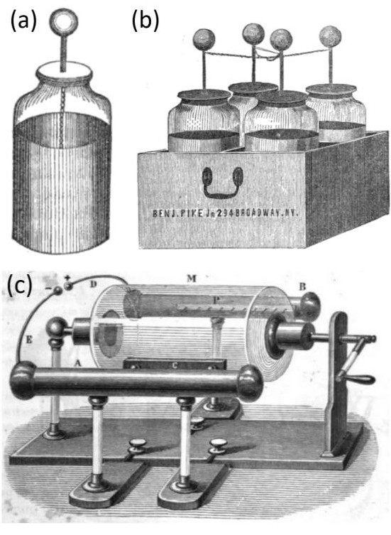

> ***Figura 1. (a) Botella de Leyden: un recipiente de vidrio que actúa como dieléctrico, con un revestimiento interior de hojalata conectado por una cadena al terminal superior; una hoja exterior (conectada a tierra) forma la segunda armadura [19]. (b) Batería de botellas de Leyden ("batería de Franklin") en una caja de madera [19]. (c) Máquina eléctrica de cilindro de Nairne (c. 1770s) [20].***

## 1.2. 1790–2000: Del galvanismo a las descargas controladas y sus procesos

La invención de la pila por Volta (1799–1800; Figura 2a) marcó un punto decisivo: por primera vez, los experimentadores tenían acceso a una fuente de corriente continua, controlable y reproducible **[32]**. A lo largo del siglo XIX, esta base se reforzó con la estandarización de instrumentos y unidades: galvanómetros y puentes de precisión, celdas estándar y el sistema práctico voltio-ohmio-amperio proporcionaron un marco metroológico calibrado.

Faraday formalizó las leyes de la electrólisis en la década de 1830 **[36]**. En biología, Burdon-Sanderson registró potenciales de acción en *Dionaea muscipula* (1873), mostrando que los movimientos vegetales podían asociarse con señales eléctricas discretas **[37]**. Una generación después, Bose extendió este programa a la electrofisiología vegetal, desarrollando instrumentos y métodos para detectar, transmitir y analizar señales de plantas (Figura 2b) **[33]**.

> 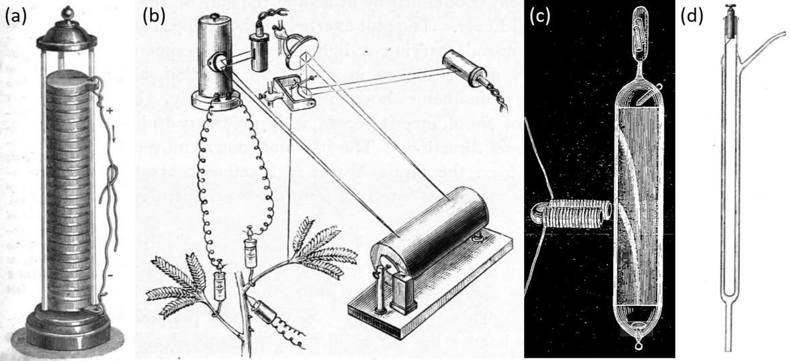

> ***Figura 2. (a) Pila voltaica (1800): columna de discos alternos de zinc-cobre separados por arandelas empapadas en salmuera [20]. (b) Aparato de Bose para respuestas mecánicas y eléctricas simultáneas [33]. (c) Tubo de Crookes (alto vacío) que demuestra rayos catódicos [34]. (d) Primer ozonizador de Werner von Siemens (1857) [35].***

Desde la segunda mitad del siglo XIX, comenzó a surgir una verdadera metrología de las descargas. Paschen formuló su ley (1889) que relacionaba el voltaje de ruptura con la presencia y la distancia entre electrodos **[38]**. La teoría de ionización de Townsend (1897–1901) aclaró la multiplicación en avalancha de electrones **[39, 40]**. Los tubos de Geissler y los experimentos de Crookes con gases enrarecidos (Figura 2c) revelaron la diversidad de fenómenos luminosos a presión reducida **[34, 41]**. Ya en 1857, Werner von Siemens describió la descarga de barrera dieléctrica (DBD) como fuente práctica para generación de ozono (Figura 2d) **[35]**. Para 1928, Langmuir introdujo el término plasma para describir un gas ionizado cuasi-neutro **[42]**.

Sobre esta base metroológica, siguieron aplicaciones químicas estructuradas. Los ozonizadores DBD de Siemens permitieron la ozonización de agua a gran escala **[43, 44]**. El arco Birkeland–Eyde (1903, Figura 3a) aprovechó plasmas de alta temperatura para oxidar nitrógeno atmosférico, produciendo nitratos como precursores de fertilizantes **[45]**. Las lámparas de vapor de mercurio a baja presión sistematizaron el uso germicida de la radiación ultravioleta (Figura 3b) **[46–48]**.

> 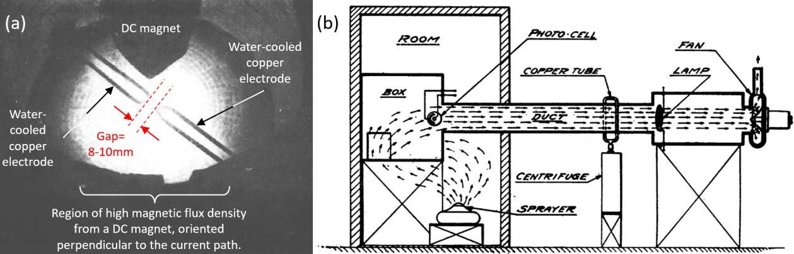

> ***Figura 3. (a) Disco de llama Birkeland–Eyde [45]. (b) Conducto de prueba de aerosol germicida UV [48].***

A principios del siglo XX, la electrocultura experimentó un renovado interés. Los dispositivos iban desde las redes aéreas de cables cargados de Lemström hasta las antenas "atmosféricas" de Christofleau **[49, 50]**. Como se muestra en la Figura 4a, estas últimas estaban diseñadas para canalizar la "electricidad natural" de diversas fuentes hacia el suelo. La Figura 4b representa su aplicación a viñedos, mientras que la Figura 4c ilustra informes de crecimiento mejorado de frijoles. Sin embargo, estos resultados deben interpretarse con precaución: los regímenes de fertilización, la heterogeneidad del suelo, los efectos estacionales y las geometrías de los dispositivos estaban mal controlados.

> 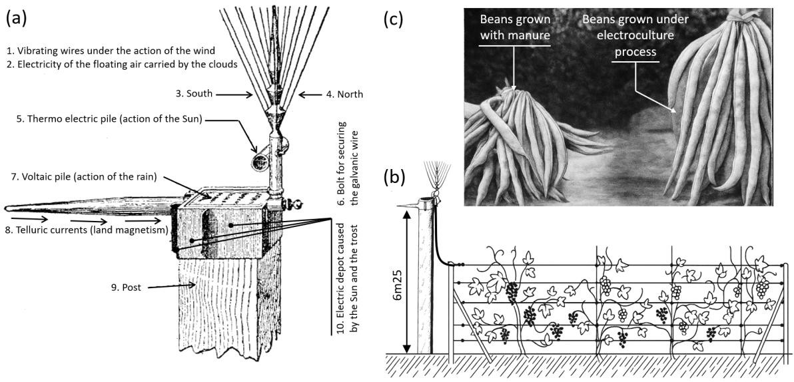

> ***Figura 4. (a) Diagrama esquemático de la antena atmosférica de Christofleau [50]. (b) Aplicación a vides [50]. (c) Frijoles cultivados con estiércol (izquierda) vs. bajo la antena de Christofleau (derecha) [50].***

Esta corriente histórica de electrocultura no evolucionó directamente hacia tecnologías basadas en plasma. Estas surgieron independientemente a finales del siglo XX, impulsadas por avances en física del plasma. Desde la década de 1970, los plasmas fríos comenzaron a investigarse como agentes de esterilización a baja temperatura. Para la década de 1990, los esterilizadores de plasma gaseoso de peróxido de hidrógeno entraron en la práctica sanitaria **[51, 52]**. A mediados-finales de la década de 1990, surgieron fuentes atmosféricas (DBDs, reactores glidarc, chorros de plasma) que operaban directamente al aire libre **[53]**.

## 1.3. El siglo XXI: el auge de la agricultura plasma

La agricultura plasma designa un campo de investigación contemporáneo que aplica fuentes de plasma frío a semillas, plantas, suelos, sistemas de riego y cadenas agroalimentarias. El análisis bibliométrico (Figura 5a) muestra que el término "agricultura plasma" ganó tracción solo después de mediados de la década de 2010.

Los plasmas fríos son descargas no térmicas cuya eficacia surge de la coacción de cinco propiedades (Figura 5b):

- **Eléctrica:** campos transitorios, frentes de ionización y corrientes pulsadas
- **Química:** especies reactivas de oxígeno y nitrógeno (RONS) — de vida corta (OH, O, NO) y de vida larga (H₂O₂, O₃, NO₂⁻/NO₃⁻)
- **Radiativa:** fotones UV y VUV que se acoplan a objetivos de ADN/proteínas
- **Térmica:** el gas volumétrico permanece cerca del ambiental, aunque el calentamiento local (10–50 °C) puede ser diseñado
- **Mecánico-fluida:** viento iónico y microchorros mejoran la transferencia de masa en límites plasma-líquido

> 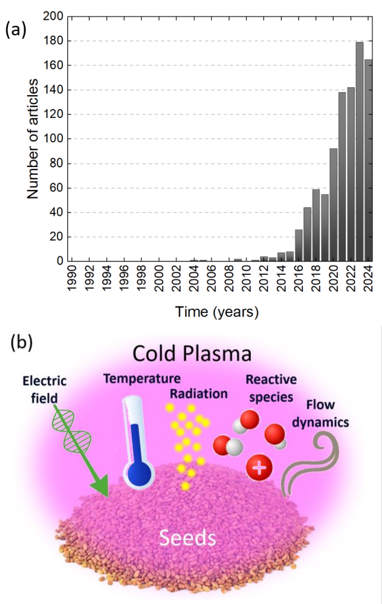

> ***Figura 5. (a) Publicaciones anuales que contienen "agricultura plasma" (Google Scholar, 1990–2024). (b) Diagrama de semillas tratadas por CAP con sus 5 propiedades acopladas.***

Para 2025, la agricultura plasma se organiza en cuatro ejes de aplicación:

- **Tratamiento de semillas:** modificación superficial inducida por plasma y RONS/UV de baja dosis para acelerar la germinación **[57, 58]**. La química de PAW se cuantifica rutinariamente mediante trazadores de dosis **[59]**.
- **Tratamiento de plantas:** CAP, afterglows y PAW bajo control térmico estricto para provocar señalización en lugar de daño **[60–62]**.
- **Tratamiento de medios:** agua de riego, suelo y aire — CAP y PAW permiten desinfección suave y modulación de comunidades microbianas **[63, 64]**.
- **Tratamiento agroalimentario:** CAP y PAW para sanitizar productos, empaques y equipos **[65–67]**.

En la agricultura plasma contemporánea, el progreso se define por un marco basado en la física de dosimetría explícita: métricas de dosis cuantificables y rastreables (concentraciones de RONS, fluencia UV, dosis eléctrica, tiempo de exposición) se miden en el objetivo.

---

# 2. Reevaluación de la contribución del Abbé Bertholon a la electricidad agrícola (década de 1780)

## 2.1. Breve biografía científica

Pierre-Nicolas Bertholon de Saint-Lazare (1741–1800), sacerdote, físico y pedagogo de la Ilustración, construyó su carrera en Montpellier, donde enseñó física experimental **[68]**. Durante la década de 1780 se convirtió en una figura central de la electricidad experimental, notable por su enfoque en aplicaciones más que en espectáculo. Combinó instrucción pública con demostraciones cuidadosamente preparadas, enmarcando su programa en torno a la electricidad meteorológica, la electricidad animal y la electricidad vegetal **[69]**.

Bertholon diseñó el electro-végétomètre, promovió la "electricidad médica" y abogó por pararrayos en Languedoc. Participó en el movimiento aerostático temprano, lanzando un globo aerostático con Jean-Antoine Chaptal en 1783 **[69, 71]**.

## 2.2. Tesis de Bertholon: la electricidad como estímulo para la vegetación

Bertholon avanzó una tesis notable: que la electricidad atmosférica era un reservorio constante capaz de estimular toda la fisiología de las plantas — germinación, circulación de la savia, nutrición, secreción, crecimiento, floración, fructificación y transpiración **[31]**. Su tratado se estructuró en tres partes:

1. Demostrar la existencia e influencia de la electricidad atmosférica
2. Catalogar sus efectos en las funciones vegetales
3. Operationalizar estos efectos mediante instrumentos dedicados, principalmente el electro-végétomètre

Reunió tres tipos de evidencia: correlaciones cualitativas (tormentas coincidiendo con germinación más rápida), observaciones instrumentadas (electrómetros, cometas y electroscopios) y conjeturas mecanicistas (electricidad impulsando la circulación de savia a través de "afinidad eléctrica").

La fortaleza del trabajo de Bertholon radica en su visión unificadora. Los límites también eran claros: no se intentó dosimetría, los roles de diferentes agentes no se distinguieron y gran parte del razonamiento permaneció analógico.

## 2.3. Dispositivos y procedimientos de operación de electrocultura de Bertholon

### Dispositivos de ruta seca: el electro-végétomètre

El instrumento insignia de Bertholon fue el electro-végétomètre — un colector-distribuidor pasivo de "electricidad atmosférica" sin pantalla ni dosimetría. Se diseñaron dos modelos (Figura 6):

> 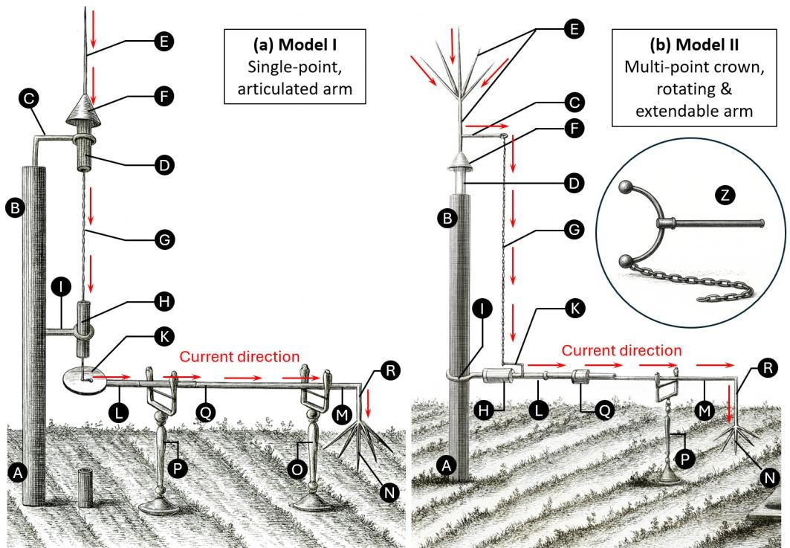

> ***Figura 6. Electró-végétomètre de Bertholon. (a) Modelo I: colector de punto único y brazo articulado. (b) Modelo II: corona de puntos, brazo giratorio extensible. Ambos incluían un dispositivo de neutralización (Z) [31].***

**Tabla 1. Comparación de las variantes del electro-vegetómetro de Bertholon.**

| Característica | Modelo I (punto único, brazo articulado) | Modelo II (corona de múltiples puntos, brazo giratorio) |
|----------------|------------------------------------------|--------------------------------------------------------|
| **Propósito** | Captura pasiva → Conducción aislada → Difusión suave | Igual |
| **Mástil/Base** | Mástil de madera: sección enterrada secada al fuego, alquitranada, envuelta en carbón/cemento | Mástil con cilindro de cabeza saturado en resina, tratado con alquitrán/brea |
| **Aislamiento superior** | Tubo de vidrio grueso con mastic bituminoso (D); segundo aislante (H) | Interfaz rotativa aislada mediante inserción de resina (D) y manguito de vidrio/mastic (H) |
| **Colector** | Varilla de punto único (E) con embudo de hojalata (F) | Corona de múltiples puntos (E) para maximizar captura de carga |
| **Ruta de conducción** | Cadena conductora (G) desde E a través de H | Palanca de hierro curvada (C) que lleva cadena (G) al brazo |
| **Buffer** | Disco de hierro (K) como pequeño "condensador/regulador" | Sin disco separado; regulación implícita |
| **Brazo horizontal** | Conductor articulado (K-L-M-N) en caballetes aislantes (O, P) con cuerdas de seda | Conductor telescópico (L-M) con conductor telescópico (Q) en caballete aislante (P) |
| **Difusor terminal** | Corona de puntas afiladas (N, R) que liberan corona no disruptiva | Corona de puntas afiladas |
| **Movilidad** | Brazo se balancea en bisagras (L, Q) para cubrir un sector | Rotación completa de 360°; extender/retraer para variar alcance |
| **Neutralización** | Cadena entre K y tierra para drenar carga | Igual |
| **Seguridad** | "Excitador en forma de C" (marco de cobre/hierro con mango de vidrio + cadena de tierra) | Igual |

Ambos modelos incluían un "excitador en forma de C": una herramienta rudimentaria de puesta a tierra para seguridad del operador (recuadro de la Figura 6b). Consistía en una varilla metálica curvada con extremos redondeados, uno de los cuales llevaba una cadena arrastrándose en el suelo.

Bertholon también imaginó un método de "ruta seca" para combatir insectos taladrantes de la madera (Figura 7). Propuso descargar una botella de Leyden directamente a través de la madera afectada posicionando dos alambres de hierro en lados opuestos. Para huertos, los árboles se conectaban con alambres de hierro desnudos para que una sola descarga pudiera propagarse a través de tramos sucesivos.

> 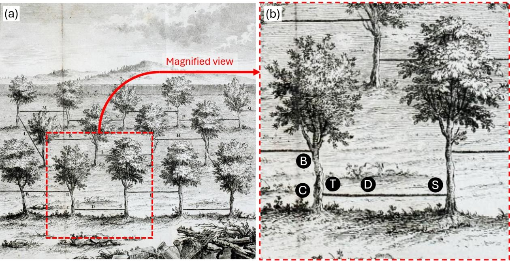

> ***Figura 7. (a) Huerto de frutales donde los árboles están interconectados por alambres de hierro formando una cuadrícula. Una botella de Leyden se descarga a través de la red. (b) Primer plano: dos alambres enmarcan una sección del tronco [31].***

### Dispositivos de ruta húmeda: riego electrificado

Bertholon también diseñó instrumentos basados en riego con "agua electrificada," impulsados por una máquina electrostática (Figura 8).

> 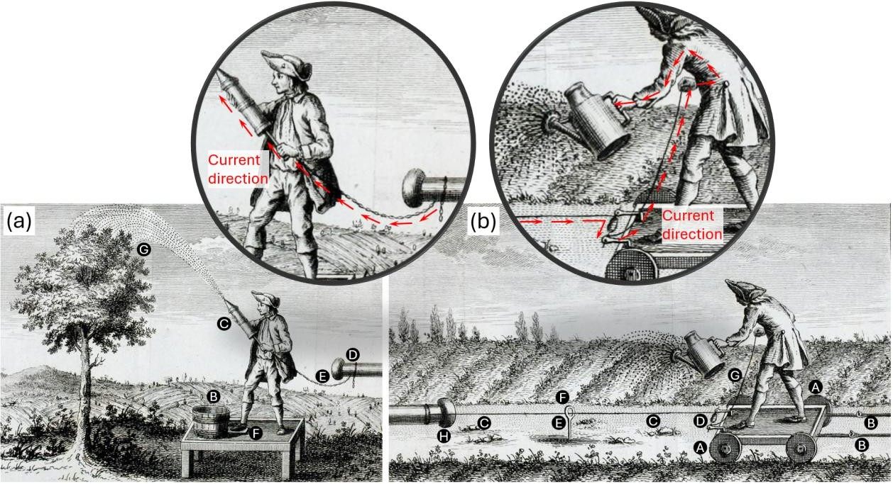

> ***Figura 8. (Izquierda) "Riego eléctrico artificial" para árboles: operador en taburete aislante con cubeta y bomba de jeringa. (Derecha) "Riego eléctrico" móvil para camas de hortalizas: carrito aislado con resina y carrete de alambre [31].***

**Tabla 2. Comparación de los dispositivos de riego electrificado de Bertholon.**

| Característica | Riego árbol por árbol | Carrito móvil para camas de hortalizas |
|----------------|----------------------|----------------------------------------|
| **Aislamiento** | Operador en taburete aislante (A), tabla soportada por pilares de vidrio | Operador en carrito aislante moldeado con resina (A) |
| **Fuente de agua** | Cubeta (B) sobre plataforma del taburete | Regaderas rellenadas por segundo jardinero |
| **Dispositivo de riego** | Bomba de jeringa (C) rocía sobre dosel (G) | Operador vierte desde regadera mientras sostiene cordón vivo (G) |
| **Conexión eléctrica** | Máquina electrostática vía cadena (E) desde conductor (D) | Carrito lleva carrete (D) con eje aislado, alambre (C) a máquina (H) |
| **Conducción al agua** | Placa de hojalata (F) bajo el pie asegura que la cubeta se comunique con la carga | Alambre pasa por soportes aislantes (E) con anillos de vidrio (F) |
| **Modo de electrificación** | El agua se carga; chispas/hormigueo en el chorro | Regadera y operador al mismo potencial; "lluvia eléctrica" |
| **Movilidad/flujos** | Dispositivo transportado árbol por árbol; simple e inexpensive | Carrito avanza fila por fila; suministro continuo de regaderas |
| **Seguridad** | Aislamiento asegura que la corriente fluya al agua; leve hormigueo si conectado a tierra | Operador aislado en carrito; "excitador en forma de C" recomendado |
| **Uso agronómico** | Efectivo cuando se repite diariamente sobre plántulas | Ligeramente más lento pero beneficios claros tras varios días |

## 2.4. Limitaciones técnicas y metodológicas

A finales del siglo XVIII, el programa de Bertholon estaba limitado sobre todo por la instrumentación. El electrómetro de chispa de Lane (1767) y el cuadrante de Henley (c. 1770) proporcionaron solo indicadores cualitativos toscos **[72, 73]**. La balanza de torsión de Coulomb (1785), aunque estableció la primera ley cuantitativa de la electrostática, posterior a los escritos de Bertholon y midió fuerzas en lugar de deposición de energía **[74, 75]**.

El marco conceptual era igualmente incompleto. El ozono no se reconoció como especie química distinta hasta 1840 **[76]**, mientras que la radiación ultravioleta se descubrió solo en 1801 **[77, 78]**. Las especies reactivas de oxígeno y nitrógeno (RONS) y los flujos electrohidrodinámicos eran completamente desconocidos. En *De l'Électricité des Végétaux* (pp. 399, 401), el propio Bertholon reportó aigrettes luminosas visibles en la noche en los terminales de múltiples puntos — la física moderna las reconoce como descargas corona: plasmas localizados que liberan iones, electrones, ozono y óxidos de nitrógeno **[31, 79]**.

La práctica experimental estaba muy por debajo de los estándares modernos. Bertholon dependió de relatos cualitativos sin replicación sistemática, randomización ni grupos de control formales. Las herramientas metodológicas requeridas para estabilizar la inferencia solo aparecerían en el siglo XX **[80, 81]**.

En contraste, la agricultura plasma moderna define la "dosis" a través de parámetros explícitos y cuantitativos: intensidad del campo eléctrico (V·m⁻¹·s), densidad de carga superficial (C·m⁻²) y deposición de energía específica (J·kg⁻¹ o J·m⁻²) **[54, 56, 82]**.

---

# 3. Física moderna de plasmas fríos aplicada a la agricultura

## 3.1. Definición de plasma frío y propiedades clave

El plasma es el cuarto estado de la materia, caracterizado por cuasi-neutralidad macroscópica (densidades aproximadamente equilibradas de iones positivos y electrones) y dinámica colectiva dominada por interacciones de Coulomb de largo alcance. Dos parámetros fundamentales gobiernan su comportamiento electrostático:

- **Longitud de Debye** λ_D = √(ε₀ k_B T_e / n_e e²)
- **Frecuencia de plasma de electrones** ω_p = √(n_e e² / ε₀ m_e)

Un medio se califica como plasma cuando λ_D ≪ L (tamaño del sistema), N_D = (4/3)πn_e λ_D³ ≫ 1, y los efectos colectivos dominan sobre colisiones binarias **[83, 84]**.

Un **plasma atmosférico frío (CAP)** es una descarga de no equilibrio en la que la temperatura de los electrones T_e (≈1–5 eV, es decir, 11,600–58,000 K) excede ampliamente la temperatura del gas T_g (≈300–350 K). A presión atmosférica, se observan regímenes de streamer (microdescargas canalizadas <10 ns) y descargas de barrera dieléctrica (DBDs), que pueden ser filamentosas o difusas **[84]**.

Los CAP acoplan múltiples procesos: el campo eléctrico impulsa el transporte de carga mientras que los RONS incluyen especies de vida corta (O(³P), OH•, ¹O₂, NO•) y de vida larga (O₃, H₂O₂, NO₂⁻/NO₃⁻) **[87, 88]**. La cadena de energía: fuente → electrones → reacciones elementales → especies reactivas → flujos interfaciales **[89]**.

Las fuentes atmosféricas comunes incluyen **DBDs** (planares, coaxiales) impulsadas sinusoidalmente o en modo pulsado (kHz–MHz) **[90]** y **chorros de plasma a presión atmosférica (APPJ)** que operan en helio o argón **[91]**.

La cualificación metroológica incluye: diagnósticos eléctricos (V(t), I(t), figuras de Lissajous), imagen ICCD para visualización de streamers, temperatura del gas por espectroscopia rotacional y análisis fisicoquímico (H₂O₂, NO₂⁻, NO₃⁻, pH, conductividad) **[87, 92–96]**.

## 3.2. Tecnologías y protocolos de laboratorio

El CAP se implementa a través de tres rutas complementarias:

- **DDS (Exposición directa en superficie seca):** plasma aplicado directamente a tejidos sin agua libre intencional
- **DWS (Exposición directa en superficie húmeda):** plasma aplicado con una película acuosa delgada en la interfaz
- **PAW (Agua activada por plasma):** agua tratada ex situ por plasma, luego aplicada por remojo, aspersión, riego o enjuague postcosecha **[58]**

Rangos operativos indicativos:
- **DBD:** 6–20 kVpp, 5–50 kHz, gap 0.5–5 mm, exposición 0.5–60 s
- **APPJ:** 2–10 kVpp, 10–200 kHz o RF, 0.5–5 L·min⁻¹ He/Ar, boquilla-tejido 5–30 mm

Para exposiciones directas, la dosis se expresa como energía específica (J·m⁻² para hojas, J·kg⁻¹ para lotes de semillas), condiciones operativas eléctricas, composición/flujo del gas, distancia fuente-objetivo, velocidad de escaneo, tiempo de exposición y temperatura del efluente **[98, 99]**.

Para PAW, la caracterización incluye energía eléctrica específica (J·L⁻¹), estado químico (H₂O₂, NO₂⁻/NO₃⁻, pH, conductividad) y dosis aplicada **[87, 100, 101]**.

## 3.3. Efectos del plasma frío en las semillas

El CAP ejerce tres influencias principales e interdependientes sobre las semillas: (1) alteración de la fisico-química de la cubierta, (2) reducción de la carga microbiana y (3) activación de respuestas fisiológicas y moleculares tempranas.

### 3.3.1. Modificación de la cubierta de la semilla y humectabilidad

Los estudios de microscopía (AFM/SEM) muestran consistentemente que el CAP altera la superficie externa de las semillas mediante el alisamiento y reestructuración de la cubierta a través de grabado, ablación y nano/micro-estructuración. En trigo y cebada, los tratamientos con plasma Ar–O₂ produjeron superficies visiblemente fisuradas y más rugosas que se correlacionaron con una mayor absorción de agua **[102, 103]**.

> 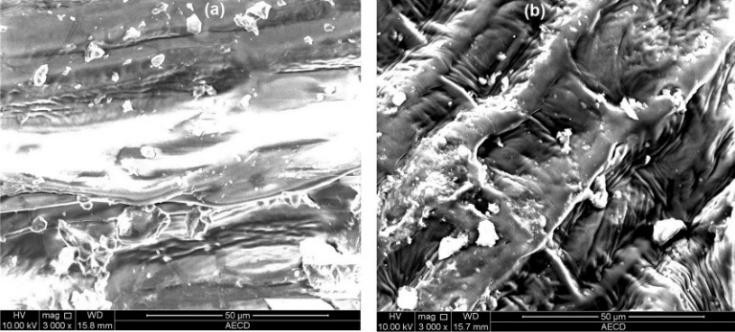

> ***Figura 9. Imágenes SEM de superficies de semillas de trigo tratadas durante 90 s con (a) control (sin plasma), (b) plasma Ar/O₂. Barra de escala es 50 μm. Reproducido de Rahman et al., Scientific Reports, 2018, CC BY 4.0 [102].***

La química de la superficie también se transforma: el plasma introduce grupos funcionales que contienen oxígeno, aumentando la energía superficial **[107, 108]**. Una de las señales más claras es la reducción dramática en el ángulo de contacto con el agua (WCA). En lenteja, frijol y trigo, el plasma de RF de aire redujo el WCA de 127°, 98° y 115° a 20°, 53° y casi 0°, respectivamente (Figura 10) **[109]**.

> 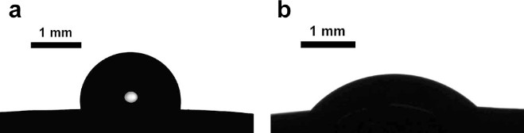

> ***Figura 10. Gotita de agua sobre una semilla de frijol: (a) sin tratar, (b) tratada con plasma. Reproducido de Bormashenko et al., Scientific Reports, 2012, CC BY 4.0 [109].***

### 3.3.2. Descontaminación y control de patógenos

Los tratamientos con CAP logran reducciones sustanciales en la carga microbiana superficial para maíz, trigo, girasol y otras semillas **[111]**. La Figura 11a demuestra la descontaminación fúngica efectiva de semillas de girasol tras un tratamiento de plasma de 5 minutos. En garbanzo, 2–5 minutos de CAP redujeron la microbiota natural en 1–2 unidades log **[112]**. En avellanas, el plasma de SF₆ a baja presión logró hasta una reducción de 5-log de *Aspergillus parasiticus* **[113]**.

> 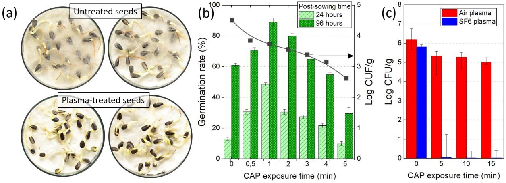

> ***Figura 11. (a) Semillas de girasol contaminadas por Rhizopus: sin tratar vs. tratadas con plasma durante 5 min (T. Dufour, LPP). (b) Efecto del CAP sobre la germinación de Cicer arietinum y la supervivencia de microorganismos [112]. (c) Reducción de A. parasiticus en avellanas [113].***

Sin embargo, la inactivación microbiana completa sigue siendo infrecuente y dependiente de la especie. En albahaca dulce, los tratamientos DBD redujeron *Fusarium oxysporum* pero colonias viables persistieron en los huecos de las semillas **[114]**.

### 3.3.3. Respuestas fisiológicas y moleculares

Los RONS generados por plasma promueven el catabolismo del ácido abscísico (ABA), mejoran la señalización del ácido giberélico (GA), interactúan con el óxido nítrico (NO) e inducen la expresión de genes debilitantes de la pared celular **[116, 117]**.

A nivel fisiológico, uno de los resultados más consistentes es la sobre-regulación de las defensas antioxidantes. En colza expuesta a sequía, el CAP mejoró la germinación y aumentó las actividades de SOD y CAT mientras reducía la peroxidación lipídica (MDA) (Figura 12) **[118]**.

> 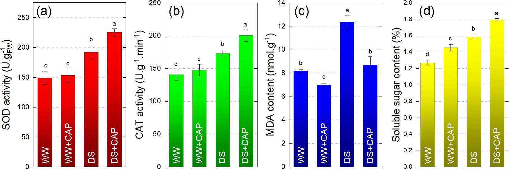

> ***Figura 12. Efecto del estrés por sequía y el tratamiento con plasma frío sobre 4 biomarcadores en plántulas de colza: (a) actividad SOD, (b) actividad CAT, (c) contenidos de MDA, (d) contenidos de azúcares solubles. WW: bien regado; DS: estrés por sequía. Adaptado de [118].***

En arroz bajo estrés por frío, el DBD de argón aceleró la germinación y activó cambios transcriptómicos incluyendo la supresión de NCED3 y la inducción de genes de tolerancia al estrés **[119]**. Tendencias similares se reportaron en soja **[120]**.

## 3.4. Efectos del plasma frío en plántulas y plantas

El CAP puede estimular el crecimiento y la tolerancia al estrés en múltiples especies, aunque los resultados permanecen fuertemente dependientes de la dosis y el contexto. El PAW promovió el crecimiento de plántulas de tomate y la calidad nutricional, mientras que la albahaca expuesta a DBD mostró clorofilas elevadas y actividad antioxidante **[123, 124]**. Los beneficios a largo plazo del riego con PAW son visibles en tomate y pimiento, donde las plántulas permanecieron más grandes y vigorosas incluso 60 días después de la siembra (Figuras 13a–b) **[125]**.

En tomate, los tratamientos moderados de PAW (15–30 min) maximizaron el desarrollo de plántulas a los 28 días, mientras que exposiciones más largas se volvieron menos efectivas (Figura 13c) **[123]**. Las plántulas de lenteja regadas con agua activada por plasma mostraron un crecimiento más fuerte comparado con controles a los 18 días (Figura 13d) **[126]**.

> 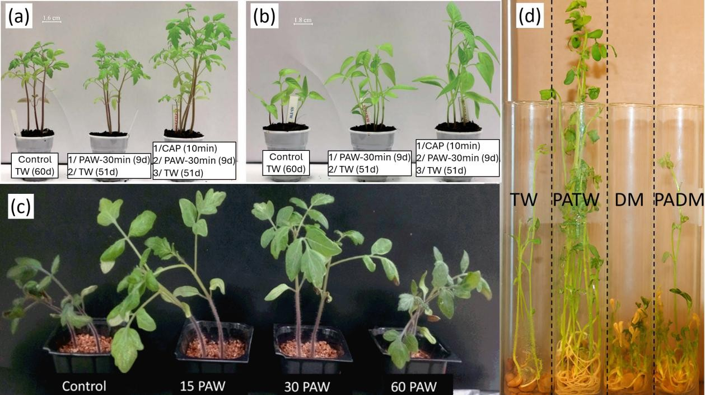

> ***Figura 13. (a–b) Efecto a largo plazo del PAW sobre plántulas de tomate (a) y pimiento (b), 60º día después de la siembra [125]. (c) Efecto del tiempo de exposición al PAW sobre el crecimiento de plántulas de tomate (28 días) [123]. (d) Plántulas de lenteja regadas con agua del grifo (TW), agua del grifo activada por plasma (PATW), agua desmineralizada (DM) o agua desmineralizada activada por plasma (PADM), día 18 [126].***

El plasma también afecta el rendimiento fotosintético (PSII). Las dosis bajas mejoran los parámetros fotoquímicos, mientras que las dosis más altas los inhiben **[127, 128]**. CAP/PAW a menudo sobre-regula enzimas antioxidantes (SOD, CAT, POX) y modula el metabolismo secundario **[124, 129]**. Las plántulas de tomate rociadas con PAW mostraron hasta un 61% de reducción en severidad de enfermedad contra *Xanthomonas* **[130]**.

La química redox-activa del PAW se ha vinculado a una mejor tolerancia a la salinidad y la sequía **[128, 132]**. A nivel radicular, el maíz mostró lignificación endodérmica acelerada bajo exposición al arsénico, sugiriendo una "fortificación" anatómica inducida por plasma **[133]**.

---

# 4. Conclusiones y perspectivas

Este artículo ha trazado una línea continua, aunque discontinua, desde las "electrizaciones" del siglo XVIII hasta la agronomía de plasma frío de hoy. El eje es la metrología. Donde Bertholon diseñó caminos para un "fluido eléctrico" indivisible sin acceso a dosis ni agentes, la agricultura plasma contemporánea define fuentes, cuantifica transferencias interfaciales y mide la dosis bajo condiciones controladas.

Reevaluada a la luz de esto, la contribución de Bertholon es metodológica más que evidencial: proporcionó un vocabulario operativo y la intuición de que regímenes eléctricos moderados podrían modular benéficamente las funciones de las plantas. El trabajo moderno explica cuándo y por qué esa intuición se mantiene.

La ruptura con la electrocultura histórica es triple: la naturaleza del objeto eléctrico (de una esencia unitaria a un proceso multifísico), los medios de medición y control (de señales cualitativas a dosimetría químico-energética) y los estándares de validación (de pruebas convincentes a diseños aleatorizados y replicados).

De cara al futuro, cuatro prioridades definen un agenda aplicada:

1. **Anclar la práctica en dosificación rastreable** para ambas rutas CAP y PAW
2. **Escalar** con fuentes eco-diseñadas, alimentadas por aire y reactores PAW de baja energía
3. **Integrar procesos de plasma** dentro de itinerarios agroecológicos
4. **Garantizar una adopción segura y robusta** mediante límites de ozono/NOₓ y UV, protección contra arcos y ensayos multicéntricos

Visto a lo largo de tres siglos, el motivo de una "électricité vivifiante" perdura, pero su estatus está transformado. Ya no es una idea reguladora basada en reservorios atmosféricos; es una caja de herramientas mecanicista capaz de entregar sistemas de cultivo de menor insumo, rastreables y potencialmente más resilientes.

---

# 5. Referencias

[1] Teofrasto. *De Lapidibus*. Oxford, At the Clarendon Press (1965).
[2] Plinio el Viejo. *Historia Natural*. Libro 37. Traducido por D.E. Eichholz (1962).
[3] J. Francis, J. Dingley. "Electroanaesthesia — del pez torpedo al TENS." *Anaesthesia* 70(1), 93–103 (2015).
[4] A. Magnus, *De mineralibus*, Libro II. Clarendon Press: Oxford, 1967.
[5] G. della Porta. *Magia naturalis* (1558/1589), Libro VII, cap. 16.
[6] G. Cardano. *De subtilitate*, Libro VII. Lyon, 1663.
[7] W. Gilbert. *De Magnete* (1600).
[8] N. H. de V. Heathcote, "El globo de azufre de Guericke," *Ann. Sci.* 6(3), 293–305 (1950).
[9] F. Hauksbee. *Experiencias Físico-Mecánicas sobre Varios Temas* (1709).
[10] S. Gray. "Una carta a Cromwell Mortimer." *Philosophical Transactions* 37, 1731–32.
[11] C.-F. Du Fay. "Electricidad Vitrea/Resinosa." *Nature* 144, 105 (1939).
[12] J. L. Heilbron. "A propos de l'invention de la bouteille de Leyde." *Revue d'histoire des sciences* 19(2), 133–142 (1966).
[13] C. Dorsman, C. A. Crommelin. "La invención de la botella de Leyden."
[14] J. Priestley. *The History and Present State of Electricity*. Londres, 1767.
[15] E. Nairne. *Experiencias sobre electricidad*. Londres, 1779.
[16] W. D. Hackmann. "Las investigaciones del Dr. Martinus Van Marum." *Medical History* 16(1), 11–26 (1972).
[17] J.-A. Nollet. *Cartas sobre la electricidad*. París, 1753.
[18] J.-A. Nollet. *Ensayo sobre la Electricidad de los Cuerpos*. París, 1765.
[19] B. Pike. *Catálogo Ilustrado Descriptivo de Pike*, 2ª ed., vol. 1, 1856, pp. 260, 269.
[20] A. Ganot. *Tratado elemental de física experimental*, 9ª ed. (1860), pp. 567, 691.
[21] B. Franklin. *Experiencias y observaciones sobre la electricidad*. Londres, 1751.
[22] E. P. Krider. "Benjamin Franklin y los pararrayos." *Physics Today* 59(1), 42–48 (2006).
[23] T. Lane. "Descripción de un electrómetro inventado por el Sr. Lane." *Phil. Trans. R. Soc.* 57, 451–460 (1767).
[24] J.-A. Sigaud De La Fond. *Resumen histórico y experimental de los fenómenos eléctricos*. París, 1785.
[25] *Philosophical Transactions*, vol. LXII, 1772, p. 359.
[26] J. Lacki. "El Turista Físico. Ginebra." *Physics in Perspective* 9(2), 231–252 (2007).
[27] C. A. Coulomb. *Memorias sobre la electricidad y el magnetismo*. París, 1785.
[28] J. Priestley. *The History and Present State of Electricity*, 2ª ed. Londres, 1769.
[29] T. Cavallo. *Un tratado completo de electricidad*, 3ª ed. Londres, 1786.
[30] G. Beccaria. *Dell'elettricismo artificiale e naturale*. 1753.
[31] Bertholon. *De l'électricité des végétaux*. París, 1783.
[32] L. Fabbrizzi. "Extraño Caso del Señor Volta y el Señor Nicholson." *Angewandte* 58(18), 5810–5822 (2019).
[33] J. C. Bose. *Electrofisiología Comparada*. Nueva York, 1907.
[34] W. Crookes. "Sobre la materia radiante." *American Journal of Science* s3-18(106) (1879).
[35] W. von Siemens. "Sobre la inducción electrostática." *Annalen der Physik* 178(9), 66–122 (1857).
[36] M. Faraday. "Investigaciones experimentales en electricidad — quinta serie." *Philosophical Transactions* 123 (1833).
[37] J. Burdon-Sanderson. "Nota sobre los Fenómenos Eléctricos que acompañan la Irritación de la Hoja de Dionaea muscipula." *Proc. Royal Society* (1873).
[38] F. Paschen. "Sobre la diferencia de potencial requerida para la chispa en aire." *Annalen der Physik* (1889).
[39] J. S. Townsend. "La conductividad producida en gases." *Nature* 62, 340–341 (1900).
[40] J. S. Townsend. *La Teoría de Ionización de Gases por Colisión*. Londres, 1901.
[41] A. W. Hofmann. "Dr. Heinrich Geissler." *Ber. Dtsch. Chem. Ges.* 12, 147–148 (1879).
[42] I. Langmuir. "Oscilaciones en Gases Ionizados." *Proc. Natl. Acad. Sci.* (1928).
[43] C. von Sonntag, U. von Gunten. *Química del ozono en tratamiento de agua y aguas residuales*. Iwa Publishing, 2012.
[44] C. Gottschalk, J. A. Libra, A. Saupe. *Ozonación de agua y aguas residuales*. Wiley-VCH, 2010.
[45] Kr. Birkeland. *Trans. Faraday Soc.* 2, 98–116 (1906).
[46] A. M. W. Downing, T. P. Blunt. "Investigaciones sobre el efecto de la luz sobre Bacterias." *Proc. Royal Society of London* 26 (1878).
[47] M. Luckiesh, L. Holladay. *Aplicaciones de Energía Germicida, Eritemal e Infrarroja*. Nueva York, 1946.
[48] Rentschler, H. (1942) "Acción Bactericida de la Radiación Ultravioleta."
[49] S. Lemström. *Electricidad en Agricultura y Horticultura*. Londres, 1904.
[50] J. Christofleau. *Electroculture — Fertilización de tierras por la electricidad atmosférica*. 1925.
[51] M. S. Kyi, J. Holton, G. L. Ridgway. "Evaluación de la eficacia de un sistema de esterilización por plasma gaseoso de H₂O₂ a baja temperatura." *J. Hospital Infection* 31(4), 275–284 (1995).
[52] W. A. Rutala et al. "Evaluación comparativa de la actividad esporicida de nuevas tecnologías de esterilización a baja temperatura." *Am. J. Infection Control* 26(4), 393–398 (1998).
[53] M. Laroussi. "Esterilización de materia contaminada con un plasma a presión atmosférica." *IEEE Trans. Plasma Science* 24(3), 1188–1191 (1996).
[54] I. Adamovich et al. "La Hoja de Ruta del Plasma 2017." *J. Physics D: Applied Physics* 50(32), 323001 (2017).
[55] P. Ranieri et al. "Agricultura plasma: Revisión." *Plasma Processes & Polymers* 18(1), 2000162 (2021).
[56] D. B. Graves. "El papel emergente de las especies reactivas de oxígeno y nitrógeno." *J. Physics D: Applied Physics* 45(26), 263001 (2012).
[57] D. Yan et al. "Mejorando la Germinación de Semillas con Plasma Atmosférico Frío." *Plasma* 5(1), 98–110 (2022).
[58] M. A. Benabderrahm et al. "El tratamiento con plasma frío impulsa la germinación de cebada." *J. Cereal Science* 116, 103852 (2024).
[59] K. S. Wong et al. "Agua Activada por Plasma: Propiedades Fisicoquímicas." *Processes* 11(7), 2213 (2023).
[60] E. Cortese et al. "PAW Provoca Elevaciones Rápidas de Ca²⁺ en Arabidopsis." *Plants* 10(11), 2516 (2021).
[61] S. M. E. Sultan et al. "El plasma atmosférico frío mejora plántulas de tomate." *BMC Plant Biology* 24, 420 (2024).
[62] Y. Zambon et al. "El agua activada por plasma provoca respuestas de defensa en plantas." *Scientific Reports* 10, 19211 (2020).
[63] Y. Gao et al. "Revisión sobre la formación de agua activada por plasma frío." *Food Research International* 157, 111246 (2022).
[64] J. Šimečková et al. "Influencia del PAW sobre propiedades del suelo." *Water* 12(9), 2357 (2020).
[65] B. A. Niemira. "Descontaminación de Alimentos con Plasma Frío." *Ann. Rev. Food Sci. Tech.* 3, 125–142 (2012).
[66] N. N. Misra et al. "Tratamiento con plasma frío a presión atmosférica en empaque de fresas." *J. Food Engineering* 125, 131–138 (2014).
[67] M. Bayati et al. "Cambios químicos y físicos inducidos por tratamiento con plasma frío." *Compr Rev Food Sci Food Saf* 23(4), e13376 (2024).
[68] M. François, F. Fourmaux. "Nota sobre el Abbé Pierre Bertholon de Saint Lazare." CTHS.
[69] L. Dulieu. "El movimiento científico montpellierés en el siglo XVIII." *Revue d'histoire des sciences* 11(3), 227–249 (1958).
[70] M. l'Abbé Bertholon. *De l'électricité du corps humain*. París, 1780.
[71] M. l'Abbé Bertholon, M. Goyer. *La nature considérée sous ses différents aspects*. París, 1787.
[72] J. Priestley. "Una cuenta de un nuevo electrómetro, ideado por el Sr. William Henly." *Philosophical Transactions* 62 (1772).
[73] A. Guillemin. *Electricidad y Magnetismo*. Londres, 1891.
[74] C. A. Coulomb. *Memorias sobre la electricidad y el magnetismo*. Segunda memoria, pp. 577–611 (1785).
[75] A. Martinez. "Replicación del Experimento de la Balanza de Torsión de Coulomb." *Arch. Hist. Exact Sci.* 60, 517–563 (2006).
[76] M. B. Rubin. "La historia del ozono." *Bull. Hist. Chem.* 26(1), 40–56 (2001).
[77] D. Tarasick et al. "Informe de Evaluación de Ozono Troposférico." *Elementa* 7:39 (2019).
[78] J. Barth. "Johann Wilhelm Ritter y el descubrimiento de la radiación UV." *Hautarzt* 38(5), 301–303 (1987).
[79] E. Kuffel et al. *Ingeniería de alto voltaje: fundamentos*. Butterworth-Heinemann, 2000.
[80] R. A. Fisher. *El diseño de experimentos*. Hafner Press, 1971.
[81] I. Chalmers et al. "Por qué el ensayo MRC de 1948 de estreptomicina usó asignación basada en números aleatorios." *J. Royal Society of Medicine* 104(9) (2011).
[82] P. Bourke et al. "El Potencial del Plasma Frío para una Producción Alimentaria Segura y Sostenible." *Trends in Biotechnology* 36(6), 615–626 (2018).
[83] F. F. Chen. *Introducción a la Física del Plasma y la Fusión Controlada*. Springer, 2019.
[84] Y. P. Raizer. *Física de Descargas de Gas*. Springer, 1991.
[85] M. A. Lieberman, A. J. Lichtenberg. *Principios de Descargas de Plasma y Procesamiento de Materiales*. Wiley, 2005.
[86] L. C. Pitchford et al. "LXCat: una Plataforma de Acceso Abierto." *Plasma Processes & Polymers* 14(1–2) (2016).
[87] F. Judée et al. "Activación de agua del grifo usando DBD." *Wat. Res.* 133, 47–59 (2018).
[88] P. Bruggeman, C. Leys. "Plasmas no térmicos en y en contacto con líquidos." *J. Physics D* 42(5), 053001 (2009).
[89] P. J. Bruggeman et al. "Interacciones plasma-líquido: Una revisión y hoja de ruta." *Plasma Sources Sci. Technol.* 25(5), 053002 (2016).
[90] U. Kogelschatz. "Descargas de Barrera Dieléctrica." *Plasma Chemistry and Plasma Processing* 23, 1–46 (2003).
[91] J. Winter et al. "Chorros de plasma a presión atmosférica: una visión general." *Plasma Sources Sci. Technol.* 24(6), 064001 (2015).
[92] T. C. Manley. "Las Características Eléctricas de la Descarga del Ozonizador." *Trans. Electrochemical Society* 84(1) (1943).
[93] H. Decauchy, T. Dufour. "Mecanismos de transmisión y reflexión múltiple de streamers guiados." *Plasma Sources Sci. Technol.* 31(11) (2022).
[94] J. H. Kim et al. "Mediciones ópticas de temperaturas de gas en plasmas fríos RF a presión atmosférica." *Surface and Coatings Technology* 171, 211–215 (2003).
[95] N. Masoud et al. "Mediciones de Temperaturas Rotacionales y Vibracionales en un C-DBD." *Contributions to Plasma Physics* 45(1), 32–39 (2005).
[96] A. Herrmann et al. "Diseño Mejorado de Sonda Catalítica para Mapeo de Densidad de Radicales." *J. Phys. Chem. A* 128(46), 10080–10086 (2024).
[97] R. R. Brandenburg. "Descargas de barrera dieléctrica: progreso en fuentes de plasma." *Plasma Sources Sci. Technol.* 26(5), 053001 (2017).
[98] L. L. Alves et al. "Fundamentos de estándares de plasma." *Plasma Sources Sci. Technol.* 32(2) (2023).
[99] J. R. Bolton, K. G. Linden. "Estandarización de Métodos para Determinación de Fluencia." *J. Environmental Engineering* 129(3).
[100] D. Tsikas. "Análisis de nitrito y nitrato en fluidos biológicos." *J. Chromatography B* 851, 51–70 (2007).
[101] J.-Y. Han et al. "Efectos del agua activada por burbuja de plasma sobre patógenos transmitidos por alimentos en tomates." *Food Control* 144, 109381 (2023).
[102] M. M. Rahman et al. "Mecanismos y Señalización Asociados con la Mejora del Crecimiento en Trigo Mediante Plasma LPDBD." *Scientific Reports* 8, 10498 (2018).
[103] N. Dawood. "Efectos del tratamiento con plasma de aire sobre la absorción de agua de semillas de trigo y cebada." *J. Taibah University For Science* 15(1), 1094–1100 (2021).
[104] P. Starič et al. "Respuesta de Dos Variedades de Trigo a Plasma de Oxígeno de Brillo y Afterglow." *Plants* 10(8), 1728 (2021).
[105] P. Starič et al. "La Influencia del Plasma Frío de Brillo y Afterglow sobre Semillas de Trigo." *Int. J. Mol. Sci.* 23(13), 7369 (2022).
[106] S. Karmakar et al. "Impacto del plasma LFGD sobre superficie de semillas, germinación, crecimiento de maíz." *Heliyon* 7, e06458 (2021).
[107] R. Molina et al. "Análisis fisicoquímico de superficie de semillas de trigo tratadas con DBD." *Plasma Processes & Polymers* 18(1), 2000086 (2021).
[108] N. Recek et al. "Germinación de Semillas de Phaseolus vulgaris L. tras Plasma RF." *Int. J. Mol. Sci.* 22(13), 6672 (2021).
[109] E. Bormashenko et al. "El Tratamiento con Plasma RF Frío Modifica la Humectabilidad y Velocidad de Germinación de Semillas." *Scientific Reports* 2, 741 (2012).
[110] N. Khamsen et al. "Esterilización y Mejora de Germinación de Semillas de Arroz Mediante Plasma de Descarga Híbrida Atmosférica." *ACS Appl. Mater. Interfaces* 8(30), 19268–19275 (2016).
[111] J. Mravlje et al. "Desarrollo de Tecnologías de Plasma Frío para Descontaminación Superficial de Patógenos Fúngicos en Semillas." *J. Fungi* 7(8), 650 (2021).
[112] A. Mitra et al. "Inactivación de Microorganismos Superficiales por Plasma Atmosférico Frío." *Food and Bioprocess Technology* 7, 645–653 (2014).
[113] P. Basaran et al. "Eliminación de Aspergillus parasiticus de superficie de nueces con LPCP." *Food Microbiology* 25, 626–632 (2008).
[114] K. Homa et al. "Estrategias de Tratamiento con Plasma Frío para Fusarium oxysporum en Albahaca Dulce." *HortScience* 56(1), 42–51 (2020).
[115] J. Mravlje et al. "El Plasma Frío Afecta la Germinación y la Estructura de la Comunidad Fúngica de Semillas de Trigo Sarraceno." *Plants* 10(5), 851 (2021).
[116] G. Grainge et al. "Mecanismos moleculares de liberación de dormancia de semillas por agua activada con plasma gaseoso." *J. Experimental Botany* 73(12), 4065–4078 (2022).
[117] G. Grainge et al. "Impacto del Agua Activada con Plasma Gaseoso sobre Mecanismos de Dormancia Fotodependiente en Semillas de Nicotiana tabacum." *Int. J. Mol. Sci.* 23(12), 6709 (2022).
[118] L. Ling et al. "El tratamiento con plasma frío mejora la germinación de semillas de colza bajo estrés por sequía." *Scientific Reports* 5, 13033 (2015).
[119] J.-Y. Bian et al. "El plasma no térmico mejora la germinación de semillas de arroz bajo estrés por baja temperatura." *Applied Biological Chemistry* 67(2) (2024).
[120] K. Sayahi et al. "Evaluando el impacto del Plasma Frío sobre la soja." *BMC Biotechnology* 24, 93 (2024).
[121] K. Kučerová et al. "Efectos del agua activada por plasma sobre el trigo." *Plasma Processes & Polymers* 16(3), 1800131 (2019).
[122] B. Šerá et al. "Tratamiento con Plasma de Arco Deslizante de Granos de Maíz." *Agronomy* 11(10), 2066 (2021).
[123] B. Adhikari et al. "Riego con Agua Activada por Plasma Atmosférico Frío en Plántulas de Tomate." *Scientific Reports* 9, 16080 (2019).
[124] F. M. Abarghuei et al. "Una Aplicación de CAP para Mejorar Rasgos de Albahaca." *Plants* 10(10), 2088 (2021).
[125] L. Sivachandiran, A. Khacef. "Germinación mejorada de semillas y crecimiento de plantas por plasma de aire frío a presión atmosférica." *RSC Advances* 7, 1822 (2017).
[126] S. Zhang, A. Rousseau, T. Dufour. "Promoviendo la germinación de lenteja con agua activada por plasma." *RSC Advances* 7, 31244 (2017).
[127] J. Perner et al. "El tratamiento con plasma frío influye en los parámetros fisiológicos del mijo." *Photosynthetica* 62(1), 126–137 (2024).
[128] F. Bussmann et al. "Efectos a Largo Plazo del Agua Tratada con CAP sobre Hordeum vulgare." *J Plant Growth Regul* 42, 3274–3290 (2023).
[129] K. Panngom et al. "El Tratamiento con Plasma No Térmico Reduce la Viabilidad Fúngica." *PLoS ONE* 9(6), e99300 (2014).
[130] S. M. Perez et al. "El agua activada por plasma como inductor de resistencia contra mancha bacteriana del tomate." *PLoS ONE* 14(5), e0217788 (2019).
[131] P. J. Savi et al. "El riego con agua activada por plasma aumenta la mortalidad de ácaros araña en tomate." *Scientific Reports* 15, 22118 (2025).
[132] M. Veerana et al. "El plasma no térmico mejora el crecimiento y la tolerancia a la salinidad de bok choy." *Frontiers in Plant Science* 15, 1445791 (2024).
[133] Z. Lukacova et al. "El Efecto del PAW sobre Maíz bajo Estrés por Arsénico." *Plants* 10(9), 1899 (2021).

---

> 📄 **Paper original:** [arXiv:2505.06968](https://arxiv.org/abs/2505.06968)
> 📥 **Descargar PDF:** [arxiv.org/pdf/2505.06968](https://arxiv.org/pdf/2505.06968)
> 🔬 **DOI:** [10.5802/crmeca.331](https://doi.org/10.5802/crmeca.331)
