# Justin Christofleau — Libro y Patentes de Electroicultura

> **Fuente:** [rexresearch.com](https://www.rexresearch.com/ElectroCulture/ChristofleauEC/ChristofleauEC.htm)
>
> *Agradecimiento a Michael Sipos por recuperar y compartir esta información.*

---

## Electrocultura

**Por Justin Christofleau**

[PDF del libro original — 20 MB](https://www.rexresearch.com/ElectroCulture/ChristofleauEC/christofleauelcult.pdf)

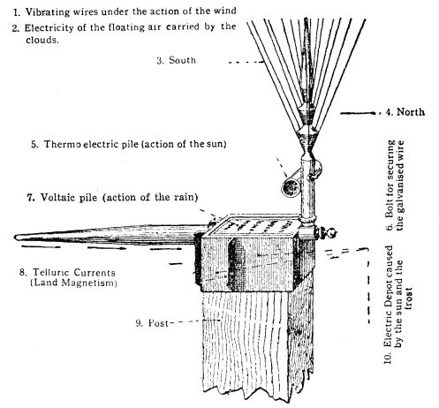

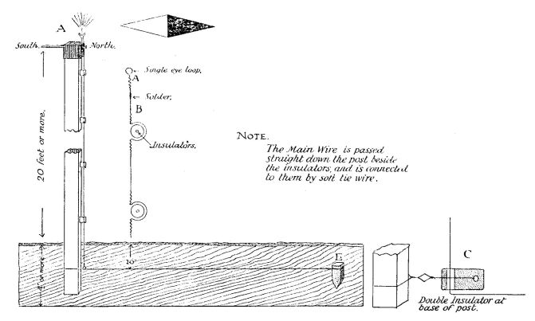

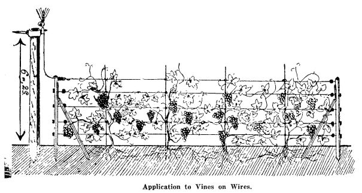

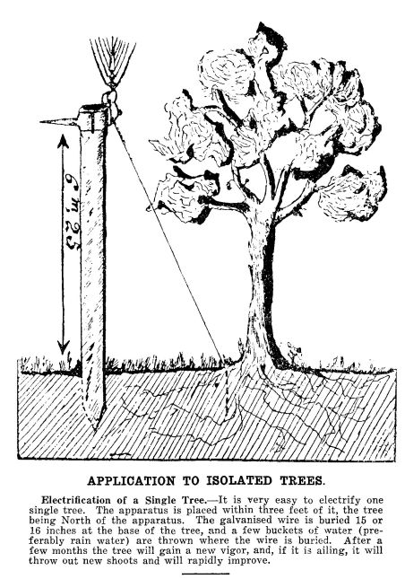

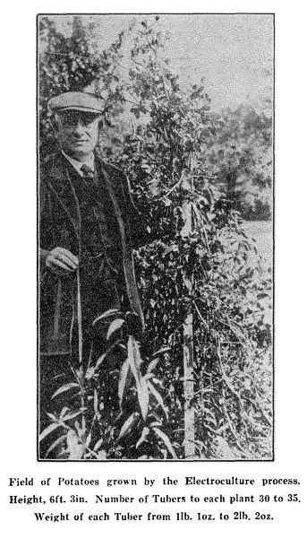

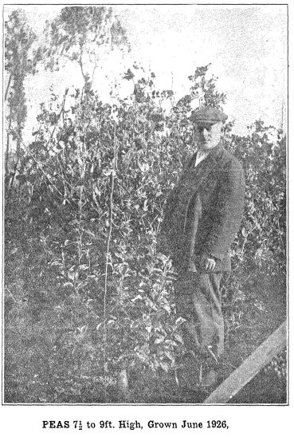

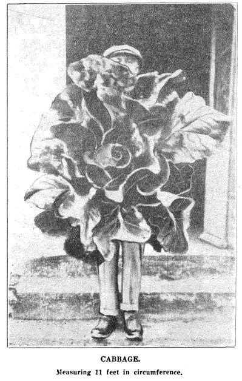

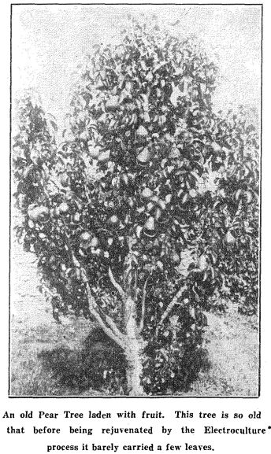

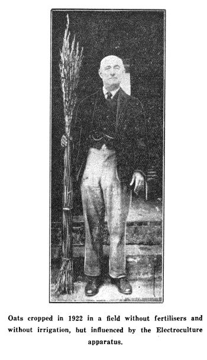

---

## Patentes

---

### FR 829789 — Fertilizador Electromagnético

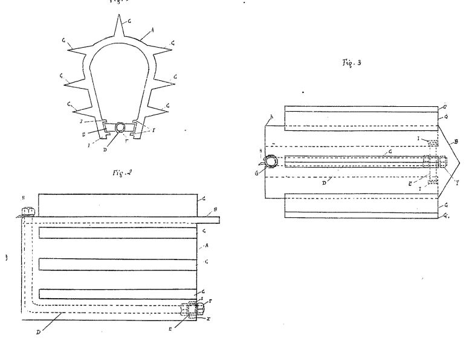

Desde hace casi 20 años, cuando la electrocultura pasó del laboratorio a la práctica, los resultados obtenidos cada año desde esa época han demostrado el triunfo de este gran progreso.

El propósito del aparato representado aquí es拥er una mayor capacidad de recolección de las fuerzas electromagnéticas de la naturaleza, de modo que, utilizado con la fertilización del suelo, los resultados obtenidos en la electrocultura se vean aún más aumentados.

La forma de ejecución del objeto de la invención se dio como ejemplo en los dibujos anexos que muestran:
- Fig. 1: Vista en extremo del aparato, lado sur
- Fig. 2: Vista en elevación
- Fig. 3: Vista en planta

En estas figuras, las mismas letras de referencia indican las mismas partes siempre.

#### Descripción del Aparato

El aparato consta de una pieza de hierro fundido **A**, en forma de imán alargado, que sostiene en sus paredes un cierto número de aletas **C**. Termina en el lado sur en forma de punta **B**, para facilitar la recolección del magnetismo terrestre que se mueve de sur a norte siempre.

Las aletas se funden con el cuerpo del aparato. En la base del aparato, entre los 2 polos de la pieza **A** en forma de imán, pasa un rango metálico **D**, mantenido a una distancia igual de los 2 polos del imán, por una pieza aislante **E**, sostenida por pequeñas barras **I** que vienen fundidas con el cuerpo del aparato.

Este rango metálico sigue al aparato en toda su longitud y se dobla para pasar en una abertura **G** provista en la brida del aparato donde se atornilla.

#### Funcionamiento

El aparato se entierra en la tierra a una profundidad tal que no pueda ser alcanzado por el paso de los implementos de arado. Se dirige rigurosamente de **sur a norte magnético**, con la punta **B** hacia el sur, para recolectar las corrientes magnéticas que se mueven de sur a norte.

Tan pronto como está cubierto de tierra, la electricidad negativa cuya esfera está cargada precipita sobre el aparato. Las aletas **C** se usan entonces como antenas para atraer la electricidad de la tierra hacia la masa **A**, y como el experimento demostró que cuanto mayor es el contacto del aparato con la tierra, mayor es su capacidad de recolección, las aletas son superficies destinadas a aumentar el contacto del aparato con la tierra.

También desempeñan otro papel. Cuando una barra de hierro blando se coloca en la dirección de la aguja de la brújula, es tan pronto traversada por una corriente. Todas las aletas que están en el aparato son así traversadas por esta corriente que se une al cuerpo del aparato ya cargado de electricidad negativa del suelo. La masa **A** se convierte así en un imán formidable cargado de electricidad negativa de la tierra.

Cuando el aparato está en su lugar, los dos polos en la parte inferior, una de las aletas se coloca en la parte superior del aparato apuntando a las corrientes verticales de la atmósfera que son atraídas por inducción con la masa formada por el aparato. El propósito de las aletas que están en el este y el oeste del aparato es la recolección de las corrientes de la tierra.

Para que el circuito no se cierre entre los 2 polos del aparato, un rango metálico **D** pasa entre estos 2 polos, mantenido por una pieza aislante **E**, recoge su energía y la lleva a la cabeza del aparato en el lado norte, donde se toma y se atornilla en una abertura **G**, de modo que toda la energía negativa de la tierra y positiva de la atmósfera, que puede ser recolectada por el aparato, llega al final del vástago **D** de donde escapa del aparato por un conductor **H** que la distribuirá en el suelo cultivado.

Las formas, dimensiones y materiales empleados para la construcción del aparato descrito, pueden variar sin cambiar en nada el objeto de la invención.

---

### CH 172269 — Aparato de Electroicultura

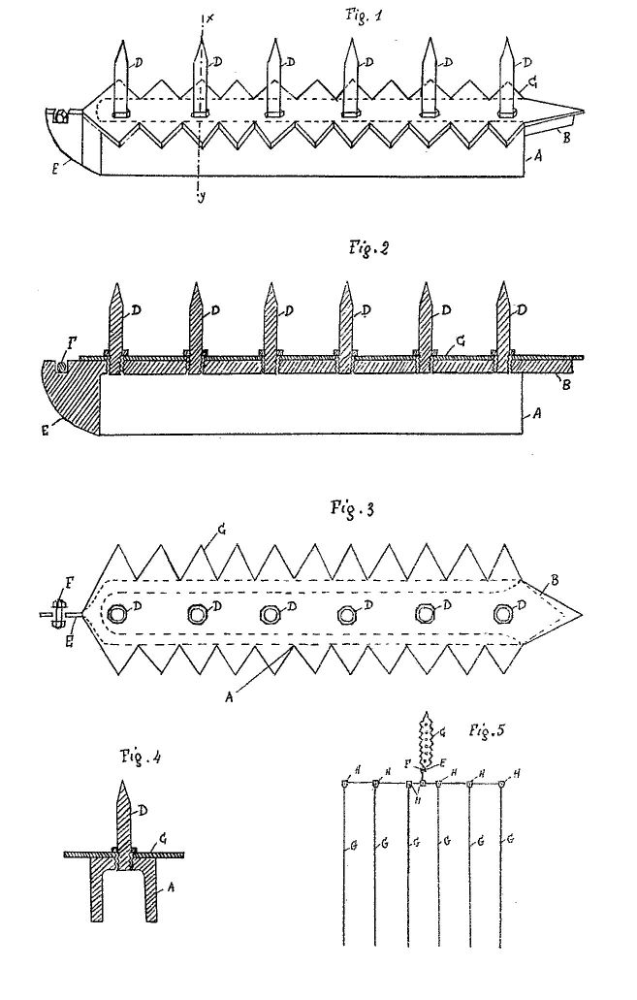

La presente invención se refiere a un aparato de electroicultura completamente subterráneo, cuyo propósito es la recolección de las corrientes eléctricas del suelo y una pequeña cantidad de electricidad estática.

La forma de ejecución del objeto de la invención fue representada, como ejemplo, en los dibujos anexos que muestran:
- Fig. 1: Vista en elevación del aparato
- Fig. 2: Vista en corte longitudinal
- Fig. 3: Vista en planta
- Fig. 4: Vista en corte según X de la fig. 1
- Fig. 5: Vista en planta del aparato en posición de funcionamiento bajo tierra con su red de cables distribuidores

El cuerpo del aparato está formado por una masa de metal magnético **A** en forma de hierro con **U**, terminado en el lado sur por una punta **B** destinada a la recolección de las corrientes que se dirigen de sur a norte magnético.

Para recolectar las corrientes terrestres que se mueven generalmente de este a oeste y a veces de oeste a este, una placa de metal magnético **C** con dientes mellados en cada lado se sujeta en la parte superior del aparato, de modo que todas las corrientes de la tierra serán fácilmente recolectadas por los dientes de esta placa. La placa también termina en el lado sur por una cola muy mellada, destinada a aumentar la capacidad de recolección del aparato de las corrientes que se mueven de sur a norte magnético.

El aparato lleva en la parte superior una serie de puntas melladas **D**, adheridas en la masa. En el lado norte, el aparato termina en una forma de nariz **E** que sostiene una pequeña abertura destinada a recibir un perno **F** para fijar al aparato los cables de red distribuidora **G** de las fuerzas eléctricas recolectadas.

Para dar un contacto perfecto entre el cable conductor que forma la red, piezas de abrazadera **H** de dos partes en metal magnético se aprietan usando pernos, atrapando el cable en ranuras adecuadas.

Los cables que constituyen la red subterránea se colocan, así como el aparato, en la dirección de la aguja de la brújula.

---

### FR 764497 — Nuevo Aparato de Electroicultura

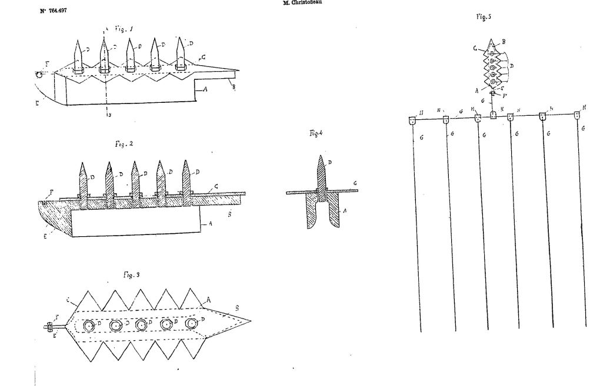

Después de haber expuesto la electricidad de la naturaleza, y especialmente desde que los biólogos nos mostraron que el suelo era algo viviente, muchos investigadores pensaron en aumentar la vida microbiana del suelo, atrayendo, en el lugar donde se deseaba aumentar la vegetación, la electricidad de la naturaleza, fuente de vida de todo lo que vive en la tierra, sabiendo que donde la electricidad sería atraída y concentrada, habría más vida, consecuentemente un aumento de la vegetación y también un aumento de las cualidades biológicas de esta vegetación.

#### El Problema

Para llegar a este propósito, se construyeron muchos aparatos ligeros que tenían, para recolectar la electricidad, que ser colocados en un mastil elevado a cierta altura sobre el suelo. Pero la presencia de estos mastiles en las tierras cultivadas obstruía considerablemente los arados; en los pastos, eran volteados por el ganado; y cerca de las viviendas dañaban la estética de las propiedades.

Además, los aparatos elevados en el espacio, si bien traían al suelo una gran cantidad de electricidad estática que aumentaba en proporciones considerables la calidad de los productos y también la cantidad de las cosechas, en ciertos casos, por ejemplo para los cereales, la electricidad estática aumentando el desarrollo vegetal especialmente, sucedía que aquellos, debido a su tamaño, eran propensos a las caídas.

#### La Solución

El propósito de la presente invención, referente a un aparato completamente subterráneo, es corregir especialmente esta desventaja eliminando los mastiles costosos y antiestéticos inicialmente, y disminuyendo la recolección de la electricidad estática del aire, para tomar una cantidad mayor de las corrientes de la tierra concurrentes al aumento de las cosechas en cantidad y calidad, pero no en la cara gigantesca; consecuentemente eliminando por allí las causas de las caídas.

En una palabra, el propósito del aparato es aumentar las cosechas tanto en cantidad como en calidad, pero por un método que se acerca más a la naturaleza, que cuando uno solo busca la electricidad a cierta altura sobre el suelo.

#### Descripción del Aparato

La forma de ejecución del objeto de la invención fue representada, como ejemplo, en los dibujos anexos que muestran:
- Fig. 1: Vista en elevación del aparato
- Fig. 2: Vista en corte longitudinal
- Fig. 3: Vista en planta
- Fig. 4: Vista en corte según X
- Fig. 5: Vista en planta del aparato en funcionamiento bajo tierra con su red de cables distribuidores

En estas figuras, las mismas letras de referencia indican las mismas partes siempre.

El cuerpo del aparato está formado por una masa de metal magnético **A** en forma de hierro con **U**, terminado en dimensiones sur por una punta **B** destinada a la recolección magnética de las corrientes que se mueven de sur a norte. La forma en **U** está destinada a reforzar estas corrientes que atraviesan el aparato.

Para recolectar las corrientes terrestres que se mueven generalmente de este a oeste y a veces de oeste a este, una placa de metal magnético **C** con dientes mellados en cada lado se sujeta en la parte superior del aparato, de modo que todas las corrientes de la tierra atraídas al aparato por su masa serán fácilmente recolectadas por los dientes de esta placa. La placa también termina, en el lado sur, por una cola muy mellada destinada a aumentar la capacidad de recolección del aparato de las corrientes que se mueven de sur a norte magnético.

El aparato lleva en la parte superior una serie de puntas melladas **D** adheridas en la masa, destinadas a recolectar por inducción a través de la capa de tierra que las cubre, una pequeña cantidad de electricidad positiva de la atmósfera.

En el lado norte, el aparato termina en una forma de nariz **E** que sostiene una pequeña abertura destinada a recibir un perno **F** para fijar al aparato los cables de red distribuidora **G** de las fuerzas eléctricas recolectadas.

Para dar un contacto perfecto entre el cable conductor que forma la red, una doble pieza pequeña **H** en metal magnético se aprieta usando un perno, una contra la otra, atrapando el extremo del cable en una ranura adecuada.

#### Funcionamiento

Los cables que constituyen la red subterránea, colocados así como el aparato en la dirección de la aguja de la brújula, son traversados por el magnetismo terrestre, bajo los términos del fenómeno bien conocido, que si se coloca una barra de hierro blando en la dirección de la aguja de la brújula, esta barra es inmediatamente traversada por la corriente magnética que se mueve de sur a norte y adquiere inmediatamente dos polos.

Esta red así formada sería ya capaz de retener en el paso una gran cantidad de las corrientes negativas de la tierra que se mueven de este a oeste y a veces de oeste a este, muy favorables con la vegetación, pero como recibirá la pequeña cantidad de electricidad positiva recolectada por inducción por el aparato y empujada en la red por el magnetismo terrestre, la electricidad positiva que será así distribuida en la red atraerá y retendrá allí una gran parte de las corrientes de la tierra; lo que tendrá como consecuencia que la parte del suelo donde esta red funcionará, habrá acumulado la capa arable sobre un campo magnético formado por la electricidad negativa del suelo y la electricidad positiva de la atmósfera, traída por el aparato y la red.

Además, en las plantas que estarán sobre este terreno y que se usan ya habitualmente como conductores entre la electricidad positiva de la atmósfera y la negativa de la tierra, el intercambio de estas dos electricidades se verá aumentado en proporciones considerables y la vitalidad se verá aumentada en las proporciones en que este intercambio de las dos electricidades se vea aumentado en todo lo que vive sobre la tierra.

En una palabra, el aparato subterráneo y su red, sostienen e aumentan el juego de las fuerzas eléctricas de la naturaleza que presiden ya la vida de las plantas no sujetas a la acción de los aparatos.

Además, como la electricidad de la naturaleza es la fuente de vida de todo lo que vive en la tierra; la concentración de la electricidad natural en el suelo cultivado desarrollará con ello la vida microbiana absolutamente necesaria para la vida de las plantas y su buena salud.

Las formas, dimensiones, detalles y materiales empleados para la construcción del aparato descrito, pueden variar sin cambiar en nada el objeto de la invención.

---

### FR 684117 — Electromagneto Protector para Plantas Jóvenes

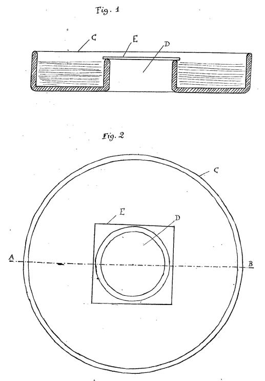

La presente invención tiene por objeto un aparato destinado a proteger las plantas jóvenes contra los babosos y caracoles que las devoran. Además, este aparato formando invernadero, permite, si se desea, sembrar semillas en tierra y obtener una mayor rapidez de germinación que en los invernaderos ordinarios y evitar tener que trasplantar la planta que, así, brota donde se levantó. Este aparato permite además un crecimiento más rápido de la planta.

La forma de ejecución del objeto de la invención fue representada como ejemplo en los dibujos anexos que muestran:
- Fig. 1: Vista en corte del aparato según AB
- Fig. 2: Vista en planta del aparato

En estas figuras, las mismas letras de referencia indican las mismas partes siempre.

#### Descripción del Aparato

Este aparato está compuesto de un pequeño reservorio circular **C** destinado a recibir agua, con un agujero en el centro **D** reservado para el sitio de la planta, ya sea que esté allí o trasplantada saliendo del invernadero, o que siembre semilla allí para dar esta planta. En este último caso, las semillas se ponen en la tierra en el centro de la abertura **D** que se cubre con una pequeña loseta con vidrio **E** cuyo propósito es formar invernadero y acelerar la germinación de las semillas y el crecimiento de la planta joven.

Cuando la planta llega a la loseta de vidrio, esta se retira y se pone continuamente agua en la garganta del reservorio **C** que será suficientemente grande para que los babosos o caracoles no puedan pasar para llegar a la planta y a menudo devorarla como la que produce el tiempo húmedo.

Además, como el aparato está en metal magnético y que descansa sobre la tierra, toma rápidamente electricidad negativa de la tierra, al mismo tiempo que atrae a sí las ondas electromagnéticas y otras corrientes positivas de la atmósfera. La planta está rodeada en su base por un campo magnético formado por las corrientes que circulan en el metal que forma la cuenca que la rodea y activa su poder de vegetación, su riqueza en cualidades nutritivas y también su madurez.

Se entiende claramente que las formas, dimensiones, detalles y materiales empleados para la construcción del aparato, pueden variar sin cambiar el objeto de la invención.

---

### CH 118648 — Aparato para Recolectar Electricidad Atmosférica

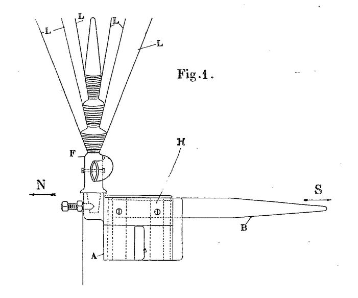

El dibujo representa, como ejemplo, la forma de ejecución del aparato, por cuyo empleo el inventor obtuvo resultados interesantes de electrocultura.

- Fig. 1: Vista en elevación
- Fig. 2: Vista en planta

El aparato representado comprende una caja destinada a ser fijada en la parte superior de un poste, a la altura deseada en la atmósfera. Esta caja lleva una cola **B** en metal magnético, dirigida hacia el sur. Presenta además un alojamiento en el cual se coloca la base de un vástago **I'** en metal del cual el eje vertical y alrededor del extremo superior se sabe que están dispuestas un haz de antenas metálicas flexibles **L** de las cuales solo se representan algunas.

En dos caras laterales de la caja están dispuestas placas de acero magnetizadas. Las antenas recolectan la electricidad del aire ambiente y aquellas que provienen de la inducción de las nubes, bajo los términos de la capacidad de las puntas.

Estas mismas antenas **L** tienen además el propósito de producir electricidad (de frotamiento) al vibrar bajo el efecto de un viento lento.

La parte superior de la caja **A** está constituida por un platillo de zinc en el fondo del cual se adjunta una placa de cobre.

---

### FR 552892 — Zapato Conductor

El propósito de la presente invención es una mejora considerable en el diseño actual y la industria de construcción del zapato.

Desde hace un gran número de años, muchos científicos, pertenecientes a casi todos los países del mundo, mostraron que el hombre y la planta estaban sujetos a las mismas leyes de la naturaleza, que uno y el otro tenían necesidad de desarrollarse de manera normal, de estar en contacto con las fuerzas de la naturaleza y especialmente con la tierra.

La planta que vive en maceta y en apartamento, aislada de la tierra, necesita recibir una adición de alimentos para compensar la privación de la electricidad telúrica y de la del aire circulante que fluye a través de sus ramas cuando está en plena tierra.

Lo mismo sucede con los seres humanos: los hombres desprovistos de ropa y yendo descalzos, apoyados sobre la tierra, constantemente en contacto con las fuerzas de la naturaleza, se desarrollan normalmente y adquieren una gran fuerza con una alimentación insignificante; mientras que las personas cubiertas de ropa y encerrando sus pies en zapatos que los aíslan del suelo, necesitan, para mantener su vitalidad, una alimentación mucho más abundante y mucho más rica para compensar las fuerzas de la naturaleza de las cuales están aislados por su ropa y especialmente por sus zapatos. Como la planta en maceta, están privados de electricidad telúrica, de la del aire ambiente, que no puede circular a través de su cuerpo.

Para evitar que el zapato en el cual el pie está encerrado, aisle al cuerpo humano de la tierra, es necesario hacer cruzar el zapato por uno o más pequeños rangos metálicos, buenos conductores de la electricidad, apoyados de un extremo sobre la tierra y el otro extremo en contacto con el pie encerrado en el zapato.

La forma de ejecución del objeto de la invención se da aquí, como ejemplo solamente, en el dibujo anexo que muestra:
- Fig. 1: Vista en corte de una suela de zapato provista de uno de estos vástagos
- Fig. 2: Vista en planta de esta suela

Una suela de zapato **A** es traversada en toda su altura por un tornillo metálico **B** con cabeza ancha sobre la cual reposará el pie que será puesto por ella en contacto con la tierra, permitiendo así el paso, el intercambio y la combinación, a través del cuerpo humano, de las electricidades telúrica y atmosférica.

Es evidente que el número de estos vástagos no está limitado, que pueden ser colocados en un lugar no especificado de la suela del zapato lo que les permite tocar de un extremo la tierra y del otro extremo el pie, y que las formas, dimensiones, detalles y metales empleados, pueden variar sin cambiar el objeto de la invención.

---

### FR 628803 — Campana Electromagnética

Hasta el presente, para aumentar la tasa de crecimiento de las plantas y su madurez, se las cubría con una campana de vidrio o un invernadero acristalado, teniendo por propósito dejar penetrar en el interior de la campana o el invernadero, la luz y los rayos del sol, y, apartándolas de las variaciones abruptas de la temperatura exterior, preservar alrededor de ellas la atmósfera de calor determinada por la radiación de la tierra bajo las superficies verdes, y los rayos del sol pasando a través del vidrio y calentando el aire ambiente bajo las campanas o el invernadero.

Es obvio que el cultivo de las plantas bajo vidrio puede aumentar la tasa de crecimiento y la madurez, por las razones explicadas anteriormente, pero en detrimento de la calidad de los productos vegetales, porque estos principios están en obvia contradicción con las leyes de la naturaleza. Todas las plantas, cualquiera que sean, tienen hojas y ramas, todas provistas de serraciones alrededor de las hojas, o pequeñas barbas, que son tantos pequeños sensores destinados a recibir sobre estas antenas de las cuales la naturaleza las ha provisto, las fuerzas de origen eléctrico en estado latente en la atmósfera.

Pero las plantas cultivadas bajo vidrio, están completamente aisladas de estas diversas fuerzas eléctricas a las cuales por las leyes de la naturaleza están llamadas a pedir la vida, como todo lo que vive en la tierra, así lo muestran las múltiples pequeñas antenas naturales de las que están provistas. Encerrando las plantas bajo campanas o invernaderos de vidrio, estas plantas están, por el vidrio, aisladas de las fuerzas eléctricas de la naturaleza, lo que perjudica enormemente la veloz ascensión de la savia en las plantas y su riqueza en cualidades nutritivas.

El propósito de la presente invención es traer dentro de las campanas, invernaderos y mismos invernaderos, la electricidad del aire ambiente y el mismo magnetismo terrestre.

La forma de ejecución del objeto de la invención fue representada, como ejemplo, en los dibujos anexos que muestran:
- Fig. 1: Vista en corte del aparato
- Fig. 2: Vista en corte de un aparato simplificado

#### Descripción del Aparato

Este aparato está compuesto de una campana de vidrio perforada **A** con dos agujeros **B** en su parte superior, destinados a dejar pasar dos cables metálicos de diferente naturaleza, por ejemplo un cable de hierro galvanizado **D** y un cable de cobre **C**.

El cable de hierro galvanizado **D** está doblado en su parte superior, de tal modo que presenta una punta dirigida hacia el sur, para recolectar el magnetismo terrestre que se mueve de sur a norte. El cable de cobre **C** termina en punta y está dirigido hacia el cielo, para recolectar por esta punta, la electricidad estática del aire ambiente.

Estos dos cables están unidos a cierta distancia de su extremo superior, por algunas vueltas de enrollamiento y una soldadura por puntos **F**, cruzan la campana por los agujeros **B**, y vienen a ser insertados en la tierra **E** bajo la campana, cada uno en una base opuesta; el cable de hierro galvanizado **D** en la base sur de la campana, el cable de cobre **G** en la base magnética norte.

Como estos cables son de metales diferentes, hundidos en la tierra forman una pila cuyo circuito se cierra por la humedad de la tierra, y como los dos polos están hundidos en la tierra en la base interior de la campana, uno al sur, el otro al norte, el circuito cerrándose por la humedad de la tierra, baña constantemente las raíces de las plantas llamadas a crecer en el centro de la campana.

Al producto de esta pequeña pila formada por los dos metales diferentes, se viene a unir aún el magnetismo terrestre recolectado por la punta tensada **D** hacia el sur, la electricidad estática del aire ambiente recolectada por la punta afilada del cobre **C** tensada hacia el cielo.

Y se muestra hoy que la electricidad estática de la atmósfera da a las plantas un crecimiento más rápido, una vegetación más abundante, y el magnetismo terrestre les trae una adición de riqueza que se manifiesta por un aumento de la fructificación y un aumento en alcohol y azúcar y otras cualidades nutritivas que se revelan cada vez que se hace un análisis.

Se puede aún traer bajo la campana las fuerzas eléctricas de la atmósfera, usando solo un cable **H** terminado por dos ramas; una **I** dirigida hacia el sur para recolectar el magnetismo terrestre, y la otra **J** hacia el cielo para recolectar la electricidad estática del aire ambiente, y hundiendo el otro extremo en la tierra **E** bajo la campana (fig. 9).

Este mismo aparato se aplica también a cualquier superficie cubierta de vidrio, o material transparente que pueda ser cubierto por la luz o los rayos del sol, como invernaderos, marcos, etc.

Se puede aún usar el aparato **CD**, y el aparato **H**, solos, para plantas en tierra completa.

Las formas, dimensiones, detalles y materiales empleados para la construcción de los aparatos descritos, pueden variar sin cambiar en nada el objeto de la invención, así como el número de los conductores empleados que fueron dados aquí solo como ejemplo.

#### Resumen

La posibilidad de traer a las plantas que crecen bajo campanas o invernadero, las fuerzas eléctricas de la atmósfera de las cuales están aisladas por el vidrio u otro material transparente del cual uno se usa usualmente para cubrirlas.

Quizás usando dos vástagos formados de dos metales diferentes, uno terminado en punta dirigida hacia el cielo para recolectar la electricidad estática del aire ambiente, el otro terminado en punta tensada hacia el sur para recolectar el magnetismo terrestre que se mueve de sur a norte. Estos dos vástagos unidos entonces juntos cerca de su extremo superior, cruzan la campana por dos agujeros provistos a este efecto y son hundidos en la tierra bajo la campana, de tal modo que el circuito se cierra por la tierra y forma pila, y que las raíces de las plantas están tomadas en este circuito.

O por medio de un rango metálico que sostiene dos ramas, una dirigida hacia el cielo, la otra hacia el sur, y que cruza la superficie acristalada, campanas, invernaderos, etc. para ser insertados luego en la tierra y traer a las plantas las fuerzas eléctricas de la atmósfera de las cuales están aisladas por el vidrio u otro material transparente del cual uno se usa usualmente para cubrirlas.

---

### FR 630219 — Incubadora Electromagnética

Desde hace un gran número de años, los físicos de todos los países reconocieron que bastaba colocar una barra de hierro blando en la dirección de la aguja de la brújula, para que inmediatamente esta barra sea traversada por las corrientes magnéticas que se mueven de sur a norte siempre. También ha sido demostrado por científicos pertenecientes a todos los países del mundo, que la electricidad natural, no solo jugaba un papel considerable en la vegetación, sino que además esta electricidad en estado latente en la atmósfera, y especialmente el magnetismo terrestre, eran la fuente de vida de todo lo que vive en la tierra, sea para las plantas, los humanos o los animales. Está absolutamente demostrado hoy, de una manera precisa, que un campo magnético creado por una serie de barras de hierro blando colocadas en la dirección de la aguja de la brújula, puesto alrededor de cualquier ser viviente, aumenta su vitalidad en proporciones considerables.

El propósito de la presente invención es así mostrar la aplicación de este principio a los gallineros e incubadoras.

La forma de ejecución del objeto de la invención fue representada como ejemplo en los dibujos anexos que muestran:
- Fig. 1: Vista en corte de una incubadora
- Fig. 2: Vista en elevación de la incubadora cerrada
- Fig. 3: Vista en elevación de la incubadora abierta

#### Descripción del Aparato

La incubadora está compuesta de una caja **A**, provista en toda su superficie interior, de pequeñas barras de hierro blando **B**. En esta caja se ponen los huevos **A** para incubar, y cuando el pollo u otra ave cualquiera, está sobre sus huevos, se cierra la tapa **C** que es también provista con pequeñas barras de hierro blando **B**, de modo que el pollo está completamente rodeado por barras de hierro blando, cuyos extremos, terminados en punta, están orientados hacia el lado del sur, y el otro hacia el lado del norte magnético.

Dada la orientación de las barras con las cuales está provista la caja para incubar en toda su superficie interior, el pollo que incuba así se encuentra completamente rodeado por estas barras que, debido a su orientación crean alrededor de él un campo magnético que lo envuelve completamente, y le da una vitalidad que le permite alcanzar hasta el fin y casi sin fatiga su tarea.

Los huevos que también están bañados por este campo magnético, permiten a los futuros polluelos adquirir, antes de su nacimiento, una vitalidad mucho mayor que la que pueden obtener en cualquier caso donde los pollos incuban en un nido cualquiera.

La tapa **C** está constituida por una serie de barras de hierro blando **B** montadas en un marco. Mientras el pollo incuba y especialmente durante la noche, la tapa **C** se baja sobre la caja **A**, y la pared móvil **D** se levanta, de modo que la caja está bastante cerrada (fig. 2), para que las ratas destructoras y otros animales no puedan venir a importunar al pollo, y a la vez destruir los huevos que incuba.

Cuando el pollo debe ser liberado durante el día para que pueda ir a alimentarse, la tapa **C** se levanta y la pared **D** se baja (fig. 3). Lo mismo sucede cuando los pequeños polluelos eclosionan. La pared **D** se baja para que puedan salir y caminar. El pollo y los polluelos habiendo vuelto de nuevo, la pared **D** se cierra de nuevo, así como la tapa **C**.

La explicación anterior muestra la utilidad de esta caja para las incubadoras, pero dadas las ventajas que se tienen al hacer vivir a los animales en medio de un campo magnético, una serie de cajas **A** pueden ser colocadas unas al lado de las otras, y al quitar la tapa **C**, constituirán una serie de gallineros cuyo número está limitado solo por los requisitos del gallinero.

Estos principios pueden ser aplicados también a las incubadoras artificiales.

Las formas, dimensiones, detalles y materiales empleados para la construcción del aparato descrito, pueden variar sin cambiar en nada el objeto de la invención.

---

### FR 812689 — Pila Termo-electro-magnética

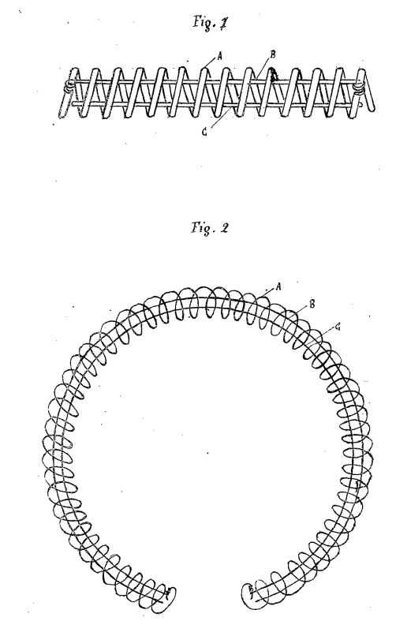

Desde que se expuso la electricidad de la naturaleza, el hombre se ingenió para domesticarla a su provecho. Los experimentos hechos por los científicos de todos los países del mundo mostraron, a medida que los años pasaban, que esta fuerza invisible cuya eficacia podían medir, era la fuente de vida de todo lo que vive en la tierra. Así, muchos fueron los intentos de recolección de este fluido misterioso para aumentarlo alrededor de los organismos vivientes, con el fin de aumentar su vitalidad por él, con éxitos variables según el valor científico de los aparatos usados.

El propósito de la presente invención es reunir en el mismo aparato una pila termoeléctrica, usando para su funcionamiento los cambios de temperatura, y un sensor amplificador de las fuerzas electromagnéticas de la naturaleza con el fin de aumentar la vitalidad de cualquier organismo viviente que se pueda colocar en el centro del aparato.

La forma de ejecución del objeto de la invención se dio como ejemplo en los dibujos anexos que muestran:
- Fig. 1: Vista general de este aparato
- Fig. 2: Vista del aparato en forma de círculo no cerrado, listo para recibir en el centro, los organismos vivientes cuya vitalidad se desea aumentar

En estas figuras, las mismas letras de referencia indican las mismas partes siempre.

Este aparato está compuesto de un tubo **A**, formado por un cable de acero enrollado en espiral.

Dentro del tubo formado por estas vueltas, se pasa un cable de cobre **B**, aislado en toda su longitud, solo pelado en los dos extremos para estar en contacto con cada uno de los dos extremos del tubo de acero **A** al cual está adherido, formando así un circuito cerrado. En este tubo de acero **A** también se encierra un cable de hierro blando **C**, también aislado en toda su longitud, excepto en los dos extremos.

#### Funcionamiento

La electricidad de la atmósfera es atraída por el conjunto del aparato que forma masa magnética y su poder es aumentado por su paso en el cable de acero **A** enrollado en espiral, que se convierte por esta causa en un sensor y un amplificador de las fuerzas electromagnéticas, electricidad atmosférica.

Como la espiral del cable de acero **A** está conectada en los dos extremos con el cable de cobre **B**, formando así un circuito cerrado compuesto de dos metales diferentes, cada vez que por alguna causa no especificada un cambio de temperatura alcanza el aparato, este circuito cerrado, calentado desigualmente, se convertirá en una pequeña pila termoeléctrica. Además, el paso de estas diferentes electricidades en las vueltas del cable de acero, lo magnetiza y sus dos extremos estando muy cerca de los dos extremos del cable de hierro blando **C** que está dentro del aparato, forma por inducción un segundo circuito cerrado traversado constantemente por las fuerzas electromagnéticas de la atmósfera.

Siendo el aparato flexible, si se forma con él un círculo no cerrado alrededor del cuerpo de un hombre o un animal, el calor de este organismo viviente hace aumentar la temperatura en el aparato. Pero como la naturaleza de los metales que forman este circuito es de composición diferente, la temperatura aumenta más rápido en uno de los metales que en el otro y el aparato se convierte en una pila termoeléctrica. Si este círculo rodea el tronco de un árbol o una planta al aire libre, esta pila funcionará cada vez que la temperatura del aire ambiente cambie.

El aparato es así una fuente de doble energía que puede ser usada para aumentar la vitalidad de los organismos vivientes que se colocan en su campo magnético. Una de estas fuerzas formada por la recolección de las ondas electromagnéticas y amplificada por su paso a través de las vueltas del aparato, la otra producida por el cambio de temperatura que actúa sobre un circuito cerrado formado por dos metales de composición diferente.

Las formas, dimensiones, detalles y metales empleados en la composición del aparato, pueden variar sin cambiar en nada el objeto de la invención.

---

### FR 804141 — Aparato de Iluminación Electromagnética

Desde hace largos años, muchos científicos notaron el papel benéfico de la electricidad de la naturaleza sobre la vida de las plantas y mismo sobre todo lo que es viviente en la tierra.

Los trabajos de estos muchos científicos, estudiados, condensados, aportando pruebas irrefutables del aumento de la vida en todas partes donde la electricidad de la naturaleza fue aumentada, han dado lugar a la electrocultura, es decir, al cultivo de las plantas por medio de la electricidad natural recolectada por aparatos especiales y drenada en el suelo cultivado donde se quiere obtener un aumento de vegetación.

Hay hoy en todos los países del mundo experimentadores, con resultados mejorados según la calidad de los aparatos de los cuales hacen uso para la recolección de la electricidad natural y su modo de distribución en el suelo cultivado.

Pero cualquiera que sea el modo de recolección que los experimentadores empleen, hay un punto en el cual todos llegan al mismo propósito, es decir: si un organismo viviente se coloca en un campo magnético creado por las solas fuerzas eléctricas de la naturaleza, recolectadas, drenadas, aumentadas en el punto donde se quiere aumentar la vida, la vida aumenta en ese punto en las mismas proporciones en que la cantidad natural de electricidad fue amplificada.

Todos estos trabajos que duran desde que se expuso la electricidad y que han tenido miles de experimentadores, a cuya cabeza están los más grandes nombres de la ciencia, muestran por los resultados obtenidos en todos los organismos vivientes, que la electricidad de la naturaleza es la fuente de vida de todo lo que vive en la tierra.

Los humanos son así también tributarios de estas fuerzas. Pero como no pueden permanecer día y noche afuera en contacto con las fuerzas electromagnéticas de la naturaleza y están parcialmente privados cuando están encerrados en sus residencias, se puede corregir esta desventaja trayendo una adición de electricidad natural en sus viviendas.

El propósito de la presente invención es así:
> Un aparato recolector de la electricidad natural y difusor de la misma en la vivienda humana.

La forma de ejecución del objeto de la invención fue representada como ejemplo en los dibujos anexos que muestran:
- Fig. 1: Vista de frente del aparato
- Fig. 2: Vista en corte

En estas figuras, las mismas letras de referencia indican las mismas partes siempre.

#### Descripción del Aparato

El aparato está compuesto de un círculo metálico no cerrado **A**, magnetizado por medio de la electricidad negativa de la tierra. Sobre este círculo se fija un reflector **B**, en el fondo del cual se dispone un foco de luz **C**. El conjunto se fija usando pernos o remaches **D**, sobre una bandeja **E**, perforada, de una abertura **F**, que permite que la luz se extienda en la parte. Esta bandeja **E** se mantiene vertical por un pie **G**.

#### Funcionamiento

El círculo metálico **A** está preliminarmente cargado de electricidad negativa de la tierra, constantemente atrae a sí una cantidad mayor de electricidad positiva de la atmósfera. El espacio contenido en el interior del círculo se convierte así en un campo magnético creado por la electricidad natural que los rayos de luz deben cruzar antes de ser extendidos fuera del aparato.

Estos rayos de luz, al cruzar el campo magnético, toman electricidad natural que transfieren sobre todo el espacio alcanzado por su radiación. Como la electricidad de la naturaleza es la fuente de vida de todo lo que vive en la tierra, cualquier organismo viviente alcanzado por estos rayos de luz que le traen una adición de electricidad, ve aumentada su vitalidad en proporciones considerables.

Este aparato puede también extenderse a establos, gallineros, conejeras, etc., y en los invernaderos para aumentar la vitalidad de las plantas y su madurez.

Las formas, dimensiones, detalles y materiales empleados para la construcción del aparato descrito que puede adaptarse a todos los modos de iluminación, pueden variar sin cambiar en nada el objeto de la invención.

---

## Otras Patentes (Menciones Breves)

| Patente | Título |
|---|---|
| **FR 845448** | Campo magnético oscilante |
| **CH 118648** | Aparato para recolectar electricidad atmosférica |
| **FR 25541** | Aparato electro-magnético terro-celeste |
| **FR 529202** | Red thermo-magnética moto-solar para la intensificación de la producción de la tierra y la fuerza motriz |
| **FR 528468** | *(Mención breve)* |

---

> *Fuente original: [rexresearch.com/ElectroCulture/ChristofleauEC](https://www.rexresearch.com/ElectroCulture/ChristofleauEC/ChristofleauEC.htm)*
