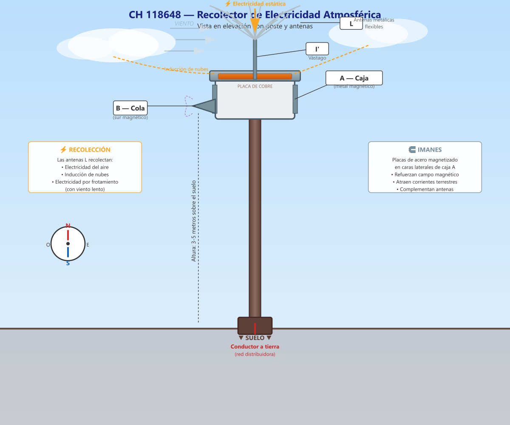

# CH 118648 — Aparato para Recolectar Electricidad Atmosférica

**Inventor:** Justin Christofleau  
**Fecha de concesión:** 1934  
**País:** Suiza

---

## Resumen de la Invención

Un dispositivo instalado en la parte superior de un poste, diseñado para **recolectar electricidad estática del aire ambiente** y de la inducción de nubes, utilizando antenas metálicas flexibles que también generan electricidad por frotamiento con el viento. Incorpora imanes de acero y un platillo de zinc con placa de cobre para complementar la recolección.

---

## Diagrama Técnico



---

## Descripción Científica Detallada

### Principio Fundamental

Este dispositivo se diferencia de los aparatos subterráneos de Christofleau en que está **diseñado para captar electricidad atmosférica**, no telúrica. Está optimizado para:

1. **Electricidad estática del aire ambiente**
2. **Inducción de nubes** (cargas eléctricas en formaciones nubosas)
3. **Electricidad por frotamiento** (efecto del viento sobre las antenas)

### Componentes y Funciones

| Componente | Material | Función |
|---|---|---|
| **A** — Caja | Metal magnético | Housing principal. Contiene las placas de acero magnetizado en sus caras laterales. |
| **B** — Cola | Metal magnético | Orientada hacia el sur magnético. Atrae corrientes terrestres que complementan la recolección atmosférica. |
| **I'** — Vástago | Metal conductor | Soporte vertical que eleva las antenas por encima de la caja. |
| **L** — Antenas (×13+) | Metal flexible | Recolección principal: electricidad del aire, inducción de nubes, electricidad por frotamiento con el viento. |
| **Platillo de zinc** | Zinc | Cubierta superior. El zinc es un buen conductor y resistente a la corrosión. |
| **Placa de cobre** | Cobre | En el fondo del platillo. El cobre complementa la recolección (dos metales diferentes crean un efecto termoeléctrico). |
| **Placas de acero** | Acero magnetizado | En caras laterales de A. Refuerzan el campo magnético del dispositivo. |

### Mecanismo de Recolección

```
FUENTES DE ENERGÍA CAPTADAS
════════════════════════════

1. ELECTRICIDAD ESTÁTICA DEL AIRE
   ────────────────────────────────
   • Las puntas de las antenas L atraen cargas positivas
   • Efecto de punta: concentración de campo eléctrico
   • Mayor altura = mayor recolección

2. INDUCCIÓN DE NUBES
   ───────────────────
   • Las nubes contienen grandes masas de carga
   • Crean campo eléctrico inducido en el suelo
   • Las antenas captan esta inducción
   • Efecto mayor con nubes de tormenta (sin peligro)

3. ELECTRICIDAD POR FROTAMIENTO
   ──────────────────────────────
   • El viento mueve las antenas flexibles
   • Frotamiento entre antenas = electricidad estática
   • Funciona con viento suave (no necesita tormenta)
   • Las antenas vibran como cabello en el viento

4. CAMPO MAGNÉTICO COMPLEMENTARIO
   ────────────────────────────────
   • La cola B (sur) atrae corrientes terrestres
   • Las placas de acero refuerzan el campo
   • Complemento a la recolección atmosférica
```

### Diseño de las Antenas

Las antenas son el componente más innovador:

- **Material:** Metal flexible (resistente a la intemperie)
- **Forma:** Largas y delgadas, como bigotes de gato
- **Cantidad:** Múltiples (13 o más) para maximizar superficie
- **Flexibilidad:** Se mueven con el viento más suave
- **Efecto de punta:** Las puntas finas concentran el campo eléctrico

```
    Antenas flexibles (L)
    ╱│╲╱│╲╱│╲╱│╲╱│╲
   ╱ │ ╲│ ╱│ ╲│ ╱│ ╲
      │  │  │  │  │
      └──┴──┴──┴──┘
         Vástago I'
         ┌──────┐
         │ CAJA A │ ← Placas de acero magnetizado
         │ (imán) │
         └──────┘
            │
         Cola B → SUR magnético
```

### Instalación

| Parámetro | Recomendación |
|---|---|
| **Altura del poste** | 3-5 metros sobre el suelo |
| **Orientación de B** | Sur magnético |
| **Conexión a tierra** | Cable conductor desde caja A hasta red subterránea |
| **Superficie cubierta** | 2-5 hectáreas (según suelo y cultivos) |
| **Mantenimiento** | Inspección visual periódica de antenas |

### Aplicaciones Ideales

- **Campos abiertos** donde no hay obstáculos para el viento
- **Zonas con nubes frecuentes** (inducción maximizada)
- **Cultivos altos** (maíz, girasol) donde el mastil no obstruye
- **Combinación con aparatos subterráneos** para cobertura completa

### Limitaciones

- **Requiere poste visible** (estética afectada)
- **Puede obstruir maquinaria** en campos pequeños
- **Captación excesiva** puede causar crecimiento excesivo
- **Mejor combinado** con aparatos subterráneos (FR 764497)

---

## Referencias

- **Patente original:** CH 118648 (1934) — Justin Christofleau
- **Libro:** *Electroculture* by Justin Christofleau (1927)
- **Fuente digital:** [rexresearch.com/ElectroCulture/ChristofleauEC](https://www.rexresearch.com/ElectroCulture/ChristofleauEC/ChristofleauEC.htm)

---

*Documento actualizado con diagramas técnicos modernos y explicaciones científicas detalladas.*  
*Autor original: Justin Christofleau — Traducción y actualización para fines de investigación.*
