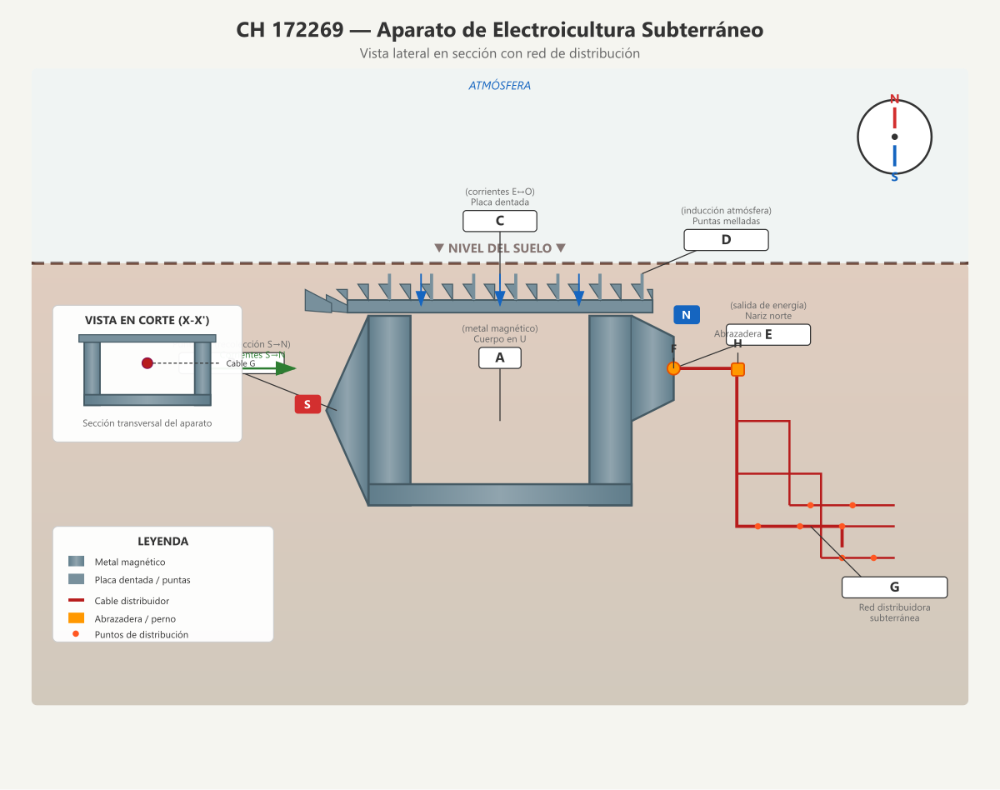

# CH 172269 — Aparato de Electroicultura Subterráneo

**Inventor:** Justin Christofleau  
**Fecha de concesión:** 1935  
**País:** Suiza

---

## Resumen de la Invención

Un dispositivo completamente subterráneo para la recolección de corrientes eléctricas del suelo y electricidad estática atmosférica, diseñado para eliminar los mastiles superficiales y distribuir la energía mediante una red subterránea de cables.

---

## Diagrama Técnico



---

## Descripción Científica Detallada

### El Problema que Resuelve

Los dispositivos de electrocultura tradicionales requerían **mastiles elevados** sobre el suelo, lo cual causaba múltiples problemas:
- **Obstrucción agrícola:** Los arados y maquinaria golpeaban los mastiles
- **Daño por ganado:** El ganado volcaba los postes en pastizales
- **Estética:** Arruinaban la apariencia de propiedades y viviendas
- **Caídas de cultivo:** La excesiva electricidad estática hacía que los cereales crecieran demasiado y se cayeran

### La Solución: Aparato Completamente Subterráneo

Este dispositivo elimina todos esos problemas al funcionar **íntegramente bajo tierra**, captando principalmente las corrientes del suelo (que son las más beneficiosas para los cultivos) en lugar de la electricidad estática del aire.

### Principio de Funcionamiento

```
     ATMÓSFERA
     ─────────────────────────
     ↓ ↓ ↓ ↓ ↓ ↓ ↓ ↓ ↓ ↓ ↓   ← Corrientes verticales
     ┌─────────────────────┐
     │   PLACA DENTADA C   │  ← Captura corrientes E↔O
     │   ╔═══════════╗     │
     │   ║  APARATO  ║←────│──── Punta B (sur magnético)
     │   ║   EN U    ║     │
     │   ╚═══════════╝     │
     │         │           │
     │    ┌────┴────┐      │
     │    │ NARIZ E │──────│──── Salida de energía
     │    └─────────┘      │
     └─────────────────────┘
              │
     ┌────────┴────────┐
     │  RED DISTRIBUIDORA│  ← Cables subterráneos
     │  G (dirección S→N)│
     └─────────────────┘
```

### Componentes Clave

#### 1. Cuerpo en U (A)
- **Forma:** Hierro con U invertida
- **Función:** Refuerza las corrientes magnéticas que lo atraviesan. La forma de U crea un circuito magnético cerrado que amplifica las fuerzas captadas.
- **Orientación:** Estrictamente Sur→Norte magnético

#### 2. Punta Sur (B)
- **Geometría:** Punta afilada
- **Función:** Concentra las corrientes magnéticas terrestres (S→N). La punta facilita la entrada de estas fuerzas en el dispositivo.

#### 3. Placa Dentada (C)
- **Diseño:** Metal magnético con dientes en ambos lados y cola mellada
- **Función:** Los dientes laterales captan las corrientes terrestres este-oeste (y oeste-este). La cola mellada sur captura corrientes S→N adicionales.
- **Ventaja:** La superficie dentada maximiza el contacto con las corrientes direccionales del suelo.

#### 4. Puntas Melladas (D)
- **Ubicación:** Parte superior del aparato
- **Función:** Por inducción electromagnética a través de la capa de tierra que las cubre, captan una pequeña cantidad de electricidad positiva de la atmósfera.
- **Mecanismo:** Las puntas elevadas crean un efecto de punta que atrae cargas positivas del aire.

#### 5. Nariz Norte (E) con Perno (F)
- **Función:** Punto de conexión para los cables de la red distribuidora.
- **Diseño:** Abertura roscada que permite fijar firmemente los cables.

#### 6. Abrazaderas (H)
- **Material:** Metal magnético, dos piezas comprimidas por pernos
- **Función:** Garantizan contacto eléctrico perfecto entre el cable y el aparato.

#### 7. Red Distribuidora (G)
- **Orientación:** Norte-Sur magnético (misma dirección que el aparato)
- **Material:** Cable conductor (hierro galvanizado o cobre)
- **Función:** Distribuye la energía recolectada por toda el área cultivada.

### Mecanismo Físico Detallado

1. **Magnetización por orientación:** Al colocar el aparato en dirección S→N, el hierro blando se convierte inmediatamente en un imán por las corrientes terrestres.

2. **Recolección tri-dimensional:**
   - **Eje vertical (S→N):** Punta B + cola mellada de C
   - **Eje horizontal (E↔O):** Dientes laterales de C
   - **Eje vertical ascendente:** Puntas D (inducción atmosférica)

3. **Amplificación por forma:** La configuración en U crea un circuito magnético cerrado que concentra y amplifica las fuerzas captadas.

4. **Distribución por red:** Los cables de la red G, al estar orientados S→N, también se magnetizan por las corrientes terrestres, creando un campo magnético distribuido que:
   - Atrae y retiene corrientes negativas del suelo
   - La electricidad positiva del aparato atrae más energía negativa del suelo
   - Se crea un **campo magnético combinado** (negativo del suelo + positivo de la atmósfera) en la capa arable

5. **Efecto biológico:** Las plantas, que naturalmente actúan como conductores entre electricidad positiva (atmósfera) y negativa (suelo), ven aumentado enormemente este intercambio, multiplicando su vitalidad.

### Ventajas sobre Mastiles Superficiales

| Aspecto | Mastil superficial | Aparato subterráneo (CH 172269) |
|---|---|---|
| Electricidad estática | Alta captación | Baja (inducida) |
| Corrientes del suelo | Baja captación | **Alta captación** |
| Riesgo de caídas de cultivo | Alto (crecimiento excesivo) | **Eliminado** |
| Obstrucción agrícola | Sí | **No** |
| Estética | Deteriorada | **No visible** |
| Mantenimiento | Requiere acceso | **Nulo** |
| Tipo de beneficio | Crecimiento rápido | **Crecimiento equilibrado y natural** |

### Especificaciones de Instalación

| Parámetro | Valor |
|---|---|
| **Profundidad** | 40-60 cm |
| **Orientación del aparato** | Sur a Norte magnético |
| **Orientación de la red G** | Sur a Norte magnético |
| **Separación entre ramas** | 1-2 metros |
| **Profundidad de cables** | 20-30 cm |
| **Conexión** | Perno F en nariz E |

### Resultados Documentados

Christofleau reportó que este aparato subterráneo:
- **Aumentaba cosechas en cantidad y calidad**
- **Se acercaba más a la naturaleza** que los dispositivos superficiales
- **Eliminaba las caídas** de cereales por crecimiento excesivo
- **Desarrollaba la vida microbiana** del suelo (esencial para plantas saludables)
- **Funcionaba silenciosamente** sin intervención humana

---

## Referencias

- **Patente original:** CH 172269 (1935) — Justin Christofleau
- **Patente complementaria:** FR 764497 (misma invención, registro francés)
- **Libro:** *Electroculture* by Justin Christofleau (1927)
- **Fuente digital:** [rexresearch.com/ElectroCulture/ChristofleauEC](https://www.rexresearch.com/ElectroCulture/ChristofleauEC/ChristofleauEC.htm)

---

*Documento actualizado con diagramas técnicos modernos y explicaciones científicas detalladas.*  
*Autor original: Justin Christofleau — Traducción y actualización para fines de investigación.*
