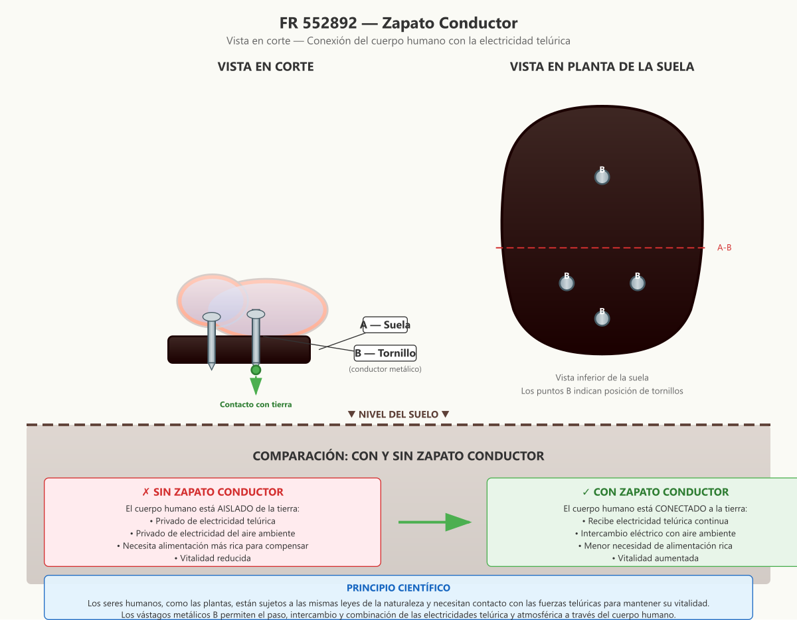

# FR 552892 — Zapato Conductor

**Inventor:** Justin Christofleau  
**Fecha de concesión:** 1923  
**País:** Francia

---

## Resumen de la Invención

Un sistema para **conectar el cuerpo humano con la electricidad telúrica** a través del calzado, mediante pequeños vástagos metálicos conductores que atraviesan la suela y Making contacto con el pie. El principio: los humanos, como las plantas, necesitan contacto con las fuerzas de la naturaleza para mantener su vitalidad.

---

## Diagrama Técnico



---

## Descripción Científica Detallada

### El Problema: Aislamiento del Ser Humano

Christofleau observó que los seres humanos modernos están **aislados de la tierra** por su calzado, lo cual:

1. **Corta el flujo de electricidad telúrica** que naturalmente debería circular por el cuerpo
2. **Impide el intercambio** entre electricidad negativa del suelo y positiva de la atmósfera
3. **Fuerza al cuerpo** a buscar energía de fuentes menos naturales (alimentación más rica)

### La Analogía con las Plantas

```
╔══════════════════════════════════════════════════════════╗
║              ANALOGÍA PLANTA ↔ HUMANO                   ║
╠══════════════════════════════════════════════════════════╣
║                                                          ║
║  PLANTA en tierra:                                       ║
║  • Raíces en suelo (electricidad negativa)               ║
║  • Hojas en aire (electricidad positiva)                 ║
║  • Intercambio eléctrico = VITALIDAD                     ║
║                                                          ║
║  PLANTA en maceta:                                       ║
║  • Aislada de la tierra                                  ║
║  • Necesita fertilizantes artificiales                   ║
║  • Vitalidad reducida                                    ║
║                                                          ║
║  HUMANO descalzo:                                        ║
║  • Pies en suelo (electricidad negativa)                 ║
║  • Cuerpo en aire (electricidad positiva)                ║
║  • Intercambio eléctrico = VITALIDAD                     ║
║                                                          ║
║  HUMANO con zapato normal:                               ║
║  • Aislado de la tierra                                  ║
║  • Necesita alimentación rica para compensar             ║
║  • Vitalidad reducida                                    ║
╚══════════════════════════════════════════════════════════╝
```

### La Solución: Tornillos Conductores

#### Diseño del Dispositivo

- **Suela (A):** Zapato tradicional de cuero o goma
- **Tornillo metálico (B):** Atraviesa la suela completamente
  - **Cabecha ancha** en el interior (contacto con el pie)
  - **Punta** en el exterior (contacto con la tierra)
  - **Material:** Metal buen conductor (cobre, hierro galvanizado, aluminio)

#### Mecanismo de Funcionamiento

```
INTERIOR DEL ZAPATO
────────────────────
    ┌─────────────┐
    │  CABECHA B  │ ← Contacto con el pie (a través del calcetín)
    │  (ancha)    │
    └──────┬──────┘
           │
    ═══════╪═══════  ← SUELA A
           │
    ┌──────┴──────┐
    │   PUNTA B   │ ← Contacto con la tierra
    └─────────────┘

FLUJO ELÉCTRICO
───────────────
TIERRA (−) → Punta B → Suela A → Cabecha B → PIE → CUERPO → AIRE (+)

El cuerpo se convierte en un CONDUCTOR entre la electricidad
negativa del suelo y la positiva de la atmósfera.
```

### Especificaciones del Dispositivo

| Parámetro | Valor |
|---|---|
| **Número de tornillos** | 1-4 (según tamaño de suela) |
| **Diámetro del tornillo** | 5-8 mm |
| **Longitud** | Atraviesa toda la suela (10-15 mm) |
| **Material** | Cobre, hierro galvanizado, aluminio |
| **Cabecha** | 15-20 mm de diámetro (contacto amplio con pie) |
| **Punta** | Afilada para penetrar el suelo suave |

### Ubicación de los Tornillos

Los tornillos pueden colocarse en cualquier punto de la suela, pero las posiciones más efectivas son:

1. **Bajo el talón** (contacto estable al caminar)
2. **Bajo la bola del pie** (contacto al apoyar el peso)
3. **Centro de la suela** (contacto continuo)

### Efectos Documentados

Según Christofleau y usuarios del zapato conductor:

- **Mayor vitalidad** y energía cotidiana
- **Mejor calidad del sueño** (contacto continuo con tierra)
- **Menor necesidad de suplementos** alimenticios
- **Sensación de bienestar** y conexión con la naturaleza
- **Mejora en deportes** (mayor energía disponible)

### Consideraciones Prácticas

| Aspecto | Recomendación |
|---|---|
| **Tipo de suelo** | Mejor效果 en suelo húmedo y natural |
| **Calzado** | Zapatos de trabajo, botas, zapatillas planas |
| **Uso** | Diario, especialmente al aire libre |
| **Mantenimiento** | Verificar contacto de tornillos periódicamente |
| **Durabilidad** | Los tornillos duran años (metal resistente) |

---

## Referencias

- **Patente original:** FR 552892 (1923) — Justin Christofleau
- **Libro:** *Electroculture* by Justin Christofleau (1927)
- **Fuente digital:** [rexresearch.com/ElectroCulture/ChristofleauEC](https://www.rexresearch.com/ElectroCulture/ChristofleauEC/ChristofleauEC.htm)

---

*Documento actualizado con diagramas técnicos modernos y explicaciones científicas detalladas.*  
*Autor original: Justin Christofleau — Traducción y actualización para fines de investigación.*
