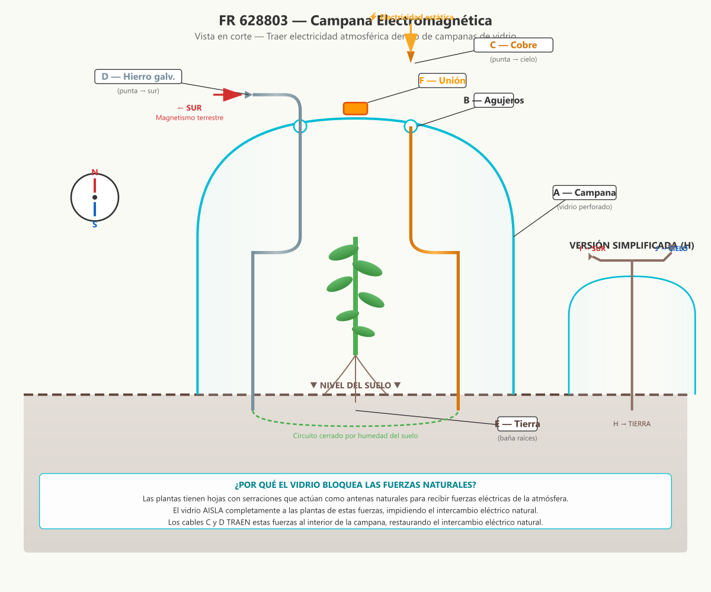

# FR 628803 — Campana Electromagnética

**Inventor:** Justin Christofleau  
**Fecha de concesión:** 1927  
**País:** Francia

---

## Resumen de la Invención

Un sistema para **traer electricidad atmosférica y magnetismo terrestre dentro de campanas de vidrio e invernaderos**, donde las plantas normalmente están aisladas de estas fuerzas naturales por el vidrio. Utiliza dos cables de metales diferentes (hierro galvanizado y cobre) que forman una pila natural, complementada por magnetismo terrestre y electricidad estática.

---

## Diagrama Técnico



---

## Descripción Científica Detallada

### El Problema: Aislamiento por el Vidrio

Las campanas de vidrio e invernaderos son útiles para:
- Proteger de heladas y viento
- Mantener temperatura estable
- Acelerar el crecimiento

Pero tienen un **defecto fundamental**: el vidrio **aísla completamente** a las plantas de las fuerzas eléctricas de la naturaleza.

```
PLANTA EN CAMPAPA DE VIDRIO (sin modificación)
═══════════════════════════════════════════════

    Electricidad positiva
    de la atmósfera
         ↓ ↓ ↓
    ═══════════════  ← VIDRIO (bloquea 100%)
    │   PLANTA    │
    │  (aislada)  │
    │             │
    ═══════════════
         ↑ ↑ ↑
    Electricidad negativa
    del suelo

RESULTADO: La planta crece rápido pero
           con MENOR CALIDAD nutritiva
```

### La Solución: Traer la Electricidad al Interior

Christofleau diseñó un sistema que **penetra el vidrio** con dos cables de metales diferentes:

```
PLANTA EN CAMPAPA CON CABLES C y D
════════════════════════════════════

    ⚡ Electricidad estática
         ↓ (punta C)
    ═══════════════  ← VIDRIO (con agujeros B)
    │      C↓      │
    │   PLANTA    │
    │      ↑D      │
    ═══════════════
         ↓ (punta D → SUR)
    Magnetismo terrestre

    + Pila formada por C (cobre) y D (hierro)
      → Circuito cerrado por humedad del suelo
      → Electricidad baña las raíces
```

### Los Tres Mecanismos de Recolección

#### 1. Cobre (C) — Electricidad Estática del Aire
- **Punta afilada hacia el cielo**
- Atrae electricidad estática del aire ambiente
- El cobre es excelente conductor
- **Efecto de punta:** concentra el campo eléctrico

#### 2. Hierro Galvanizado (D) — Magnetismo Terrestre
- **Punta tensada hacia el sur magnético**
- Recoge magnetismo terrestre que se mueve de sur a norte
- El hierro se magnetiza por inducción
- **Orientación crítica:** debe apuntar al sur magnético

#### 3. Pila Natural (C + D) — Circuito Cerrado
- **Dos metales diferentes** hundidos en la tierra
- La humedad del suelo cierra el circuito
- Se crea una **pila galvánica** natural
- **Las raíces de la planta** quedan dentro del circuito
- **Electricidad baña constantemente** las raíces

### Efectos Combinados

```
ENERGÍA QUE RECIBE LA PLANTA
═════════════════════════════

1. ELECTRICIDAD ESTÁTICA DEL AIRE (vía cable C)
   → Crecimiento más rápido
   → Vegetación más abundante

2. MAGNETISMO TERRESTRE (vía cable D)
   → Aumento de fructificación
   → Mayor contenido de alcohol y azúcar
   → Mejores cualidades nutritivas

3. PILA GALVÁNICA (C + D en tierra)
   → Electricidad continua baña raíces
   → Intercambio eléctrico restaurado
   → Vitalidad multiplicada

TOTAL: La planta bajo campana ahora recibe
       las fuerzas naturales que el vidrio bloqueaba
```

### Especificaciones del Dispositivo

| Componente | Material | Orientación | Función |
|---|---|---|---|
| **C** — Cable superior | Cobre | Punta → cielo | Recolección de electricidad estática |
| **D** — Cable inferior | Hierro galvanizado | Punta → sur magnético | Recolección de magnetismo terrestre |
| **F** — Unión | Soldadura por puntos | — | Conecta ambos cables |
| **B** — Agujeros | — | Parte superior de campana | Permiten paso de cables |
| **E** — Extremos en tierra | — | Base interior de campana | Forman pila galvánica |

### Versión Simplificada (H)

Para quien prefiera un dispositivo más simple:

```
        I → SUR (magnetismo)
         ↙
    ─────●─────  ← Cable H con dos ramas
         ↖
        J → CIELO (electricidad estática)
         │
         ↓
      TIERRA (E)

Un solo cable H con dos ramas:
• I apunta al sur (magnetismo)
• J apunta al cielo (electricidad)
• Extremo inferior en tierra (circuito)
```

### Aplicaciones

1. **Campanas de vidrio** para plantas individuales
2. **Invernaderos** completos (múltiples cabless C/D)
3. **Marcos de vidrio** para plantas en exterior
4. **Cualquier superficie transparente** que reciba luz solar

### Resultados Esperados

- **Crecimiento:** Más rápido que en campana sin cables
- **Calidad:** Mayor contenido de azúcar, vitaminas, minerales
- **Fructificación:** Aumento significativo
- **Madurez:** Anticipada
- **Sin químicos:** La electricidad natural reemplaza fertilizantes

---

## Referencias

- **Patente original:** FR 628803 (1927) — Justin Christofleau
- **Libro:** *Electroculture* by Justin Christofleau (1927)
- **Fuente digital:** [rexresearch.com/ElectroCulture/ChristofleauEC](https://www.rexresearch.com/ElectroCulture/ChristofleauEC/ChristofleauEC.htm)

---

*Documento actualizado con diagramas técnicos modernos y explicaciones científicas detalladas.*  
*Autor original: Justin Christofleau — Traducción y actualización para fines de investigación.*
