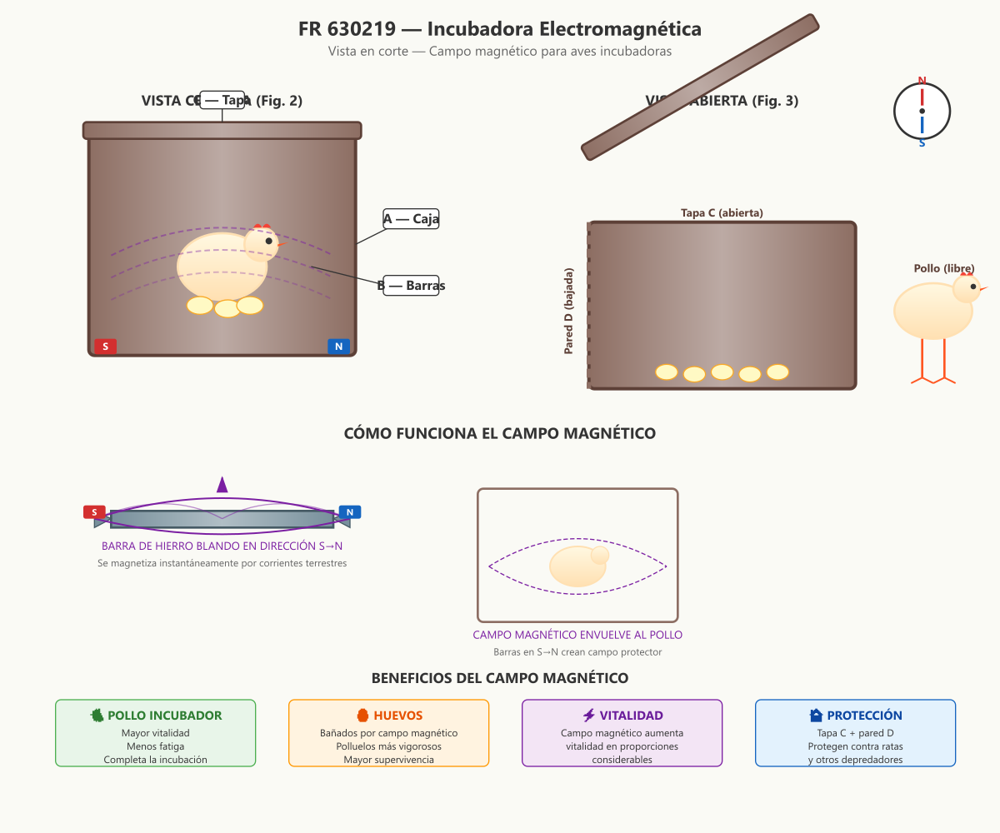

# FR 630219 — Incubadora Electromagnética

**Inventor:** Justin Christofleau  
**Fecha de concesión:** 1927  
**País:** Francia

---

## Resumen de la Invención

Una incubadora para pollos y otras aves, provista en toda su superficie interior de **pequeñas barras de hierro blando** orientadas Norte-Sur magnético. El campo magnético resultante aumenta la vitalidad del pollo incubador y de los huevos, permitiendo completar la incubación con menos fatiga y producir polluelos más vigorosos.

---

## Diagrama Técnico



---

## Descripción Científica Detallada

### Principio Fundamental

Desde hace siglos, los físicos han demostrado que:

1. **Una barra de hierro blando** colocada en la dirección de la aguja de la brújula es **inmediatamente traversada** por las corrientes magnéticas terrestres (sur→norte).

2. **Un campo magnético** creado por barras de hierro blando orientadas aumenta la **vitalidad de cualquier ser viviente** que se coloque dentro de ese campo.

3. Este efecto está **absolutamente demostrado** para plantas, humanos y animales.

### Diseño de la Incubadora

#### Estructura

```
VISTA EXPLOTA
═════════════

    ┌───────────────────────┐ ← Tapa C (con barras B)
    │ │ │ │ │ │ │ │ │ │ │ │ │
    ├───────────────────────┤
    │ │ │ │ │ │ │ │ │ │ │ │ │ ← Caja A (con barras B)
    │ │ │ │ │ │ │ │ │ │ │ │ │
    │ │ │ │ │ 🐔 │ │ │ │ │ │ │ ← Pollo + huevos
    │ │ │ │ │ │ │ │ │ │ │ │ │
    └───────────────────────┘
           ↑
      Pared D (móvil)
```

#### Componentes

| Componente | Material | Función |
|---|---|---|
| **A** — Caja | Madera | Estructura principal que contiene los huevos |
| **B** — Barras (×24+) | Hierro blando | Crean campo magnético环境al al pollo y huevos |
| **C** — Tapa | Madera + barras B | Cierra la incubadora por la noche. Se abre de día |
| **D** — Pared móvil | Madera | Se baja de día (pollo sale), se sube de noche (protección) |

### Mecanismo de Funcionamiento

```
DÍA (Tapa abierta, pared baja)
══════════════════════════════

    Tapa C ←── ABIERTA
    ┌───────────────────────┐
    │ │ │ │ │ │ │ │ │ │ │ │ │
    │ │ │ │ │ 🥚🥚🥚 │ │ │ │ │ ← Huevos bañados por campo
    │ │ │ │ │ │ │ │ │ │ │ │ │
    └───────────────────────┘
    Pared D ←── BAJADA
    
    🐔 Pollo libre para alimentarse
    Las barras B siguen creando campo magnético
    Los huevos reciben energía continuamente

NOCHE (Tapa cerrada, pared subida)
══════════════════════════════════

    Tapa C ←── CERRADA (con barras)
    ┌───────────────────────┐
    │ │ │ │ │ │ │ │ │ │ │ │ │
    │ │ │ │ 🐔 │ │ │ │ │ │ │ │ ← Pollo rodeado de campo
    │ │ │ │ 🥚🥚🥚 │ │ │ │ │ │
    │ │ │ │ │ │ │ │ │ │ │ │ │
    └───────────────────────┘ ← Pared D SUBIDA
    
    Pollo completamente rodeado de barras de hierro blando
    Campo magnético ENVUELE completamente al pollo
    Protegido contra ratas y depredadores
```

### El Campo Magnético Ambiental

La innovación clave es que **todas las superficies interiores** están provistas de barras de hierro blando:

```
SECCIÓN TRANSVERSAL
═══════════════════

    │ B │ B │ B │ B │ B │   ← Barras en tapa C
    ─────────────────────
    │                   │
    B                   B   ← Barras en paredes
    │      🐔 🥚        │
    B                   B
    │                   │
    ─────────────────────
    │ B │ B │ B │ B │ B │   ← Barras en fondo
    
    Cada barra:
    • Orientada SUR → NORTE
    • Magnetizada por corrientes terrestres
    • Crea campo magnético环境al
    
    Resultado: El pollo está COMPLETAMENTE RODEADO
    por un campo magnético uniforme
```

### Efectos en los Huevos

Los huevos, al estar dentro de este campo magnético:

1. **Reciben energía continua** durante toda la incubación
2. **Los polluelos adquieren vitalidad** antes de nacer
3. **Mayor resistencia** a enfermedades
4. **Crecimiento más rápido** después de la eclosión
5. **Mejor adaptación** al medio ambiente

### Aplicación a Gallineros

La caja A, sin la tapa C, puede usarse como **módulo de gallinero**:

```
GALLINERO MODULAR
═════════════════

    ┌─────┐ ┌─────┐ ┌─────┐
    │ │ │ │ │ │ │ │ │ │ │ │ │
    │ │ │ │ │ │ │ │ │ │ │ │ │   ← Múltiples cajas A
    │ 🐔 │ │ 🐔 │ │ 🐔 │ │ │ │      sin tapa C
    │ │ │ │ │ │ │ │ │ │ │ │ │
    └─────┘ └─────┘ └─────┘
    
    Cada gallinero mantiene su campo magnético
    Las gallinas viven permanentemente en campo magnético
    → Mayor producción de huevos
    → Gallinas más sanas y vigorosas
```

### Resultados Esperados

- **Tasa de eclosión:** Mayor porcentaje de huevos que nacen
- **Vitalidad de polluelos:** Significativamente aumentada
- **Supervivencia:** Menor mortalidad en las primeras semanas
- **Producción de huevos:** Aumento en gallineros con barras magnéticas
- **Salud general:** Mayor resistencia a enfermedades

---

## Referencias

- **Patente original:** FR 630219 (1927) — Justin Christofleau
- **Libro:** *Electroculture* by Justin Christofleau (1927)
- **Fuente digital:** [rexresearch.com/ElectroCulture/ChristofleauEC](https://www.rexresearch.com/ElectroCulture/ChristofleauEC/ChristofleauEC.htm)

---

*Documento actualizado con diagramas técnicos modernos y explicaciones científicas detalladas.*  
*Autor original: Justin Christofleau — Traducción y actualización para fines de investigación.*
