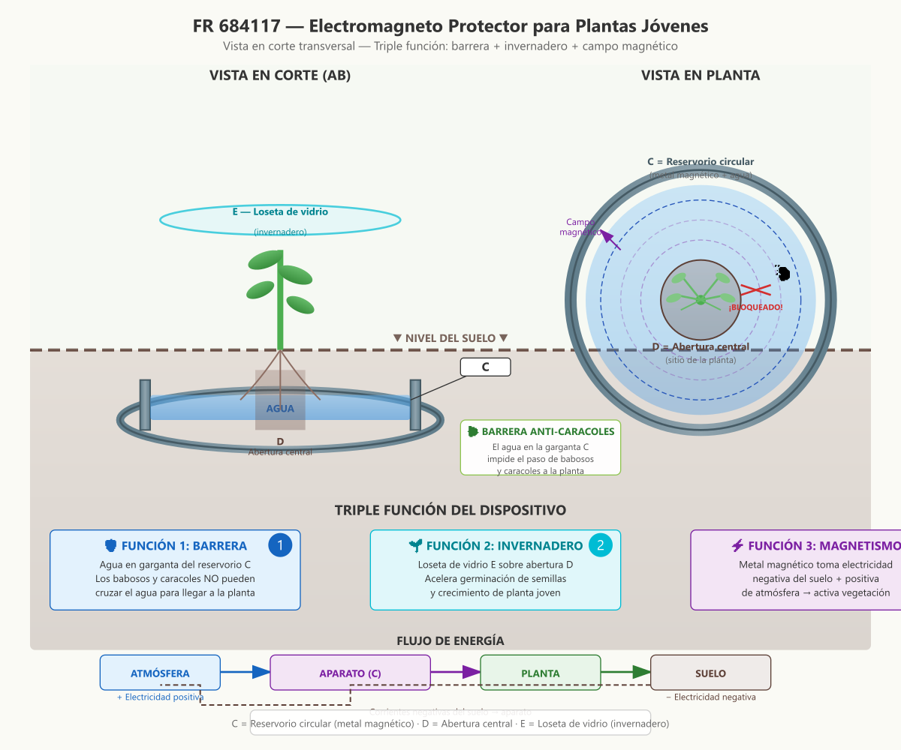

# FR 684117 — Electromagneto Protector para Plantas Jóvenes

**Inventor:** Justin Christofleau  
**Fecha de concesión:** 1930  
**País:** Francia

---

## Resumen de la Invención

Un dispositivo circular de metal magnético que combina tres funciones: **protección contra babosos y caracoles**, **mini-invernadero para germinación acelerada**, y **campo magnético para aumentar la vitalidad** de plantas jóvenes. Funciona como barrera física (agua) y como fuente de energía natural para la planta.

---

## Diagrama Técnico



---

## Descripción Científica Detallada

### El Problema que Resuelve

Las plantas jóvenes son vulnerables a múltiples amenazas:

1. **Babosos y caracoles:** Devoran plantulas tiernas, especialmente en clima húmedo
2. **Germinación lenta:** Las condiciones naturales pueden ser lentas para la germinación
3. **Vitalidad baja:** Las plantas jóvenes tienen poca energía para crecer vigorosamente

### La Solución: Dispositivo Triple Función

Christofleau diseñó un aparato que resuelve los tres problemas simultáneamente:

```
╔═══════════════════════════════════════════════════════════╗
║                  TRIPLE FUNCIÓN                          ║
╠═══════════════════════════════════════════════════════════╣
║  1. BARRERA FÍSICA (agua)                                ║
║     → Los caracoles no pueden cruzar el agua             ║
║     → Protección continua sin pesticidas                 ║
║                                                           ║
║  2. MINI-INVERNADERO (vidrio)                            ║
║     → Acelera germinación de semillas                    ║
║     → Protege de heladas y viento                        ║
║     → Se retira cuando la planta crece                   ║
║                                                           ║
║  3. CAMPO MAGNÉTICO (metal ferromagnético)               ║
║     → Atrae electricidad negativa del suelo              ║
║     → Atrae electricidad positiva de la atmósfera        ║
║     → Activa poder de vegetación y madurez               ║
╚═══════════════════════════════════════════════════════════╝
```

### Descripción de Componentes

#### Reservorio Circular (C)
- **Material:** Metal magnético (hierro blando)
- **Forma:** Anillo circular con garganta para agua
- **Función mecánica:** Contiene agua que actúa como barrera contra babosos
- **Función magnética:** Al descansar sobre la tierra, toma rápidamente electricidad negativa del suelo
- **Función de inducción:** Atrae ondas electromagnéticas y corrientes positivas de la atmósfera

#### Abertura Central (D)
- **Ubicación:** Centro exacto del reservorio
- **Función:** Sitio donde se coloca la planta o se siembran semillas
- **Tamaño:** Suficiente para el crecimiento inicial de la planta

#### Loseta de Vidrio (E)
- **Material:** Vidrio transparente
- **Función:** Forma un mini-invernadero sobre la abertura central
- **Efecto:** Acelera germinación y crecimiento inicial
- **Uso temporal:** Se retira cuando la planta toca el vidrio

### Mecanismo de Funcionamiento

```
FASE 1: SIEMBRA
────────────────
1. Colocar el reservorio C sobre el suelo
2. Llenar la garganta con agua
3. Sembrar semillas en el centro D
4. Cubrir con loseta de vidrio E

FASE 2: GERMINACIÓN ACELERADA
─────────────────────────────
• El vidrio E crea efecto invernadero
• La humedad y calor se concentran
• Germinación más rápida que en invernadero ordinario
• La planta brota donde se sembró (sin trasplante)

FASE 3: PROTECCIÓN CONTINUA
───────────────────────────
• El agua en C bloquea el paso de babosos/caracoles
• La planta crece protegida
• El campo magnético del metal activa la vegetación

FASE 4: CRECIMIENTO LIBRE
─────────────────────────
• Cuando la planta toca el vidrio, se retira E
• Se mantiene el agua en C para protección
• La planta continúa受益 del campo magnético
• Crecimiento más rápido y saludable
```

### Fundamento Científico del Campo Magnético

El metal magnético del reservorio funciona según principios bien establecidos:

1. **Conducción de electricidad telúrica:** Al contacto con el suelo, el metal toma inmediatamente electricidad negativa natural.

2. **Inducción atmosférica:** La masa metálica atrae ondas electromagnéticas y corrientes positivas de la atmósfera.

3. **Campo combinado:** La planta queda rodeada en su base por un campo magnético formado por:
   - **Corrientes negativas del suelo** (captadas por el metal)
   - **Corrientes positivas de la atmósfera** (atraídas por inducción)

4. **Efecto biológico:** Este campo magnético:
   - **Activa el poder de vegetación** (crecimiento más vigoroso)
   - **Aumenta riqueza en cualidades nutritivas** (mejor calidad)
   - **Acelera la madurez** (cosecha más temprana)

### Ventajas sobre Métodos Tradicionales

| Aspecto | Cebolla/ pesticidas | Invernadero tradicional | FR 684117 |
|---|---|---|---|
| Protección babosos | Parcial | No | **Completa** |
| Germinación | Normal | Acelerada | **Acelerada** |
| Trasplante | Necesario | Acelerada | **No necesario** |
| Campo magnético | No | No | **Sí** |
| Costo | Bajo | Alto | **Moderado** |
| Mantenimiento | Alto | Medio | **Bajo** |
| Toxicidad | Sí | No | **No** |

### Instrucciones de Uso

1. **Preparar el suelo:** Fertilizar normalmente el área donde se colocará el dispositivo
2. **Colocar el reservorio:** Poner C sobre el suelo en el sitio deseado
3. **Llenar con agua:** Añadir agua a la garganta del reservorio (que sea suficientemente ancha para que babosos no puedan saltar)
4. **Sembrar:** Colocar semillas o planta joven en la abertura central D
5. **Cubrir con vidrio:** Poner la loseta E para crear el efecto invernadero
6. **Mantener:** Reponer agua según sea necesario
7. **Retirar vidrio:** Cuando la planta toque el vidrio, retirar E
8. **Continuar:** Mantener el agua en C para protección continua

### Resultados Esperados

- **Germinación:** 30-50% más rápida que en suelo desnudo
- **Supervivencia:** Casi 100% contra babosos y caracoles
- **Crecimiento:** 20-40% más rápido debido al campo magnético
- **Calidad:** Mayor contenido de nutrientes
- **Sin trasplante:** La planta crece donde se sembró (menor estrés)

---

## Referencias

- **Patente original:** FR 684117 (1930) — Justin Christofleau
- **Libro:** *Electroculture* by Justin Christofleau (1927)
- **Fuente digital:** [rexresearch.com/ElectroCulture/ChristofleauEC](https://www.rexresearch.com/ElectroCulture/ChristofleauEC/ChristofleauEC.htm)

---

*Documento actualizado con diagramas técnicos modernos y explicaciones científicas detalladas.*  
*Autor original: Justin Christofleau — Traducción y actualización para fines de investigación.*
