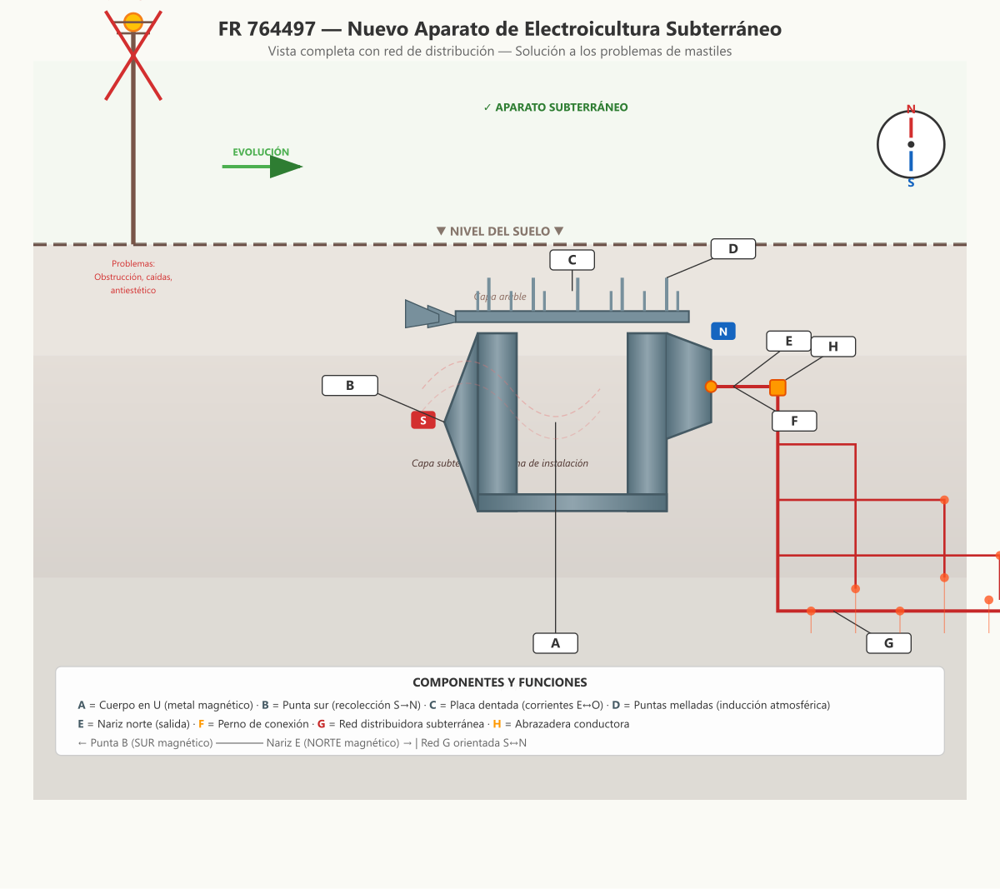

# FR 764497 — Nuevo Aparato de Electroicultura Subterráneo

**Inventor:** Justin Christofleau  
**Fecha de concesión:** 1934  
**País:** Francia

---

## Resumen de la Invención

Versión mejorada del aparato subterráneo de electrocultura (variante de CH 172269), diseñado específicamente para **corregir las desventajas de los mastiles superficiales**: eliminar postes costosos y antiestéticos, reducir la captación excesiva de electricidad estática (que causaba caídas en cereales), y priorizar las corrientes del suelo que aumentan cosechas en cantidad y calidad de forma equilibrada.

---

## Diagrama Técnico



---

## Descripción Científica Detallada

### El Problema: Limitaciones de los Mastiles Superficiales

La electrocultura original utilizaba **dispositivos elevados en mastiles** para captar electricidad atmosférica. Aunque efectivos para aumentar cosechas, tenían defectos significativos:

| Problema | Causa | Consecuencia |
|---|---|---|
| **Obstrucción agrícola** | Mastiles en tierras cultivadas | Arados y maquinaria golpeaban los postes |
| **Daño por ganado** | Postes en pastizales | Ganado volcaba los dispositivos |
| **Anti-estético** | Postes visibles cerca de viviendas | Deterioro de la apariencia de propiedades |
| **Caídas de cereales** | Excesiva electricidad estática | Plantas crecían demasiado y se caían |
| **Costo** | Mastiles altos y aparatos grandes | Inversión inicial elevada |

### La Solución: Priorizar Corrientes del Suelo

Christofleau identificó que existen **dos tipos de electricidad** beneficiosas para las plantas:

```
╔══════════════════════════════════════════════════════════╗
║                    ATMÓSFERA                             ║
║   Electricidad POSITIVA estática (rayos, nubes, viento) ║
║   → Aumenta crecimiento VIGOROSO                        ║
║   → Exceso causa CAÍDAS en cereales                     ║
╠══════════════════════════════════════════════════════════╣
║                    SUELO                                 ║
║   Electricidad NEGativa telúrica (actividad microbiana)  ║
║   → Aumenta crecimiento EQUILIBRADO                     ║
║   → Mejora CALIDAD (azúcar, vitaminas, minerales)       ║
║   → Desarrolla VIDA MICROBIANA del suelo                 ║
╚══════════════════════════════════════════════════════════╝
```

**FR 764497 prioriza las corrientes del suelo** sobre las atmosféricas, logrando:
- Cosechas más grandes **sin caídas**
- Mejora de **calidad** (no solo cantidad)
- Beneficio más **natural** y sostenible

### Diseño del Aparato

#### Estructura Principal (A)
- **Material:** Metal magnético (hierro blando)
- **Forma:** Hierro con U invertida
- **Función:** La forma de U crea un circuito magnético cerrado que **refuerza y concentra** las corrientes que lo atraviesan

#### Punta Sur (B)
- **Orientación:** Estrictamente hacia el sur magnético
- **Función:** Recolección magnética de corrientes S→N
- **Geometría:** Punta afilada para concentrar las fuerzas

#### Placa Dentada (C)
- **Diseño:** Metal magnético con dientes en ambos lados
- **Función lateral:** Dientes captan corrientes terrestres este-oeste
- **Cola mellada sur:** Aumenta recolección de corrientes S→N
- **Ventaja:** Superficie maximizada para contacto con corrientes direccionales

#### Puntas Melladas (D)
- **Ubicación:** Parte superior del aparato
- **Función:** Por inducción electromagnética a través de la capa de tierra, captan **pequeña cantidad de electricidad positiva** de la atmósfera
- **Balance:** La cantidad inducida es suficiente para atraer corrientes del suelo sin causar excesos

#### Nariz Norte (E) y Perno (F)
- **Función:** Conexión segura para la red distribuidora
- **Diseño:** Abertura roscada para fijación firme

#### Abrazadera (H)
- **Material:** Metal magnético, dos piezas comprimidas
- **Función:** Contacto eléctrico perfecto entre cable y aparato

#### Red Distribuidora (G)
- **Orientación:** Sur a Norte magnético
- **Profundidad:** 20-30 cm bajo la superficie
- **Función:** Distribuye la energía por toda el área cultivada

### Mecanismo Físico Completo

```
PASO 1: Magnetización por orientación
─────────────────────────────────────
Barra de hierro blando en dirección S→N
→ Se convierte en imán por corrientes terrestres
→ Adquiere polos Norte y Sur

PASO 2: Recolección de corrientes del suelo
─────────────────────────────────────────────
El cuerpo en U (A) atrae electricidad negativa del suelo
Las aletas laterales captan corrientes E↔O
La punta B concentra corrientes S→N

PASO 3: Inducción atmosférica controlada
─────────────────────────────────────────
Las puntas D, cubiertas por tierra, inducen
pequeña cantidad de electricidad positiva
→ Suficiente para atraer corrientes del suelo
→ Insuficiente para causar caídas

PASO 4: Distribución por red
────────────────────────────
Los cables G, orientados S→N, también se magnetizan
Crean campo magnético distribuido en toda el área
Electricidad positiva atrae y retiene corrientes negativas

PASO 5: Campo magnético combinado
──────────────────────────────────
Capa arable sobre campo magnético formado por:
  • Electricidad negativa del suelo
  • Electricidad positiva de la atmósfera (traída por aparato)
→ Las plantas ven aumentado su intercambio natural
→ Vitalidad multiplicada
```

### Comparación: Mastil vs Aparato Subterráneo

| Característica | Mastil Superficial | FR 764497 Subterráneo |
|---|---|---|
| **Tipo de electricidad** | Principalmente estática atmosférica | Principalmente corrientes del suelo |
| **Efecto en crecimiento** | Vigoroso (riesgo de caídas) | **Equilibrado (sin caídas)** |
| **Calidad de producto** | Variable | **Mejorada (azúcar, vitaminas)** |
| **Visibilidad** | visible (antiestético) | **Invisible** |
| **Obstrucción agrícola** | Sí | **No** |
| **Mantenimiento** | Requiere acceso | **Nulo** |
| **Vida microbiana del suelo** | Moderada | **Desarrollada** |
| **Costo inicial** | Alto (mastil + aparato) | **Menor (solo aparato)** |
| **Tipo de beneficio** | Crecimiento rápido | **Crecimiento natural y sostenible** |

### Especificaciones de Instalación

| Parámetro | Recomendación |
|---|---|
| **Profundidad del aparato** | 40-60 cm |
| **Orientación** | Sur a Norte magnético (usar brújula) |
| **Profundidad de cables** | 20-30 cm |
| **Separación entre ramas** | 1-2 metros |
| **Conexión ared** | Perno F + abrazadera H |
| **Extensión de la red** | Cubrir toda el área cultivada |

### Aplicaciones Recomendadas

- **Cereales:** Elimina riesgo de caídas por crecimiento excesivo
- **Viñedos:** Crecimiento equilibrado con mejor calidad de uva
- **Hortalizas:** Mayor tamaño sin sacrificar calidad
- **Frutales:** Aumento de producción sostenible
- **Pastos:** Mejor crecimiento sin intervención mecánica

---

## Referencias

- **Patente original:** FR 764497 (1934) — Justin Christofleau
- **Patente complementaria:** CH 172269 (misma invención, registro suizo)
- **Libro:** *Electroculture* by Justin Christofleau (1927)
- **Fuente digital:** [rexresearch.com/ElectroCulture/ChristofleauEC](https://www.rexresearch.com/ElectroCulture/ChristofleauEC/ChristofleauEC.htm)

---

*Documento actualizado con diagramas técnicos modernos y explicaciones científicas detalladas.*  
*Autor original: Justin Christofleau — Traducción y actualización para fines de investigación.*
