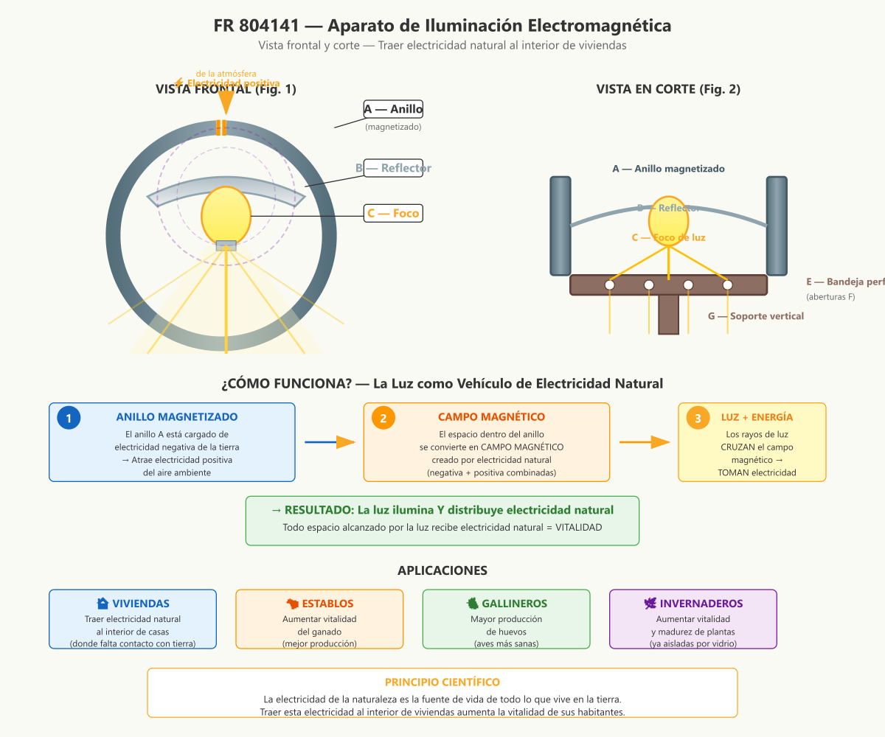

# FR 804141 — Aparato de Iluminación Electromagnética

**Inventor:** Justin Christofleau  
**Fecha de concesión:** 1936  
**País:** Francia

---

## Resumen de la Invención

Un dispositivo que **trae electricidad natural al interior de las viviendas** humanas, captándola del aire ambiente y distribuyéndola a través de la luz. Un círculo metálico magnetizado atrae electricidad positiva de la atmósfera; la luz del foco cruza este campo magnético y **se carga de electricidad natural**, transfiriéndola a todo el espacio que ilumina.

---

## Diagrama Técnico



---

## Descripción Científica Detallada

### El Problema: Aislamiento Indoor

Los seres humanos modernos pasan la mayoría de su tiempo **dentro de edificios**, donde están parcialmente **privados de las fuerzas electromagnéticas de la naturaleza**:

```
FUERA (Contacto natural)
═════════════════════════
☀ Sol + 💨 Viento + 🌧 Lluvia
     ↓ ↓ ↓ ↓ ↓
┌─────────────────────┐
│  Ser humano         │
│  (contacto directo) │
│  → VITALIDAD MÁXIMA │
└─────────────────────┘

DENTRO (Aislamiento)
═════════════════════
    ╔═══════════════╗
    ║   VIVIENDA    ║
    ║  ┌─────────┐  ║
    ║  │ Humano  │  ║  ← Aislado de fuerzas naturales
    ║  │ (aislado)│  ║  → Vitalidad REDUCIDA
    ║  └─────────┘  ║
    ╚═══════════════╝
```

### La Solución: Luz como Vehículo

Christofleau descubrió que **la luz puede transportar electricidad natural**:

```
MECANISMO DE TRANSMISIÓN
═════════════════════════

1. ANILLO A magnetizado atrae electricidad positiva
              ↓
2. Se crea CAMPO MAGNÉTICO dentro del anillo
              ↓
3. Los rayos de luz CRUZAN este campo
              ↓
4. La luz TOMA electricidad natural del campo
              ↓
5. La luz se TRANSMITE al espacio iluminado
              ↓
6. Todo lo que recibe la luz recibe electricidad

La luz no solo ilumina → ¡también ENERGIZA!
```

### Descripción de Componentes

#### Anillo Metálico (A)
- **Material:** Metal magnético (hierro blando)
- **Forma:** Círculo no cerrado (abierto en la parte superior)
- **Función:**
  - Previamente cargado de electricidad negativa de la tierra
  - Atrae constantemente electricidad positiva de la atmósfera
  - Crea campo magnético en su interior
- **Importancia del círculo no cerrado:** Permite que el campo magnético no se auto-cancele

#### Reflector (B)
- **Material:** Metal pulido (aluminio, plata, acero inoxidable)
- **Forma:** Parabólico o cóncavo
- **Función:**
  - Dirige la luz del foco hacia abajo
  - Concentra los rayos que cruzan el campo magnético
  - Maximiza la distribución de electricidad natural

#### Foco de Luz (C)
- **Tipo:** Incandescente, halógena, o cualquier fuente de luz
- **Función:** Genera rayos de luz que cruzan el campo magnético
- **Nota:** La electricidad del foco se COMPLEMENTA con la electricidad natural

#### Bandeja Perforada (E)
- **Material:** Metal o madera
- **Función:** Sostiene el aparato y permite que la luz pase
- **Aberturas (F):** Permiten que los rayos iluminen el espacio inferior

#### Soporte (G)
- **Función:** Mantiene vertical el aparato
- **Altura:** Ajustable según la aplicación

### Flujo de Energía Completo

```
ATMÓSFERA
    ↓ Electricidad positiva
╔═══════════════╗
║   ANILLO A    ║ ← Magnetizado con electricidad negativa
║  (atrayente)  ║
╚═══════════════╝
    ↓ Campo magnético creado
┌───────────────┐
│   REFLECTOR B │ ← Concentra la luz
│   + FOCO C    │ ← Genera luz
└───────────────┘
    ↓ Rayos de luz cruzan campo magnético
    ↓ Los rayos TOMAN electricidad natural
    ↓
╔═══════════════╗
║  BANDEJA E    ║ ← Perforada (F)
╚═══════════════╝
    ↓ Luz + Electricidad natural
    ↓
┌───────────────┐
│   ESPACIO     │ ← Iluminado Y energizado
│  ILUMINADO    │
│  (vivienda,   │
│   invernadero)│
└───────────────┘
```

### Resultados en Humanos

Según Christofleau, los seres humanos en viviendas con este dispositivo experimentan:

- **Mayor vitalidad** y energía diaria
- **Mejor calidad del sueño**
- **Mayor bienestar** general
- **Reducción de fatiga**
- **Mejora del estado de ánimo**
- **Sin efectos secundarios** (energía 100% natural)

### Resultados en Plantas (Invernaderos)

- **Crecimiento más rápido**
- **Mayor producción** de frutos
- **Mejor calidad** nutritiva
- **Madurez anticipada**
- **Mayor resistencia** a enfermedades

### Especificaciones de Instalación

| Parámetro | Recomendación |
|---|---|
| **Altura** | 2-3 metros sobre el suelo |
| **Orientación del gap** | Superior (hacia el cielo) |
| **Tipo de foco** | Incandescente o halógena (calor有助 al efecto) |
| **Superficie cubierta** | 20-50 m² (según potencia del foco) |
| **Uso** | Continuo (encendido durante horas de uso) |

### Adaptaciones

El aparato puede adaptarse a cualquier modo de iluminación:

1. **Lámparas de mesa** → Anillo alrededor de la lámpara
2. **Luces de techo** → Anillo montado en el techo
3. **Faroles exteriores** → Anillo alrededor del farol
4. **Invernaderos** → Series de anillos a lo largo del techo
5. **Establos/gallineros** → Anillos sobre los comederos

---

## Referencias

- **Patente original:** FR 804141 (1936) — Justin Christofleau
- **Libro:** *Electroculture* by Justin Christofleau (1927)
- **Fuente digital:** [rexresearch.com/ElectroCulture/ChristofleauEC](https://www.rexresearch.com/ElectroCulture/ChristofleauEC/ChristofleauEC.htm)

---

*Documento actualizado con diagramas técnicos modernos y explicaciones científicas detalladas.*  
*Autor original: Justin Christofleau — Traducción y actualización para fines de investigación.*
