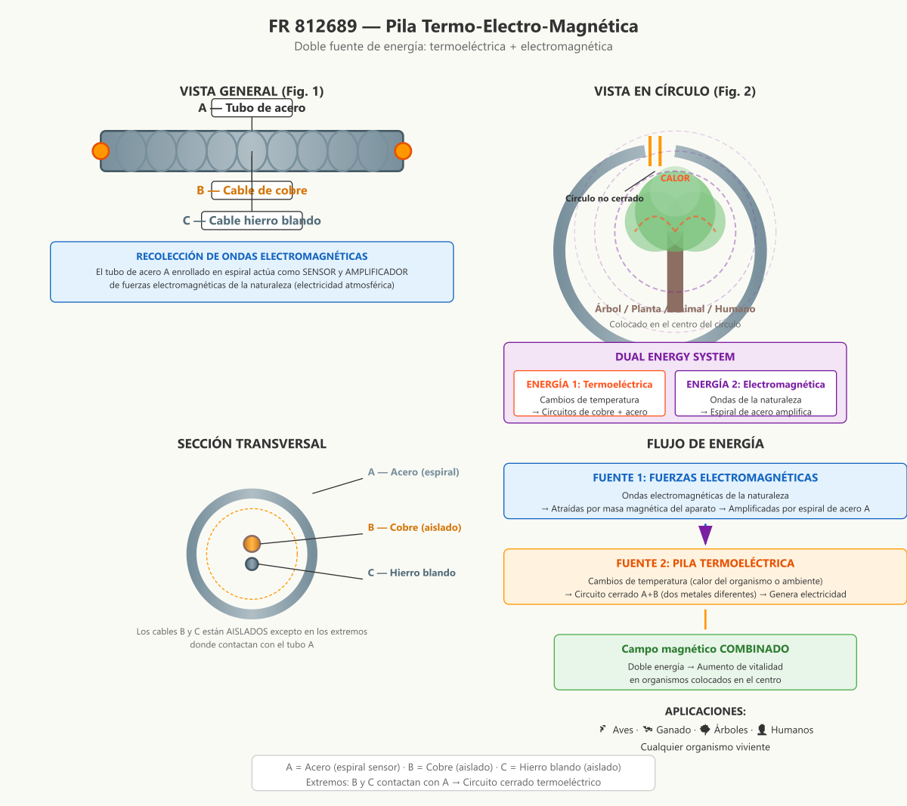

# FR 812689 — Pila Termo-Electro-Magnética

**Inventor:** Justin Christofleau  
**Fecha de concesión:** 1937  
**País:** Francia

---

## Resumen de la Invención

Un dispositivo flexible que combina **dos fuentes de energía** en un solo aparato: una pila termoeléctrica (que aprovecha cambios de temperatura) y un sensor amplificador de fuerzas electromagnéticas naturales. Diseñado para envolver organismos vivientes (humanos, animales, árboles) y aumentar su vitalidad mediante un campo magnético de doble energía.

---

## Diagrama Técnico



---

## Descripción Científica Detallada

### El Problema que Resuelve

La mayoría de los dispositivos de electrocultura captan **una sola fuente** de energía natural. Christofleau diseñó un aparato que captura **dos fuentes simultáneamente**:

```
╔══════════════════════════════════════════════════════════╗
║            DOS FUENTES DE ENERGÍA NATURAL               ║
╠══════════════════════════════════════════════════════════╣
║                                                          ║
║  1. FUERZAS ELECTROMAGNÉTICAS                           ║
║     • Ondas de la naturaleza                             ║
║     • Electricidad atmosférica en estado latente         ║
║     • Siempre disponibles (24/7)                         ║
║                                                          ║
║  2. CALOR (CAMBIOS DE TEMPERATURA)                       ║
║     • Calor del organismo vivo                           ║
║     • Cambios de temperatura del ambiente                ║
║     • Genera electricidad por efecto termoeléctrico      ║
║                                                          ║
║  COMBINACIÓN = Campo magnético de DOBLE ENERGÍA         ║
║  → Vitalidad aumentada en proporciones considerables     ║
╚══════════════════════════════════════════════════════════╝
```

### Descripción del Aparato

#### Componentes Principales

| Componente | Material | Estructura | Función |
|---|---|---|---|
| **A** — Tubo | Acero | Cable enrollado en espiral | Sensor y amplificador de ondas electromagnéticas |
| **B** — Cable | Cobre | Recto, aislado, pelado en extremos | Circuito termoeléctrico (con A) |
| **C** — Cable | Hierro blando | Recto, aislado, pelado en extremos | Segundo circuito magnético (por inducción) |

#### Detalles Construcción

```
SECCIÓN TRANSVERSAL DEL TUBO
═════════════════════════════

    ╔═══════════════════╗
    ║   ╔═══════════╗   ║  ← A: Cable de acero (espiral)
    ║   ║  B ←─────║───║── Contacto en extremos
    ║   ║  (cobre)  ║   ║
    ║   ║  C ←─────║───║── Contacto en extremos
    ║   ║  (hierro) ║   ║
    ║   ╚═══════════╝   ║
    ╚═══════════════════╝
    
    INSIDE: B y C aislados en toda su longitud
    ENDS: B y C pelados, en contacto con A
    RESULTADO: Circuito cerrado A+B (termoeléctrico)
```

### Mecanismo de Funcionamiento

#### Fuente 1: Recolección Electromagnética

```
ONDAS DE LA NATURALEZA
        ↓ ↓ ↓ ↓ ↓
    ╔═══════════════╗
    ║  A (espiral)  ║  ← Masa magnética atrae ondas
    ║  ╱╲╱╲╱╲╱╲╱╲  ║  ← Espiral AMPLIFICA la señal
    ║  sensor       ║
    ╚═══════════════╝
        ↓ ↓ ↓ ↓ ↓
    Campo magnético potenciado
```

El tubo de acero A enrollado en espiral funciona como:
- **Antena:** La masa magnética atrae ondas electromagnéticas
- **Amplificador:** La espiral aumenta la intensidad de la señal
- **Conductor:** Transporta la energía al organismo

#### Fuente 2: Pila Termoeléctrica

```
EFECTO TERMOELÉCTRICO (Seebeck)
═════════════════════════════════

    CALOR (del organismo o ambiente)
         ↓
    ┌────────────┐
    │ A (acero)  │────┐
    └────────────┘    │  Circuito cerrado
    ┌────────────┐    │  de dos metales
    │ B (cobre)  │────┘  diferentes
    └────────────┘
         ↓
    ELECTRICIDAD generada

PRINCIPIO: Dos metales diferentes unidos
forman una pila cuando hay diferencia
de temperatura entre las uniones.
```

El organismo vivo proporciona el calor necesario:
- **Humanos:** 37°C constantes
- **Animales:** 38-40°C
- **Árboles:** Variación diaria de temperatura
- **Ambiente:** Cambios día/noche, estacionales

#### Fuente 3: Segundo Circuito (Inducción)

```
INDUCCIÓN MAGNÉTICA
════════════════════

    A (acero) magnetizado por ondas
         ↓ inducción
    ┌────────────┐
    │ C (hierro) │  ← Hierro blando dentro del tubo
    └────────────┘
         ↓
    Segundo circuito cerrado
    traversado por fuerzas electromagnéticas
    
    Resultado: Energía magnética DUPLICADA
```

### Configuración en Círculo

Para envolver un organismo vivo:

```
VISTA EN PLANTA
═══════════════

         ╭─────────╮
        ╱           ╲
       │             │
       │    🌳 🐔    │  ← Organismo en el centro
       │    👤 🐄    │
       │             │
        ╲           ╱
         ╰────●────╯
              ↑
         Círculo NO cerrado
         (permite colocar/remover)

EL CALOR DEL ORGANISMO
activa la pila termoeléctrica

LAS ONDAS DE LA NATURALEZA
son captadas por la espiral

CAMPO MAGNÉTICO COMBINADO
envuelve al organismo 24/7
```

### Aplicaciones por Tipo de Organismo

| Organismo | Fuente principal de calor | Aplicación |
|---|---|---|
| **Humanos** | 37°C corporales | Cinturón alrededor del torso |
| **Ganado** | 38-40°C | Collar o cincha alrededor del cuello |
| **Aves** | 40-42°C | Anillo alrededor del gallinero |
| **Árboles** | Variación diaria | Círculo alrededor del tronco |
| **Plantas** | Variación ambiente | Círculo alrededor del tallo |

### Resultados Esperados

- **Aumento de vitalidad** en proporciones considerables
- **Mejora de salud** en humanos y animales
- **Crecimiento acelerado** en árboles y plantas
- **Mayor resistencia** a enfermedades
- **Mejor producción** (leche, huevos, frutos)
- **Sin efectos secundarios** (energía 100% natural)

---

## Referencias

- **Patente original:** FR 812689 (1937) — Justin Christofleau
- **Libro:** *Electroculture* by Justin Christofleau (1927)
- **Fuente digital:** [rexresearch.com/ElectroCulture/ChristofleauEC](https://www.rexresearch.com/ElectroCulture/ChristofleauEC/ChristofleauEC.htm)

---

*Documento actualizado con diagramas técnicos modernos y explicaciones científicas detalladas.*  
*Autor original: Justin Christofleau — Traducción y actualización para fines de investigación.*
