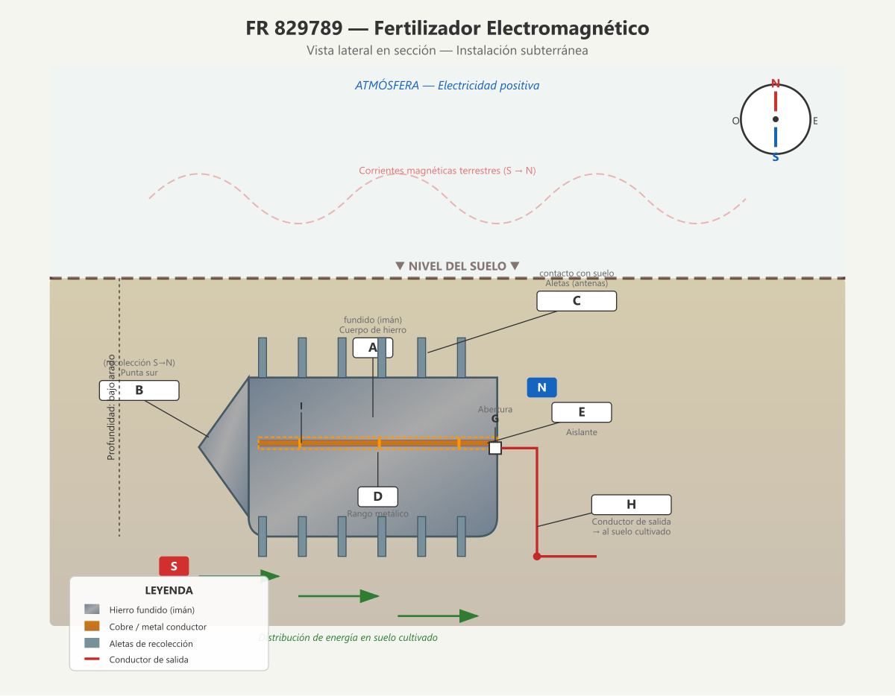

# FR 829789 — Fertilizador Electromagnético

**Inventor:** Justin Christofleau  
**Fecha de concesión:** 1938  
**País:** Francia

---

## Resumen de la Invención

Un dispositivo subterráneo de hierro fundido en forma de imán alargado, equipado con aletas de recolección, diseñado para captar y concentrar las corrientes magnéticas terrestres y la electricidad estática del suelo, distribuyéndolas en la tierra cultivada para aumentar la productividad agrícola.

---

## Diagrama Técnico



---

## Descripción Científica Detallada

### Principio Fundamental

Este dispositivo se basa en un principio bien establecido de la física: **una barra de hierro blando colocada en la dirección de la aguja de la brújula es inmediatamente atravesada por las corrientes magnéticas terrestres** que se mueven constantemente de sur a norte. El hierro, al ser un material ferromagnético, se magnetiza por inducción y actúa como un conductor de estas fuerzas naturales.

### Componentes y sus Funciones

| Componente | Material | Función |
|---|---|---|
| **A** — Cuerpo principal | Hierro fundido | Masa magnética que actúa como imán permanente. Su forma alargada maximiza la superficie de contacto con las corrientes del suelo. |
| **B** — Punta sur | Hierro fundido | Punta afilada orientada al sur magnético. Su geometría puntiaguda facilita la concentración y captación de las corrientes magnéticas terrestres (S→N). |
| **C** — Aletas (×12) | Hierro fundido | Superficies de contacto que aumentan la interfaz aparato-tierra. Actúan como antenas para atraer la electricidad negativa del suelo. Cada aleta es atravesada por la corriente magnética, amplificando el efecto. |
| **D** — Rango metálico | Metal conductor | Recorre todo el aparato entre los polos. Recoge la energía combinada (negativa del suelo + positiva de la atmósfera) y la transporta al punto de salida. |
| **E** — Pieza aislante | Material cerámico/aislante | Mantiene el rango D a distancia constante de los polos, evitando cortocircuitos internos. |
| **G** — Abertura | — | Punto de fijación del conductor de salida en el extremo norte. |
| **H** — Conductor | Cable metálico | Distribuye la energía recolectada hacia el suelo cultivado mediante una red de cables. |
| **I** — Barras de fijación | Hierro fundido | Sostienen la pieza aislante E, fusionadas con el cuerpo del aparato. |

### Dirección de Instalación

```
         SUR (magnético)
            ↑
            │
     Punta B apunta aquí
            │
   ═══════════════════
   │    APARATO A    │
   │   (orientado S→N)│
   ═══════════════════
            │
            ↓
         NORTE (magnético)
     
   → Cable H sale por el norte
     hacia la red distribuidora
```

### Mecanismo de Funcionamiento

1. **Magnetización por inducción:** Al enterrar el aparato en la dirección exacta S→N magnético, el cuerpo de hierro fundido (A) se magnetiza instantáneamente por las corrientes terrestres.

2. **Recolección de electricidad negativa:** Las aletas (C) aumentan enormemente la superficie de contacto con el suelo, atrayendo la electricidad negativa natural del suelo hacia la masa principal.

3. **Recolección de corrientes verticales:** La aleta superior captación las corrientes atmosféricas positivas que descienden verticalmente, atraídas por inducción electromagnética.

4. **Recolección de corrientes este-oeste:** Las aletas laterales capturan las corrientes terrestres que fluyen en dirección este-oeste (y ocasionalmente oeste-este).

5. **Transporte de energía:** El rango metálico D, mantenido aislado por E, recoge toda la energía (negativa del suelo + positiva de la atmósfera) y la transporta al extremo norte.

6. **Distribución:** Por el conductor H, la energía combinada se distribuye en una red subterránea que baña las raíces de las plantas cultivadas.

### Fundamento Físico

La efectividad de este dispositivo se fundamenta en tres fenómenos bien documentados:

- **Magnetismo terrestre:** La Tierra genera un campo magnético dipolar que crea corrientes magnéticas continuas de sur a norte. Estas corrientes son conductoras de electricidad natural.

- **Electricidad telúrica:** El suelo contiene electricidad negativa natural, producto de la actividad microbiana, la descomposición orgánica y las reacciones geoquímicas. Esta electricidad es esencial para la vida vegetal.

- **Inducción electromagnética:** Al colocar un conductor (el aparato) en un campo magnético variable, se inducen corrientes eléctricas en el conductor, amplificando la energía disponible.

### Especificaciones de Instalación

| Parámetro | Valor recomendado |
|---|---|
| **Profundidad** | 30-50 cm (bajo el nivel de arado) |
| **Orientación** | Sur a Norte magnético (verificar con brújula) |
| **Distancia entre aparatos** | 10-15 metros en terreno regular |
| **Conexión a red** | Cable conductor H → red subterránea |
| **Tipo de suelo** | Cualquier suelo cultivable |

### Resultados Esperados

Según los informes de Christofleau y experimentadores posteriores:

- **Aumento de productividad:** 20-50% más de rendimiento según el cultivo
- **Maduración anticipada:** Semanas antes que en cultivos sin tratamiento
- **Mejora de calidad:** Mayor contenido de azúcar, vitaminas y minerales
- **Salud vegetal:** Mayor resistencia a plagas y enfermedades
- **Sin fertilizantes químicos:** La electricidad natural reemplaza parcialmente los aportes químicos

---

## Referencias

- **Patente original:** FR 829789 (1938) — Justin Christofleau
- **Libro:** *Electroculture* by Justin Christofleau (1927)
- **Fuente digital:** [rexresearch.com/ElectroCulture/ChristofleauEC](https://www.rexresearch.com/ElectroCulture/ChristofleauEC/ChristofleauEC.htm)

---

*Documento actualizado con diagramas técnicos modernos y explicaciones científicas detalladas.*  
*Autor original: Justin Christofleau — Traducción y actualización para fines de investigación.*
